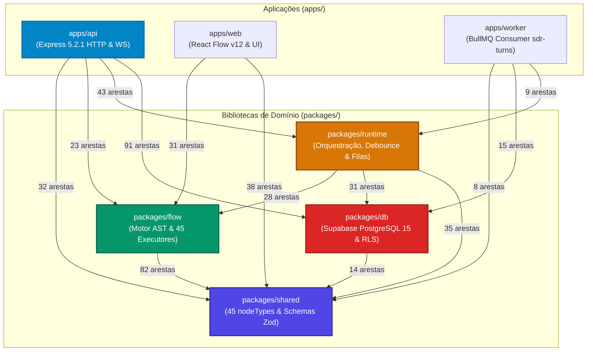
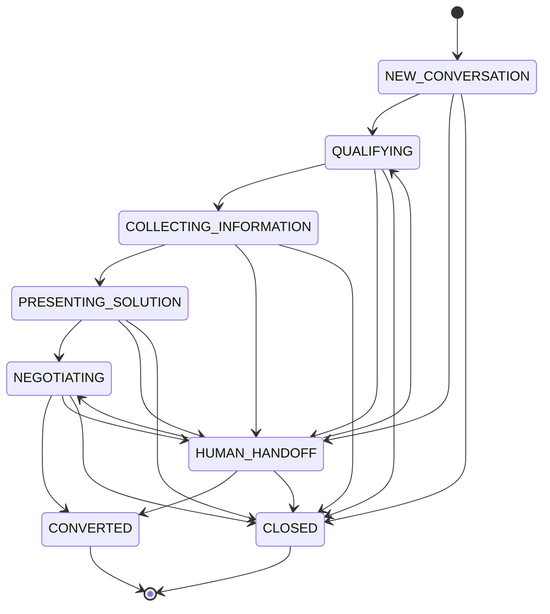

# Arquitetura e Engenharia do Motor SDR Flow
## Especificação Técnica Definitiva: Motor de Grafos, Runtime Distribuído, Persistência, Contratos de Dados e Tempo Real

---

### Sumário
1. [Visão Geral e Arquitetura do Sistema](#1-visão-geral-e-arquitetura-do-sistema)
2. [Topologia Estrutural e Métricas do Graphify](#2-topologia-estrutural-e-métricas-do-graphify)
3. [Ciclo de Vida Ponta a Ponta: A Jornada de um Evento](#3-ciclo-de-vida-ponta-a-ponta-a-jornada-de-um-evento)
4. [O Motor de Execução de Fluxos (`packages/flow`)](#4-o-motor-de-execução-de-fluxos-packagesflow)
5. [Catálogo Oficial Completo dos 45 Nós do SDR Flow](#5-catálogo-oficial-completo-dos-45-nós-do-sdr-flow)
6. [Contratos de Dados, Semântica de Grafo e Análise Estática de Variáveis](#6-contratos-de-dados-semântica-de-grafo-e-análise-estática-de-variáveis)
7. [O Runtime Distribuído e a Camada de Mensageria (`packages/runtime` & `apps/worker`)](#7-o-runtime-distribuído-e-a-camada-de-mensageria-packagesruntime--appsworker)
8. [Máquina de Estados da Conversa, Sessões e Handoff Humano](#8-máquina-de-estados-da-conversa-sessões-e-handoff-humano)
9. [Camada de Persistência e Supabase PostgreSQL (`packages/db`)](#9-camada-de-persistência-e-supabase-postgresql-packagesdb)
10. [Camada Frontend e Interação em Tempo Real (`apps/web` & `apps/api/src/ws.ts`)](#10-camada-frontend-e-interação-em-tempo-real-appsweb--appsapisrcwsts)
11. [Matriz de Resiliência, Falhas e Garantias Operacionais](#11-matriz-de-resiliência-falhas-e-garantias-operacionais)
12. [Guia Canônico de Manutenção e Extensão do Motor](#12-guia-canônico-de-manutenção-e-extensão-do-motor)

---

## 1. Visão Geral e Arquitetura do Sistema

O **SDR Flow** é uma plataforma corporativa multi-inquilino de automação e inteligência de vendas (SDR - *Sales Development Representative*) orientada a grafos de execução dirigidos (*Control-Flow Graphs*). O sistema processa fluxos conversacionais complexos integrando mensageria instantânea (WhatsApp via Evolution API v2.3.7 e Meta Cloud API Graph v21.0), modelos de linguagem em larga escala (OpenAI GPT-4o, GPT-4o-mini), gerenciamento de estado de CRM (deals, leads, contatos), agendamento real em calendários (Google Calendar e Cal.com) e intervenção humana reativa (Human Takeover/Release) em tempo real.

### 1.1 Paradigma Arquitetural: O Desenho das Camadas

A arquitetura do SDR Flow implementa uma separação rigorosa de responsabilidades em cinco camadas especializadas:

```
┌────────────────────────────────────────────────────────────────────────┐
│                        1. CAMADA DE APRESENTAÇÃO                       │
│     Visual Canvas React Flow v12 + Live Inbox + Dashboard Métricas     │
│                              (apps/web)                                │
└───────────────────▲────────────────────────────────▲───────────────────┘
                    │ REST API                       │ Dual WebSocket (/ws)
                    │ (Express 5.2.1)                │ (Canais 'debug' e 'inbox')
┌───────────────────▼────────────────────────────────▼───────────────────┐
│                    2. CAMADA DE INGESTÃO E GATEWAY                     │
│     Webhooks Inbound (Evolution/Meta) + Idempotency Gate + REST S2S    │
│                              (apps/api)                                │
└───────────────────┬────────────────────────────────────────────────────┘
                    │ Concatenação Atômica & Debounce (Script Lua)
                    ▼
┌────────────────────────────────────────────────────────────────────────┐
│                 3. CAMADA DE COORDENAÇÃO TEMPORAL E FILAS              │
│       Redis Turn Buffer (Generation Counter) + BullMQ Delayed Jobs     │
│                   (Redis 7.x + apps/worker: sdr-turns)                 │
└───────────────────┬────────────────────────────────────────────────────┘
                    │ Distributed Lock (Redlock 60s) + Version Pinning
                    ▼
┌────────────────────────────────────────────────────────────────────────┐
│               4. CAMADA DE EXECUÇÃO E INTELIGÊNCIA (RUNTIME)           │
│        Turn Processor + Graph Engine Sequencial + FlowServices         │
│                   (packages/runtime + packages/flow)                   │
└───────────────┬────────────────────────────────────────┬───────────────┘
                │ Hot Path: Redis Stream                 │ Side Effects Guarded
                │ (sdr:execution-traces:v1)              │ (assertCurrent)
                ▼                                        ▼
┌────────────────────────────────┐       ┌───────────────────────────────┐
│       TRACE BATCH WRITER       │       │       SERVIÇOS EXTERNOS       │
│  Drain em lotes de 30 steps/s  │       │  OpenAI / WhatsApp / Calendar │
└───────────────┬────────────────┘       └───────────────────────────────┘
                │ Batch Insert
                ▼
┌────────────────────────────────────────────────────────────────────────┐
│                 5. CAMADA DE PERSISTÊNCIA CANÔNICA RELACIONAL          │
│       Supabase PostgreSQL 15+ (pgvector, RLS em 100% das tabelas,      │
│        FKs Compostas, Triggers de Imutabilidade, Schema 'private')     │
│                                (packages/db)                           │
└────────────────────────────────────────────────────────────────────────┘
```

### 1.2 Por que essa Separação é Crítica para Atendimento via WhatsApp?

O motor do SDR Flow não é um mero avaliador `nó → nó`. Ele foi desenhado especificamente para resolver três problemas fundamentais de mensageria conversacional assíncrona:

1. **Coordenação Temporal contra Rajadas de Mensagens Concorrentes**:
   - Leads humanos enviam mensagens picadas em rajadas curtas ("Oi", "Tudo bem?", "Quanto custa o plano?").
   - O **Redis Turn Buffer** agrupa o lote de mensagens em uma janela de silêncio configurável (debounce de 5s a 120s) utilizando um **Script Lua atômico** que atualiza o texto e incrementa um contador monotônico de geração (`generation`).
   - Quando o Worker BullMQ desperta para processar o turno, se a geração do trabalho não for a geração ativa mais recente do Redis (`currentGeneration !== input.generation`), a execução é abortada imediatamente como `superseded`, sem tocar no PostgreSQL nem adquirir locks caros.
   - **Guarda de Efeitos Colaterais (`assertCurrent` preemption)**: Imediatamente antes de qualquer efeito colateral externo irreversível (envio de WhatsApp, criação de agendamento no Google Agenda, mutação no CRM ou disparo de webhook), o runtime invoca `await assertCurrent()`. Se o lead tiver digitado uma nova mensagem enquanto a OpenAI gerava a resposta (janela de 3 a 8 segundos), a chamada lança `conversation_turn_superseded`, cancelando o I/O para evitar respostas descontextualizadas ou compromissos fantasmas.

2. **Garantia de Imutabilidade por Pinning de Versão (`flow_version_id`)**:
   - Quando um operador clica em "Publicar" no canvas, a procedure SQL atômica `publish_flow` grava um snapshot completo do grafo em `flow_versions` e atualiza o ponteiro `flows.published_version_id`.
   - O trigger PostgreSQL `immutable_flow_version` bloqueia fisicamente qualquer instrução `UPDATE` ou `DELETE` em `flow_versions`.
   - Ao enfileirar o turno no BullMQ, o ID da versão publicada é **fixado de forma definitiva no payload do trabalho (`flowVersionId`)**.
   - Se um operador publicar uma nova versão do fluxo enquanto um lead está no meio de um turno ou aguardando o debounce, o processador executa rigorosamente a versão com a qual o turno nasceu. Nenhuma conversa sofre troca de lógica em pleno diálogo.

3. **Ingestão Durável com Idempotência Estrita (`inbound_events`)**:
   - A recepção do webhook pelo Express 5 persiste o evento bruto no PostgreSQL (`inbound_events`) com chave única baseada em `provider_message_id` antes de repassar ao Redis.
   - Retries HTTP dos provedores (Meta ou Evolution) batem no `IdempotencyGate` e são descartados com HTTP 200.
   - A perda ou reinicialização do Redis não provoca perda de mensagens: a tabela durável `inbound_events` garante integridade transacional de outbox.

4. **Isolamento Multitenant com RLS e Chaves Compostas**:
   - Toda e qualquer tabela de negócio possui obrigatoriamente a coluna `organization_id UUID NOT NULL REFERENCES organizations(id) ON DELETE CASCADE`.
   - Todas as relações entre entidades pertencentes a uma mesma organização utilizam chaves estrangeiras compostas:
     ```sql
     FOREIGN KEY (organization_id, target_id) REFERENCES target_table(organization_id, id)
     ```
   - O Row Level Security (RLS) é compulsório em 100% das tabelas de negócio, impedindo vazamento de dados entre empresas no nível do motor do PostgreSQL.

5. **Pureza Matemática do Motor de Execução (`packages/flow`)**:
   - O pacote `packages/flow` não possui dependências com banco de dados, Redis ou transportes de rede.
   - Ele recebe o grafo (`FlowGraph`), o contexto (`FlowContext`) e um conjunto de serviços abstratos (`FlowServices`), funcionando como uma máquina de estados finita determinística, testável e auditável.

---

## 2. Topologia Estrutural e Métricas do Graphify

A arquitetura do código-fonte do SDR Flow foi mapeada pelo motor de análise estática e indexação topológica **Graphify**, extraindo a Árvore Sintática Abstrata (AST), o grafo de chamadas, as dependências modulares e a centralidade dos componentes.

### 2.1 Visão Quantitativa do Grafo

```
   ┌───────────────────────────────────────────────────────────┐
   │               MÉTRICAS DO CORPUS (GRAPHIFY)               │
   ├─────────────────────────────────┬─────────────────────────┤
   │ Métrica                         │ Valor                   │
   ├─────────────────────────────────┼─────────────────────────┤
   │ Total de Nós AST (Code Entities)│ 1.548                   │
   │ Total de Arestas (Dependencies) │ 3.330                   │
   │ Comunidades Detectadas (Louvain)│ 104 comunidades         │
   │ Densidade do Grafo              │ 0,00139                 │
   │ Diâmetro Máximo de Dependência  │ 11 saltos               │
   └─────────────────────────────────┴─────────────────────────┘
```

### 2.2 Tabela de Centralidade: "God Nodes" e Hubs do Sistema

Os nós com maior centralidade de grau (*degree centrality*, *in-degree* e *out-degree*) no grafo do Graphify evidenciam os pontos cardeais da arquitetura:

| Símbolo / Módulo | Grau Total | In-Degree | Out-Degree | Papel Arquitetural Real |
|---|---|---|---|---|
| `apps/api/src/app.ts` | **126** | 8 | 118 | Hub central da API Express 5; registra middlewares, rotas autenticadas, tratamento de erros e repositórios. |
| `createApp()` | **92** | 12 | 80 | Factory do servidor Express 5; inicializa body parser, CORS, rate limits e autenticação. |
| `packages/shared/src/index.ts` | **86** | 86 | 0 | **Hub Universal de Contratos**; exporta os 45 `nodeTypes`, schemas Zod, enums e interfaces. |
| `turn-processor.ts` | **56** | 14 | 42 | **Orquestrador de Turnos**; gerencia geração, pinning de versão, guarda de I/O e telemetria. |
| `apps/web/src/builder/Builder.tsx` | **53** | 4 | 49 | Construtor visual React Flow v12 com store Zustand, autolayout e renderização de nós. |
| `packages/db/src/index.ts` | **46** | 46 | 0 | Ponto de entrada de persistência; clientes PostgREST, PGlite e fábricas de repositórios. |
| `apps/web/src/main.tsx` | **44** | 2 | 42 | Ponto de entrada do frontend React com SessionProvider e roteamento. |
| `packages/flow/src/index.ts` | **43** | 43 | 0 | Hub do motor de grafos (engine, catálogo, validadores e serviços). |
| `executors/index.ts` | **41** | 2 | 39 | Tabela de despacho polimórfico dos 45 executores de nós. |
| `apps/api/src/webhook.ts` | **38** | 6 | 32 | Ingestão, autenticação HMAC SHA-256 e normalização de payloads Evolution e Meta. |
| `ExecutionLogPage.tsx` | **34** | 3 | 31 | Visualizador em tempo real de traces, passos e telemetria de execuções. |
| `useSession()` | **33** | 33 | 0 | Hook de autenticação Supabase, perfil ativo e organização contextual. |
| `processTurn()` | **31** | 4 | 27 | Função de ciclo de vida de turno conversacional. |
| `ConversationStage` | **31** | 31 | 0 | Enum canônica de 8 estágios da máquina de estados do funil de vendas. |

### 2.3 Matriz de Dependência Inter-Pacotes



---

## 3. Ciclo de Vida Ponta a Ponta: A Jornada de um Evento

A jornada de uma interação comercial no SDR Flow compreende um fluxo sequencial estritamente orquestrado:

```mermaid
sequenceDiagram
    autonumber
    actor Lead as Lead (WhatsApp)
    participant Provider as Provedor (Evolution/Meta)
    participant API as apps/api (Express 5)
    participant DB as PostgreSQL (Supabase)
    participant Redis as Redis Turn Buffer (Lua)
    participant Queue as BullMQ (sdr-turns)
    participant Worker as apps/worker (main.ts)
    participant Runtime as TurnProcessor (turn-processor.ts)
    participant Engine as FlowEngine (engine.ts)
    participant AI as OpenAI (Responses API)
    participant TraceStream as Redis Stream (sdr:execution-traces:v1)
    participant BatchWriter as TraceBatchWriter
    participant WS as WebSocket Server (/ws)
    actor Operator as Operador Web (apps/web)

    Lead->>Provider: Envia mensagem: "Olá, gostaria de agendar uma consulta"
    Provider->>API: POST /api/webhooks/:provider/:connectionId
    Note over API: 1. Valida HMAC SHA-256 (Meta) ou apikey (Evolution)<br/>2. Normaliza para NormalizedInboundPayload<br/>3. Deduplica via IdempotencyGate

    API->>DB: acceptInboundEvent() -> INSERT INTO inbound_events (status: 'pending')
    
    API->>Redis: RedisTurnBuffer.append() via Script Lua atômico
    Note over Redis: Concatena texto no Hash da conversa,<br/>incrementa generation (ex: gen=3),<br/>reinicia janela de silêncio (ex: 15s)
    
    API->>Queue: sdr-turns.add('process-turn', { generation: 3 }, { delay: 15000 })
    API-->>Provider: HTTP 200 { received: true }

    Note over Queue: Janela de Silêncio expira (15s sem novas mensagens do lead)
    Queue->>Worker: Despacha Job 'process-turn' (generation: 3)

    Worker->>Redis: Adquire Redlock: "lock:conversation:orgId:convId" (TTL 60s)
    Worker->>Runtime: processTurn(deps, input)

    Runtime->>Redis: isCurrent() -> Confere se generation == 3
    Note over Runtime: Pinning de Versão: flowVersionId e agentId<br/>fixados no momento do enfileiramento (sem troca mid-turn)

    Runtime->>DB: findOrCreateLead() & findOrCreateConversation()
    Note over DB: Se inatividade > 15m (SESSION_TIMEOUT_MINUTES),<br/>fecha anterior (CLOSED), reseta voláteis<br/>e abre nova com stage='NEW_CONVERSATION'

    Runtime->>DB: saveMessage(INBOUND, status: 'delivered')
    Runtime->>WS: RealtimeEventV1: inbox:message.created
    WS-->>Operator: Renderiza balão no Inbox em tempo real

    Runtime->>DB: Carrega flow_versions (graph imutável) & getAgentOpenAIKey(agentId)
    Runtime->>DB: INSERT INTO flow_executions (status: 'running', flow_version_id, agent_id)
    Runtime->>WS: FlowExecutionEvent: execution:started

    Runtime->>Engine: executeFlow(graph, ctx, services, hooks)
    
    loop Para cada Nó no Grafo (Navegação Dirigida)
        Engine->>Engine: Valida limite de passos (maxSteps) e visitas (maxNodeVisits)
        Engine->>WS: FlowExecutionEvent: step:start
        WS-->>Operator: Nó correspondente pulsa azul no Canvas
        
        alt Nó de Inteligência (agent.decide / agent.next_action)
            Engine->>AI: Chamada OpenAI com prompt interpolado e chave isolada do agente
            AI-->>Engine: Resposta estruturada JSON + contagem de tokens
        else Nó de Ação Externa (output.smart_message / calendar.create_event)
            Engine->>Runtime: assertCurrent() -> Confere se não chegou nova mensagem
            Engine->>Provider: Envia mensagem de resposta para o WhatsApp
        end

        Engine->>TraceStream: traceSink.append() -> XADD sdr:execution-traces:v1
        Engine->>WS: FlowExecutionEvent: step:complete
        WS-->>Operator: Nó fica verde; log detalhado renderizado
    end

    Engine-->>Runtime: FlowExecutionResult { status: 'completed', steps, tokens }
    
    Runtime->>DB: UPDATE flow_executions (status: 'completed', tokens, duration)
    Runtime->>DB: UPDATE inbound_events (status: 'processed')
    Runtime->>WS: FlowExecutionEvent: execution:completed

    Worker->>Redis: Redlock: Libera lock "lock:conversation:orgId:convId"
    Provider->>Lead: Entrega mensagem gerada pelo bot no WhatsApp

    par Persistência Assíncrona de Traces em Lote
        BatchWriter->>TraceStream: XREADGROUP sdr:trace-consumers
        BatchWriter->>DB: INSERT INTO flow_execution_steps (Batch de 30 registros)
        BatchWriter->>TraceStream: XACK sdr:execution-traces:v1
    end
```

---

## 4. O Motor de Execução de Fluxos (`packages/flow`)

O pacote `packages/flow` implementa a execução de grafos de controle como uma **máquina de estados determinística baseada em AST**, rodando em memória e completamente isolada de I/O direto.

### 4.1 Estrutura de Dados do Grafo (`FlowGraph`)

A estrutura serializável em JSON do fluxo é rigorosamente validada via Zod (`packages/shared/src/index.ts:47-70`):

```typescript
export interface FlowGraph {
  schemaVersion: 1;
  nodes: FlowNode[];
  edges: FlowEdge[];
  loopLimit?: number;    // Limite máximo de iterações por nó (1 a 20, default: 5)
  testMode?: {
    enabled: boolean;
    phone: string;       // Telefone único autorizado com DDI e DDD
  };
}

export interface FlowNode {
  id: string;            // Identificador único (1 a 100 caracteres)
  type: NodeType;        // Um dos 45 tipos exatos de nodeTypes
  label: string;         // Nome legível exibido no card visual (1 a 120 caracteres)
  position: { x: number; y: number }; // Coordenadas cartesianas no canvas
  config: Record<string, unknown>;    // Configurações validadas pelo schema do nó
}

export interface FlowEdge {
  id: string;            // Identificador único da conexão
  source: string;        // ID do nó de origem
  sourcePort: string;    // Nome da porta de saída (ex: 'next', 'true', 'reply', 'body')
  target: string;        // ID do nó de destino
}
```

### 4.2 Validação Estática de Grafos (`validateGraph`)

Antes de qualquer fluxo ser persistido ou publicado, ele passa pela função `validateGraph` (`packages/flow/src/validate.ts`). A validação aplica 7 regras fundamentais:

1. **Unicidade de IDs**: Garante que não existam nós ou conexões com identificadores duplicados (`duplicate_node`, `duplicate_edge`).
2. **Gatilho Único (`trigger_count`)**: O fluxo deve conter exatamente um nó cujo tipo inicie com `trigger.` (`trigger.message_received`, `trigger.schedule`, `trigger.manual`). Gatilhos não aceitam conexões de entrada (`trigger_incoming`).
3. **Validação de Configuração por Nó**: O objeto `config` de cada nó é validado contra o Zod schema registrado no catálogo (`catalog[node.type].schema.safeParse`).
4. **Integridade das Portas de Saída (`portsFor` & `required_port`)**: Cada porta de saída declarada por `portsFor(node.type, node.config)` deve estar conectada a exatamente uma aresta de destino. Conexões usando saídas desconhecidas são rejeitadas (`unknown_port`).
5. **Alcançabilidade (`unreachable`)**: Uma busca em profundidade a partir do gatilho verifica se todos os nós do grafo são alcançáveis. Nós soltos no canvas impedem a publicação.
6. **Detecção de Ciclos e Componentes Fortemente Conexos (SCC)**:
   - O algoritmo calcula componentes fortemente conexos para frente e para trás.
   - Qualquer ciclo é **estritamente proibido**, exceto quando controlado por um nó de loop limitado (`flow.loop` ou `flow.do_while`), cujo schema limita o número de iterações e cuja saída `done` garante término.
7. **Garantia de Término (Fixed-Point Reachability)**:
   - A partir dos nós terminais (`output.end`), o validador calcula o ponto fixo de retrocesso.
   - Para nós de loop (`flow.loop` e `flow.do_while`), a porta `done` deve obrigatoriamente convergir para o encerramento do fluxo.

### 4.3 O Laço de Execução Central (`executeFlow` em `engine.ts`)

A execução do grafo ocorre no método `executeFlow`:

```typescript
export async function executeFlow(
  graph: FlowGraph,
  ctx: FlowContext,
  services: FlowServices,
  options: EngineOptions = {}
): Promise<FlowExecutionResult>
```

#### Mecânica de Execução:
1. **Indexação de Arestas $\mathcal{O}(1)$**: As arestas são indexadas em memória sob a chave composta `${edge.source}:::${edge.sourcePort}`.
2. **Mecanismo de Retomada (`resumeFromNodeId` & `resumePort`)**:
   - Se o motor for acordado após suspensão (ex.: nova mensagem do lead após `flow.wait_reply`), o motor inicia diretamente naquele nó passando o quarto argumento `resumePort` para o executor (`'reply'` ou `'timeout'`).
3. **Prevenção de Loops Infinitos**:
   - Um contador `visitCount` (`Map<string, number>`) registra quantas vezes cada nó específico foi executado. Se ultrapassar `maxNodeVisits` (configurado no grafo via `loopLimit` ou padrão 5), a execução aborta:
     ```text
     Loop excedido: o nó "Qualificação" (agent.decide) foi executado 5 vezes. Limite de iterações atingido.
     ```
   - Um limite global de passos (`maxSteps`, padrão 50) impede execuções excessivamente longas.
4. **Hooks de Telemetria**:
   - `hooks.onStepStart`: Chamado imediatamente antes da execução do nó.
   - `hooks.onStepComplete`: Chamado ao término, enviando `StepExecutionRecord` ao `TraceSink` (Redis Stream) e disparando WebSocket.
   - `hooks.onStepError`: Notifica falhas não tratadas.
5. **Suspensão de Turno (`result.suspend`)**:
   - Quando um nó como `flow.wait_reply` é acionado sem `resumePort`, ele retorna `{ suspend: true, port: 'reply' }`.
   - O motor interrompe o laço, salva `ctx.resumeNodeId = currentNode.id` e retorna `status: 'waiting'`. O turno corrente finaliza pacificamente aguardando o próximo evento.
6. **Navegação de Saída**: O nó executor retorna o identificador da porta ativada (`result.port`). O motor localiza a aresta correspondente em `edgeMap` e avança para `target`. Se o nó for `output.end` ou não houver aresta na porta, a execução conclui com status `completed`.

---

## 5. Catálogo Oficial Completo dos 45 Nós do SDR Flow

A tabela a seguir apresenta os **45 nós canônicos reais** implementados em `packages/shared/src/index.ts`, configurados em `packages/flow/src/catalog.ts` e executados em `packages/flow/src/executors/index.ts`:

| # | Tipo do Nó (`NodeType`) | Categoria | Label Oficial | Portas de Saída (`portsFor`) | Variáveis Produzidas / Efeitos |
|---|---|---|---|---|---|
| 1 | `trigger.message_received` | `trigger` | Mensagem recebida | `['next']` | Ponto de entrada padrão via WhatsApp. |
| 2 | `trigger.schedule` | `trigger` | Agendamento | `['next']` | Ponto de entrada via Cron programado. |
| 3 | `trigger.manual` | `trigger` | Início manual | `['next']` | Disparo manual via Inbox/Painel. |
| 4 | `guard.test_mode` | `guard` | Filtro de Conexão / Gate | `['pass', 'blocked']` | Filtra por `allowedPhones` e `allowedGroups` (@g.us). Morre silenciosamente em `blocked`. |
| 5 | `guard.human_takeover` | `guard` | Atendimento humano | `['pass', 'blocked']` | Bloqueia se `bot_paused === true` ou `handled_by === 'HUMAN'`. |
| 6 | `guard.business_hours` | `guard` | Horário comercial | `['pass', 'blocked']` | Valida horário `[start, end]` e dias da semana no fuso configurado. |
| 7 | `guard.chat_type` | `guard` | Tipo de conversa | `['pass', 'blocked']` | Bloqueia interações em grupos se `allowGroups === false`. |
| 8 | `guard.response_policy` | `guard` | Política de resposta | `['pass', 'rewrite', 'blocked']` | Valida tamanho, repetição semântica, termos proibidos e preços sem lastro na base oficial. Produz `{{response_policy}}`. |
| 9 | `input.buffer` | `input` | Agrupar mensagens | `['next']` | Telemetria do buffer de debounce (5s a 120s). |
| 10 | `input.media` | `input` | Processar mídia | `['next']` | Transcreve áudio (Whisper) e descreve imagens. Produz `{{mediaEnrichedText}}`. |
| 11 | `input.normalize` | `input` | Normalizar telefone | `['next']` | Normaliza telefone no padrão E.164 brasileiro. Produz `{{normalizedPhone}}`. |
| 12 | `context.memory` | `context` | Memória comercial | `['next']` | Carrega memória estruturada, histórico de chat recente e gera `{{lastAssistantQuestion}}` (vazio em nova sessão). |
| 13 | `context.knowledge` | `context` | Base de conhecimento | `['next']` | Busca semântica vetorial (`pgvector`). Produz `{{knowledgeSnippets}}` e `{{knowledgeSearch}}`. |
| 14 | `context.crm` | `context` | Consultar CRM | `['next']` | Inicializa contexto de oportunidade do CRM (`{{crmContext}}`). |
| 15 | `context.summarize` | `context` | Resumir conversa | `['next']` | Resume conversas longas a cada $N$ mensagens. Produz `{{conversation.summary}}`. |
| 16 | `context.storage` | `context` | Armazenamento interno | Configurável por `outputPorts` (default: `['next']`) | **Gerenciador de Dados**: Grava/Lê variáveis de turno (`ctx.variables`) e memória perene (`lead.memory`), com suporte a JSON e tags dinâmicas. |
| 17 | `context.conversation_state` | `context` | Estado da conversa | `['next']` | Persiste estágio (`DISCOVERY`, `QUALIFYING`, etc.), última ação e próxima entrada esperada. Produz `{{conversation_state}}`. |
| 18 | `agent.decide` | `agent` | Decisão do agente | `['next']` | Agente SDR principal. Gera resposta via LLM com chave privada do agente. Produz `{{decision.reply}}`, `{{decision.handoff}}`. |
| 19 | `agent.classify` | `agent` | Classificar intenção | `['next']` | Classifica intenção comercial. Produz `{{decision.intent}}`. |
| 20 | `agent.extract` | `agent` | Extrair informações | `['next']` | Extrai campos tipados configurados no nó. Produz `{{decision.lead_data}}`. |
| 21 | `agent.score` | `agent` | Pontuar lead | `['next']` | Avalia temperatura comercial de 0 a 100. Produz `{{decision.score}}`. |
| 22 | `agent.structured` | `agent` | Resposta estruturada | Dinâmicas: `[...outputKeys, 'default']` | Força retorno JSON estrito e roteia a execução dinamicamente pelo nome da chave escolhida pelo modelo em `_route`. |
| 23 | `agent.next_action` | `agent` | Próxima ação | `['next']` | Escolhe ação canônica (`ASK_MISSING_FIELD`, `SHOW_PRICE`, `CREATE_APPOINTMENT`, etc.). Produz `{{next_action.action}}`, `{{next_action.evidence}}`. |
| 24 | `flow.condition` | `flow` | Condição | `['true', 'false']` | Desvio booleano IF/ELSE determinístico por operador (`equals`, `not_equals`, `contains`, `greater_than`). |
| 25 | `flow.switch` | `flow` | Múltiplos caminhos | `[...cases, 'default']` | Desvio condicional SWITCH/CASE comparando o valor da variável. |
| 26 | `flow.delay` | `flow` | Aguardar | `['next']` | Pausa temporizada de $N$ segundos antes do próximo bloco. |
| 27 | `flow.wait_reply` | `flow` | Esperar resposta | `['reply', 'timeout']` | **Suspensão de Turno**: Pausa o fluxo até o lead responder no WhatsApp (`reply`) ou expirar o tempo limite (`timeout`). |
| 28 | `flow.loop` | `flow` | Repetir X vezes | `['body', 'done']` | Laço com $N$ repetições controladas. Emite `body` a cada ciclo e `done` ao finalizar, zerando o contador. |
| 29 | `flow.do_while` | `flow` | Repetir até condição | `['body', 'done']` | Laço pós-testado com limite estrito de iterações (`maxIterations`). Executa o corpo pelo menos 1 vez. |
| 30 | `flow.required_fields` | `flow` | Campos obrigatórios | `['complete', 'missing']` | Avalia preenchimento de campos essenciais de qualificação. Produz `{{required_fields.missing}}`. |
| 31 | `action.update_stage` | `action` | Atualizar estágio | `['next']` | Altera estágio da conversa com validação de transição na máquina de estados canônica. |
| 32 | `action.update_lead` | `action` | Atualizar lead | `['next']` | Persiste no cadastro do lead as informações de `{{decision.lead_data}}`. |
| 33 | `action.crm_sync` | `action` | Sincronizar CRM | `['next']` | Cria ou atualiza oportunidade comercial aberta (`deal`) no CRM. |
| 34 | `action.handoff` | `action` | Encaminhar para humano | `['next']` | Pausa a IA (`bot_paused = true`, `stage = 'HUMAN_HANDOFF'`) e aciona fila do Inbox. |
| 35 | `action.webhook` | `action` | Chamar webhook | `['next']` | Disparo HTTP externo (`POST`, `PUT`, `PATCH`) com snapshot dos dados do atendimento. |
| 36 | `integration.google_calendar` | `integration` | Google Calendar | `['success', 'error']` | Bloco legado de integração direta com API Google Calendar v3 via OAuth2 local. |
| 37 | `calendar.availability` | `calendar` | Consultar disponibilidade | `['available', 'unavailable', 'error']` | Consulta agenda corporativa segura. Calcula horários livres discretizados. Produz `{{calendar.slots}}`, `{{calendar.first_available}}`. |
| 38 | `calendar.create_event` | `calendar` | Criar agendamento | `['created', 'error']` | Cria evento oficial no Google Agenda. Produz `{{calendar.event_id}}`, `{{calendar.event_link}}`. |
| 39 | `calendar.reschedule_event` | `calendar` | Reagendar | `['rescheduled', 'error']` | Reagenda compromisso existente por `eventId`. Produz `{{calendar.rescheduled}}`. |
| 40 | `calendar.cancel_event` | `calendar` | Cancelar agendamento | `['cancelled', 'error']` | Exclui compromisso da agenda corporativa e registra motivo. |
| 41 | `output.send_text` | `output` | Enviar mensagem | `['next']` | Envia mensagem de texto via WhatsApp. Suporta `targetMode` (`active_lead`, `specific_targets`, `both`). |
| 42 | `output.send_media` | `output` | Enviar mídia | `['next']` | Envia fotos, áudios gravados, vídeos e PDFs com legenda. |
| 43 | `output.send_template` | `output` | Enviar template | `['next']` | Envia mensagens de modelo aprovadas pela Meta Business API. |
| 44 | `output.smart_message` | `output` | Mensagem inteligente | `['next']` | Divide respostas longas em até 3 bolhas naturais de chat com indicador visual de digitação. |
| 45 | `output.end` | `output` | Encerrar fluxo | `[]` (Terminal) | Finaliza o fluxo com sucesso (`status: 'completed'`). Não possui portas de saída. |

---

## 6. Contratos de Dados, Semântica de Grafo e Análise Estática de Variáveis

Uma das decisões arquiteturais mais acertadas do SDR Flow é que ele é um **Control-Flow Graph (CFG) com Contexto Compartilhado**, e **NÃO** um Data-Flow Graph (DFG).

### 6.1 Por que Não Transformar o SDR Flow em um Motor de Dataflow?

Em motores de fluxo de dados como Node-RED ou n8n, as arestas conectam soquetes de saída específicos a soquetes de entrada específicos, transportando objetos de dados e exigindo contratos rígidos de entrada por bloco, *merge nodes*, tratamento de dependências de chegada e ordenação topológica estrita.

No atendimento comercial via WhatsApp, esse modelo gera fricção desnecessária:
- Um atendente SDR não quer conectar um fio de "telefone do lead" do nó de webhook até cada um dos 10 nós do fluxo.
- O contexto comercial (`lead`, `memory`, `messages`, `variables`) é cumulativo ao longo de todo o atendimento.
- A aresta no SDR Flow expressa estritamente: **"ao concluir este nó pela porta X, execute aquele nó"**.

Portanto, a solução ideal não é trocar a semântica das arestas, mas sim **formalizar contratos de dados nos nós (`requires` e `produces`)** e utilizar análise estática de atribuição definitiva antes da publicação.

### 6.2 Especificação Formal: `requires` e `produces` no Catálogo

Propõe-se a extensão da interface canônica de definição de nós (`NodeDefinition`):

```typescript
export interface DataContractField {
  path: string;           // Identificador canônico (ex: 'calendar.first_available', 'lead.phone')
  type: 'string' | 'number' | 'boolean' | 'date_iso' | 'object' | 'array';
  description: string;
  optional?: boolean;     // Se true, tolera ausência sem invalidar o fluxo
}

export interface NodeDefinition<TConfig = Record<string, unknown>> {
  type: NodeType;
  label: string;
  category: Category;
  schema: z.ZodType<TConfig>;
  defaults: TConfig;
  ports: (config: TConfig) => string[];
  
  /** Variáveis que o nó EXIGE que existam no contexto para executar sem falhas */
  requires?: (config: TConfig) => DataContractField[];
  
  /** Variáveis GARANTIDAS que o nó injeta no contexto, indexadas por porta de saída */
  produces?: (config: TConfig) => Record<string, DataContractField[]>;
}
```

#### Exemplo Prático: `calendar.create_event`
```typescript
'calendar.create_event': {
  type: 'calendar.create_event',
  label: 'Criar agendamento',
  category: 'calendar',
  requires: (config) => [
    { path: config.start ? extractInterpolationTag(config.start) : 'calendar.first_available', type: 'date_iso', description: 'Início do agendamento' },
    { path: 'lead.phone', type: 'string', description: 'Telefone para registro' },
  ],
  produces: (_config) => ({
    created: [
      { path: 'calendar.event_id', type: 'string', description: 'ID do evento gerado no Google Calendar' },
      { path: 'calendar.start', type: 'date_iso', description: 'Início confirmado' },
      { path: 'calendar.end', type: 'date_iso', description: 'Fim confirmado' },
      { path: 'calendar.event_link', type: 'string', description: 'Link do evento' },
    ],
    error: [
      { path: 'calendar.error', type: 'string', description: 'Motivo da falha na API' },
    ],
  }),
}
```

### 6.3 Distinção Conceitual dos Papéis no Grafo

Para manter a clareza arquitetural, o motor distingue formalmente três tipos de blocos:

```
                                  PAPEIS NO MOTOR
                                         │
        ┌────────────────────────────────┼────────────────────────────────┐
        ▼                                ▼                                ▼
1. CONTROLE DE CAMINHO        2. MANIPULAÇÃO DE DADOS         3. PRÉ-CONDIÇÕES & SEGURANÇA
  (flow.condition,             (context.storage,              (guard.*, flow.required_fields,
   flow.switch,                 action.update_lead,            guard.response_policy,
   flow.loop, flow.do_while)    context.conversation_state)    assert/precondition)
        │                                │                                │
        ├─ Avalia estado                 ├─ Grava em ctx.variables        ├─ Estabelece barreiras
        ├─ Não altera variáveis          ├─ Persiste no Postgres          ├─ Desvia para portas seguras
        └─ Roteia caminhos               └─ Não bifurca lógicas              (blocked, rewrite, missing)
```

### 6.4 Análise Estática de Atribuição Definitiva (*Definite Assignment Analysis*)

Com `requires` e `produces` registrados no catálogo, a validação de fluxo (`packages/flow/src/validate.ts`) consegue aplicar um **algoritmo de ponto fixo de fluxo de dados** antes de autorizar a publicação:

1. **Variáveis Iniciais (Gatilho)**:
   $$In(Trigger) = \{ \text{"lead.id"}, \text{"lead.phone"}, \text{"messages"}, \text{"connectionId"}, \text{"organizationId"} \}$$
2. **Propagação de Entrada**:
   Uma variável só é considerada garantida na entrada de um nó $N$ se ela existir na saída de **todas as arestas que convergem para ele** (Operador de Interseção $\cap$):
   $$In(N) = \bigcap_{P \in Predecessores(N)} Out(P, \text{porta}_{P \to N})$$
3. **Geração de Saída**:
   $$Out(N, \text{porta}) = In(N) \cup Produces(N, \text{porta})$$

#### Prevenção Real de Erros no Canvas:
Se um operador desenhar uma aresta conectando a porta `error` de `calendar.create_event` diretamente em um nó `output.send_text` que contém a mensagem:  
`"Sua consulta foi agendada com sucesso! Código: {{calendar.event_id}}"`  

O validador acusará imediatamente:
> ❌ **Erro de Validação em "Enviar mensagem" (`output.send_text`):**  
> *A variável `{{calendar.event_id}}` é exigida neste nó, mas não é produzida no caminho que provém da porta "error" de "Criar agendamento" (`calendar.create_event`)*.

Isso elimina falhas de execução em tempo de execução sem necessitar transformar o motor em um grafo de dataflow complexo.

---

## 7. O Runtime Distribuído e a Camada de Mensageria (`packages/runtime` & `apps/worker`)

### 7.1 Framework HTTP: Express 5.2.1
A camada HTTP em `apps/api` utiliza **Express 5.2.1** montado sobre a API nativa `node:http.Server`.
- O body parser captura o payload bruto em `req.rawBody` para validação de assinaturas criptográficas da Meta (`X-Hub-Signature-256`).
- Roteamento com prefixo multitenant: `/api/organizations/:organizationId` via `express.Router({ mergeParams: true })`.
- Rotas legadas fora do escopo de organização retornam `HTTP 410 Gone` de forma determinística.

### 7.2 Redis Turn Buffer e Script Lua Atômico

Para evitar concorrência desordenada e cobranças duplicadas de IA quando o lead envia múltiplas mensagens seguidas, o sistema utiliza o **Redis Turn Buffer** (`packages/runtime/src/turns/redis-buffer.ts`):

```
Mensagem 1 (10:00:00) ──► Redis Hash ──► generation = 1 ──► BullMQ Job (delay: 15s, gen: 1)
Mensagem 2 (10:00:03) ──► Redis Hash ──► generation = 2 ──► BullMQ Job (delay: 15s, gen: 2)
Mensagem 3 (10:00:07) ──► Redis Hash ──► generation = 3 ──► BullMQ Job (delay: 15s, gen: 3)
                              │
     (15 segundos de silêncio sem novas mensagens do lead...)
                              ▼
Worker desperta Job 1: gen (1) != redis.generation (3) ──► DESCARTA (superseded)
Worker desperta Job 2: gen (2) != redis.generation (3) ──► DESCARTA (superseded)
Worker desperta Job 3: gen (3) == redis.generation (3) ──► EXECUTA O LOTE COMPLETO
```

#### Script Lua de Ingestão Atômica:
```lua
local key = KEYS[1]
local eventId = ARGV[1]
local text = ARGV[2]
local ttl = tonumber(ARGV[3])

redis.call('RPUSH', key .. ':events', eventId)
redis.call('APPEND', key .. ':text', text .. '\n')
local gen = redis.call('INCR', key .. ':generation')
redis.call('EXPIRE', key .. ':events', ttl)
redis.call('EXPIRE', key .. ':text', ttl)
redis.call('EXPIRE', key .. ':generation', ttl)

return gen
```

### 7.3 Redlock Distribuído e Preempção de Efeitos Colaterais (`assertCurrent`)

- **Distributed Lock**: Cada conversa em processamento adquire a chave `lock:conversation:${organizationId}:${conversationId}` com TTL de 60 segundos e heartbeat assíncrono (`KeepAlive`).
- **Guarda de Efeitos Colaterais**: Os métodos `sendText`, `sendMedia`, `createEvent`, `updateEvent`, `cancelEvent` e `fetch` em `FlowServices` invocam:
  ```typescript
  const assertCurrent = async () => {
    if (!(await input.isCurrent())) throw new Error('conversation_turn_superseded');
  };
  ```
  Se uma nova mensagem tiver sido registrada no buffer durante a geração da OpenAI, a execução aborta antes de emitir qualquer mensagem ao WhatsApp ou agendar no calendário.

### 7.4 Montagem do `FlowServices.db` em Execuções Reais (`turn-processor.ts`)

O objeto `services.db` consumido pelo motor em execuções reais (WhatsApp) é montado inline em `processTurn` (`packages/runtime/src/turns/turn-processor.ts`), e cada método é um adaptador fino sobre um repositório de `packages/db`:

| Método (`DatabaseService`) | Repositório | Alimenta |
|---|---|---|
| `updateLead`, `updateConversation`, `saveMessage`, `syncDeal` | `ConversationRepository` | Persistência de CRM/inbox e eventos `inbox:*` em tempo real. |
| `getMessages`, `getLeadRecentMessages` | `ConversationRepository` | `context.memory` → `{{lastAssistantQuestion}}`, histórico recente (`databaseReaderAvailable`). |
| `searchKnowledge` | `KnowledgeRepository` (`KnowledgeRepository.generateFallbackEmbedding` + `.search`) | `context.knowledge` → `{{knowledgeSnippets}}` (`readerAvailable`). |

`context.knowledge` (`packages/flow/src/executors/index.ts`) decide `readerAvailable` apenas por feature-detection: `Boolean(services.db?.searchKnowledge)`. Até a correção registrada aqui, `searchKnowledge` só existia na rota `/flows/:id/playground` (`apps/api/src/app.ts`) e nunca havia sido portado para `turn-processor.ts` — toda execução real de WhatsApp recebia `emptyReason: 'reader_unavailable'` e nunca consultava a base de conhecimento (`pricing`/`knowledge_documents`), mesmo com `context.memory.databaseReaderAvailable === true` na mesma execução (esse repositório *estava* wireado). O fix instancia `new KnowledgeRepository(db)` em `processTurn` e implementa `searchKnowledge` ali, espelhando a lógica do playground.

---

## 8. Máquina de Estados da Conversa, Sessões e Handoff Humano

### 8.1 Os 8 Estados Canônicos (`ConversationStage`)

O ciclo de vida comercial da conversa é regido por uma máquina de estados finitos estrita, definida em `packages/shared/src/enums.ts` e espelhada no PostgreSQL no tipo `public.conversation_stage`:

1. `NEW_CONVERSATION`: Abertura de contato ou reinício de sessão.
2. `QUALIFYING`: Identificação inicial de necessidades e interesse.
3. `COLLECTING_INFORMATION`: Coleta de dados essenciais (nome, cidade, plano, etc.).
4. `PRESENTING_SOLUTION`: Apresentação de planos, preços ou procedimentos.
5. `NEGOTIATING`: Alinhamento de condições de contratação ou agendamento.
6. `CONVERTED`: Conversão concluída com sucesso (venda/agendamento). Estado terminal.
7. `HUMAN_HANDOFF`: Conversa transferida para atendente humano. Bot em pausa.
8. `CLOSED`: Conversa finalizada por inatividade ou desqualificação. Estado terminal.



### 8.2 Janela de Inatividade e Limpeza de Estado Volátil

- **Timeout de 15 Minutos (`SESSION_TIMEOUT_MINUTES`)**:
  - Se o intervalo entre a mensagem anterior e a atual ultrapassar 15 minutos, a conversa anterior é encerrada com `stage = 'CLOSED'`.
  - O repositório invoca `resetVolatileLeadTurnState`:
    - **O que é limpo**: `conversation_state`, atributos temporários de agendamento (`proximo_passo`, `selected_slot_iso`, `desired_day`, `period`) e objeções de turno (`objections = []`).
    - **O que é preservado**: Toda a memória cadastral perene (`name`, `phone`, `city`, `interest`, `urgency`, `custom_fields` sólidos).
  - Uma nova conversa é criada com `stage = 'NEW_CONVERSATION'`, `handled_by = 'AI'` e `bot_paused = false`.
  - **Escopo Limpo de Turno**: No nó `context.memory`, `lastAssistantQuestion` inicia vazio (`""`), impedindo que a IA confunda uma saudação casual com a resposta a uma pergunta feita horas atrás.

### 8.3 Resgate de Sessão Anterior e Reengajamento Longo

- **Primeiras 10 Mensagens**: Quando uma nova conversa é iniciada, o nó `context.memory` resgata mensagens da sessão anterior e as formata delimitadas em `recentMessages`:
  ```text
  [Histórico anterior]
  [Lead]: Quanto custa o plano ouro?
  [AI]: O plano ouro sai por R$ 120/mês.
  --- Nova conversa iniciada ---
  [Lead]: Olá, boa tarde! E aquele plano?
  ```
- **Alerta de Reengajamento Longo (`SESSION_REENGAGEMENT_MINUTES`, padrão 240m / 4h)**:
  - Se o hiato for superior a 4 horas, o runtime calcula `resumedAfterLongGap = true`.
  - Os prompts de inteligência (`agent.decide`, `agent.next_action`) recebem essa flag e são orientados a saudar o lead e reconfirmar o interesse antes de retomar cobranças diretas de campos faltantes.

### 8.4 Mecânica de Takeover Humano e Release

1. **Takeover Automático via WhatsApp (Eco `fromMe`)**:
   - Quando um atendente humano responde pelo aplicativo do WhatsApp Web ou celular físico, a mensagem gera um evento com `fromMe = true`.
   - O runtime detecta que o `provider_message_id` não partiu da API do sistema, acionando imediatamente:
     ```sql
     UPDATE conversations 
     SET bot_paused = true, 
         handled_by = 'HUMAN', 
         stage = 'HUMAN_HANDOFF'
     WHERE id = :conversationId;
     ```
2. **Takeover via Interface Web (Inbox)**:
   - O atendente clica em **"Assumir Conversa"**. O endpoint `POST /inbox/conversations/:id/takeover` pausa a IA, atribui o operador (`assigned_user_id`) e registra auditoria em `audit_events`.
3. **Devolução para a IA (Release)**:
   - O atendente clica em **"Devolver para IA"**. O endpoint `POST /inbox/conversations/:id/release` define `bot_paused = false`, `handled_by = 'AI'`, reseta a conversa para `stage = 'NEW_CONVERSATION'`, limpa os dados voláteis do turno e notifica o canal WebSocket.

---

## 9. Camada de Persistência e Supabase PostgreSQL (`packages/db`)

### 9.1 Matriz de Ciclo de Vida: Redis vs PostgreSQL

| Entidade | Onde Reside | Quando é Gravado | Expiração / Retenção |
|---|---|---|---|
| **Mensagens Brutas de Webhook** | Redis Turn Buffer & PostgreSQL | No milissegundo em que o webhook bate na API | Redis: expira em 24h. Postgres (`inbound_events`): permanente. |
| **Geração de Conversa (`generation`)**| Redis Key (`sdr:turn:...`) | A cada mensagem recebida via Script Lua | Expira em 24h após última mensagem. |
| **Distributed Lock** | Redis Key (`lock:conversation:...`) | No início do processamento pelo worker | 60s (renovação contínua via KeepAlive). |
| **Traces em Vôo** | Redis Stream (`sdr:execution-traces:v1`) | Ao término de cada nó (`traceSink.append`) | Consumido e expurgado com `XACK` pelo TraceBatchWriter. |
| **Versões de Fluxo (`flow_versions`)** | PostgreSQL | No momento do clique em "Publicar" | **Imutável** (Trigger SQL impede UPDATE/DELETE). |
| **Passos de Auditoria (`execution_steps`)** | PostgreSQL | Descarregado em lote pelo TraceBatchWriter | Permanente (suporte a auditoria e replay). |
| **Leads, Contatos e Deals** | PostgreSQL | No primeiro turno ou em nós de ação comercial | Permanente. |
| **Credenciais de Provedores e IA** | PostgreSQL (`private` schema) | Na configuração do agente ou conexão | Permanente. Cifrado em repouso com `AES-256-GCM`. |

### 9.2 Publicação Atômica de Versões (`publish_flow` RPC)

```sql
CREATE OR REPLACE FUNCTION publish_flow(
  p_flow_id UUID,
  p_definition JSONB,
  p_user_id UUID
) RETURNS UUID AS $$
DECLARE
  v_org_id UUID;
  v_next_version INT;
  v_version_id UUID;
BEGIN
  SELECT organization_id INTO v_org_id FROM flows WHERE id = p_flow_id FOR UPDATE;
  
  SELECT COALESCE(MAX(version), 0) + 1 INTO v_next_version 
  FROM flow_versions 
  WHERE organization_id = v_org_id AND flow_id = p_flow_id;

  INSERT INTO flow_versions (organization_id, flow_id, version, graph, created_by)
  VALUES (v_org_id, p_flow_id, v_next_version, p_definition, p_user_id)
  RETURNING id INTO v_version_id;

  UPDATE flows 
  SET published_version_id = v_version_id, updated_at = NOW() 
  WHERE id = p_flow_id;

  RETURN v_version_id;
END;
$$ LANGUAGE plpgsql SECURITY DEFINER;
```

### 9.3 Pipeline Assíncrono de Tracing (`TraceBatchWriter`)

Para não degradar a latência do WhatsApp inserindo linhas de telemetria no banco de dados síncronamente no meio do diálogo:
1. Durante a execução, `traceSink.append` apenas executa `XADD sdr:execution-traces:v1 * ...` no Redis (< 1ms).
2. O serviço em background `TraceBatchWriter` (`packages/runtime/src/trace/trace-batch-writer.ts`) drena lotes de até 30 registros usando `XREADGROUP`.
3. Executa um único `INSERT INTO flow_execution_steps` em lote no PostgreSQL e confirma o consumo com `XACK`.
4. Em caso de reinicialização do writer, mensagens órfãs são reatribuídas via `XAUTOCLAIM`.

---

## 10. Camada Frontend e Interação em Tempo Real (`apps/web` & `apps/api/src/ws.ts`)

### 10.1 Construtor Visual React Flow v12 e Schemas Dinâmicos (`SchemaForm.tsx`)

- **React Flow v12 (`@xyflow/react`)**: O canvas renderiza nós customizados (`FlowNode.tsx`) com handles dinâmicos correspondentes às portas declaradas por `portsFor`.
- **Formulários Dinâmicos via Zod**: O componente `SchemaForm.tsx` inspeciona dinamicamente os schemas Zod de `packages/shared`.
  - `ZodString` $\rightarrow$ Input de texto ou textarea com menu de autocompletar de variáveis SDR (`{{lead.name}}`, etc.).
  - `ZodNumber` $\rightarrow$ Input numérico com controle de limites.
  - `ZodBoolean` $\rightarrow$ Toggle switch.
  - `ZodEnum` $\rightarrow$ Dropdown select.
  - `ZodArray` $\rightarrow$ Lista dinâmica para campos múltiplos ou chips visuais com busca de contatos na Evolution API.
- **Autolayout Determinístico com Dagre**: Calcula posições $(x, y)$ preservando hierarquia legível da esquerda para a direita.
- **Store Zustand (`store.ts`)**: Mantém pilha de estados imutáveis para Undo/Redo instantâneo (`Ctrl+Z` / `Ctrl+Y`).

### 10.2 Arquitetura de Canais Duplos no WebSocket (`/ws`)

O servidor `ExecutionWebSocketServer` conecta-se à instância `node:http.Server` do Express 5 e implementa **dois canais mutuamente isolados**:

```
                                  ┌───────────────────────────────┐
                                  │   ExecutionWebSocketServer    │
                                  │     (apps/api/src/ws.ts)      │
                                  └───────▲───────────────▲───────┘
                                          │               │
                     Canal 'debug'        │               │ Canal 'inbox'
                 (FlowExecutionEvent)     │               │ (RealtimeEventV1)
                                          │               │
                         ┌────────────────┴────┐     ┌────┴────────────────┐
                         │   ExecutionLogPage  │     │      InboxPage      │
                         │ (Rastreamento Vivo) │     │ (Chat em Tempo Real)│
                         └─────────────────────┘     └─────────────────────┘
```

1. **Canal `debug`**:
   - **Subscrição**: Restrita a `flowId`, `executionId`, `conversationId` ou `debugSessionId`.
   - **Eventos**: `execution:started`, `step:start` (acende o nó com pulso azul), `step:complete` (nó verde, exibe tokens e latência), `step:failed` (nó vermelho com erro), `execution:completed`.
2. **Canal `inbox`**:
   - **Subscrição**: Restrita a `organizationId` e `connectionId`.
   - **Eventos**: `inbox:conversation.created`, `inbox:conversation.updated`, `inbox:message.created`, `inbox:stage_changed`.

### 10.3 Playground e Replay Determinístico

- **Playground Modal (`PlaygroundModal.tsx`)**: Permite simular mensagens do lead no próprio construtor visual, com opção de alternar entre Mock local ou OpenAI real com a chave do operador, sem poluir dados de produção.
- **Replay Determinístico (`packages/flow/src/replay.ts`)**: Recarrega passos históricos salvos em `flow_execution_steps` e reproduz com exatidão matemática o caminho percorrido pelo grafo para auditorias e depuração.

---

## 11. Matriz de Resiliência, Falhas e Garantias Operacionais

| Vetor de Falha | Impacto no Sistema | Mecanismo de Defesa | Comportamento Observado |
|---|---|---|---|
| **Queda da API da OpenAI** (500 ou Timeout) | Nó de IA falha durante o turno | Timeout estrito de 15s + retry com backoff | Nó emite `step:failed`; execução é marcada como `failed`; webhook marca evento para reprocessamento. |
| **Rate Limit da OpenAI** (HTTP 429) | Bloqueio de chamadas de LLM | Chave privada isolada por agente (`ai_agents`) | Apenas o agente específico tem seu trabalho reenfileirado no BullMQ com atraso exponencial. Outros agentes e empresas continuam operando normalmente. |
| **Rajada Rápida de Mensagens do Lead** ("Oi", "Tudo bem?", "Preço?") | Respostas múltiplas e sobrepostas da IA | Script Lua atômico no Redis Turn Buffer + Debounce de 15s | Mensagens são concatenadas em uma única string; jobs antigos são marcados como `superseded` e descartados sem processamento. |
| **Lead Digita Enquanto IA Gera Resposta** | Resposta desatualizada gerada pelo bot | Preempção em tempo de execução via `assertCurrent()` | A chamada de envio ao WhatsApp é abortada imediatamente com erro `conversation_turn_superseded`. |
| **Atendente Humano Envia Mensagem no WhatsApp** | Bot e humano falando ao mesmo tempo | Detecção de eco `fromMe` não originado pela API | O bot é pausado imediatamente (`bot_paused = true`, `stage = HUMAN_HANDOFF`) e o turno ativo é descartado. |
| **Queda Temporária do Redis** | Risco de perda de mensagens voláteis | Tabela durável de outbox `inbound_events` no PostgreSQL | Eventos brutos já estão garantidos em disco no Postgres. O `outbox-dispatcher` drena e reprocessa os eventos quando o Redis restabelece. |
| **Falha do TraceBatchWriter** | Atraso na persistência de passos de auditoria | Redis Stream com Consumer Groups (`XAUTOCLAIM`) | O fluxo continua executando normalmente. O Redis Stream retém os passos até o writer reiniciar e descarregar o lote. |
| **Ciclo Infinito Criado no Fluxo** | Loop consumindo tokens eternamente | Validador estático de SCC + guarda dinâmica `maxNodeVisits` (5) | O validador rejeita a publicação. Em runtime, o motor aborta na 6ª visita ao mesmo nó com erro explicativo. |
| **Publicação de Novo Fluxo com Atendimentos Ativos** | Troca de regras no meio de um diálogo | Imutabilidade em `flow_versions` e pinning de versão | Turnos em andamento continuam executando a versão original até o término. A nova versão só atende novas conversas. |

---

## 12. Guia Canônico de Manutenção e Extensão do Motor

Para adicionar um novo nó ao SDR Flow sem violar a integridade arquitetural:

### Passo 1: Registrar o Tipo em `packages/shared/src/index.ts`
Adicione o identificador ao array `nodeTypes`:
```typescript
export const nodeTypes = [
  // ...
  'action.create_payment',
] as const;
```

### Passo 2: Definir o Schema e Portas em `packages/flow/src/catalog.ts`
1. Adicione o schema Zod de configuração no mapa `schemas`:
```typescript
'action.create_payment': z.strictObject({
  amount: z.number().positive().describe('Valor em centavos'),
  currency: z.enum(['BRL', 'USD']).default('BRL'),
  description: z.string().min(1).describe('Descrição da cobrança'),
}),
```
2. Declare as portas de saída em `portsFor`:
```typescript
case 'action.create_payment':
  return ['created', 'error'];
```

### Passo 3: Implementar o Executor em `packages/flow/src/executors/index.ts`
```typescript
'action.create_payment': async (ctx, config, services) => {
  try {
    const link = await services.payments.generateLink({
      leadId: ctx.leadId,
      amount: config.amount,
      currency: config.currency,
    });
    return {
      port: 'created',
      output: { link, status: 'created' },
      variables: { paymentLink: link },
    };
  } catch (err: any) {
    return {
      port: 'error',
      error: err?.message || 'Falha ao criar link de pagamento',
      output: { error: err?.message },
    };
  }
},
```

### Passo 4: Verificação Completa e Testes
```bash
pnpm -r typecheck
pnpm test
```

O nó aparecerá **automaticamente no construtor visual** com seu formulário dinâmico renderizado pelo `SchemaForm.tsx` e validado pelo Zod.

---
*Documentação técnica oficial do SDR Flow revisada, homologada e sincronizada integralmente com o código-fonte executável da plataforma.*
