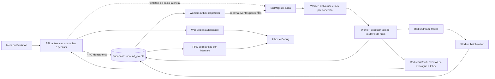

# Plano detalhado de implementação das cinco otimizações

## 1. Objetivo

Este documento é o contrato de execução para implementar e comprovar as cinco otimizações identificadas no SDR Flow:

1. unificar o processamento assíncrono no worker;
2. tornar a recepção de webhooks e a idempotência duráveis;
3. corrigir e otimizar o dashboard de métricas;
4. tornar a Inbox orientada a eventos e reduzir o bundle web;
5. reduzir a amplificação de escritas dos traces de execução.

O trabalho não estará concluído apenas porque o código compila. Cada etapa possui critérios de aceite, testes de falha, medições antes/depois e evidências que devem ser registradas pela IA implementadora.

## 2. Instruções obrigatórias para a IA implementadora

Antes de editar qualquer arquivo:

1. Ler integralmente `AGENTS.md`, `docs/PLAN.md`, `docs/IMPLEMENTATION.md`, `docs/MIGRATION.md` e este documento.
2. Executar `git status --short` e preservar todas as alterações preexistentes. No momento da criação deste plano já havia alterações do usuário em arquivos do frontend; elas não podem ser descartadas ou sobrescritas.
3. Não alterar `../auto-gen` nem `../sdr-engine`.
4. Manter Supabase Postgres como única persistência de negócio. Redis pode transportar trabalhos, locks e eventos efêmeros, mas o estado autoritativo deve terminar no Postgres.
5. Toda tabela de negócio nova deve conter `organization_id`, RLS, grants explícitos e FKs compostas quando referenciar entidades da organização.
6. Não criar fallback em memória para produção, não simular provedor disponível e não transformar falhas externas em sucesso.
7. Preservar versões publicadas imutáveis e sempre executar/retomar usando `flow_executions.flow_version_id`.
8. Não enfraquecer validação Zod, autenticação, RLS ou isolamento por organização para fazer testes passarem.
9. Criar migrações novas e aditivas. Não reescrever migrações já aplicadas.
10. Implementar uma fase por vez. Ao final de cada fase, executar seus testes direcionados e os gates globais antes de avançar.

### Regra de evidência

Para cada fase, a IA deve entregar:

- resumo dos arquivos alterados;
- decisões técnicas e alternativas rejeitadas;
- comandos executados com código de saída;
- contagem de testes aprovados/reprovados;
- métricas antes/depois quando aplicável;
- limitações que dependem de ambiente externo;
- qualquer risco residual;
- `git diff --check` sem erros.

É proibido declarar “pronto para produção” quando Supabase hospedado, Redis real e provedores reais não tiverem sido homologados. Nesse caso, declarar explicitamente “implementação local concluída; homologação externa pendente”.

## 3. Baseline conhecido

Antes desta implementação, foi medido:

- `pnpm db:types:check`: aprovado, 20 tabelas e 6 enums;
- `pnpm check`: aprovado;
- Vitest: 30 arquivos e 330 testes aprovados;
- bundle web: `1.127,69 kB` de JavaScript minificado e `330,13 kB` gzip;
- `apps/api/src/app.ts`: aproximadamente 3.049 linhas;
- `apps/api/src/webhook.ts`: aproximadamente 559 linhas;
- `apps/web/src/inbox/InboxPage.tsx`: aproximadamente 1.325 linhas;
- a Inbox consulta a lista a cada 5 segundos e o detalhe a cada 4 segundos;
- o trace aguarda uma inserção Supabase por nó executado;
- a API cria um consumidor para `sdr-inbound-debounce`;
- o worker separado consome `sdr-turns`, sem produtor encontrado para essa fila;
- o dashboard recebe `startDate` e `endDate`, mas o repositório ignora essas opções no cálculo atual;
- o caminho Supabase do dashboard carrega conversas para agregar em JavaScript e contém valor fixo de `4.2` para tempo médio de resposta;
- o `IdempotencyGate` usa memória local do processo.

A primeira tarefa da IA é repetir e registrar o baseline. Se os números mudaram, usar os números novos e explicar a diferença.

## 4. Arquitetura-alvo



### Princípios da arquitetura-alvo

- A API deve reconhecer rapidamente o webhook depois que o evento estiver durável no Postgres.
- A indisponibilidade do Redis não pode perder um evento já aceito.
- Apenas processos worker executam fluxos em produção.
- Trabalhos BullMQ carregam IDs e metadados mínimos; o payload autoritativo é lido do Postgres.
- Um retry pode repetir processamento interno, mas não pode criar uma segunda execução lógica para o mesmo turno.
- Eventos WebSocket não são a fonte de verdade. Reconexão sempre pode recuperar estado pela API.
- O trace ao vivo pode passar por Redis, mas o trace final deve estar persistido no Supabase.

## 5. Estratégia de entrega e ordem das fases

A ordem de implementação não é igual à ordem da lista original. A entrada durável precisa existir antes da mudança de consumidor para evitar perda de mensagens.

| Fase | Entrega | Dependência |
|---|---|---|
| 0 | Baseline, contratos e instrumentação | nenhuma |
| 1 | Entrada durável e idempotência | fase 0 |
| 2 | Topologia única de filas e execução no worker | fase 1 |
| 3 | Trace assíncrono e persistência em lote | fase 2 |
| 4 | Métricas corretas e agregadas no banco | fase 0 |
| 5 | Inbox em tempo real e code splitting | fases 2 e 3 para eventos completos |
| 6 | Homologação, rollout e remoção de compatibilidade | fases 1 a 5 |

As fases 4 e 5 podem ser desenvolvidas em paralelo após os contratos da fase 0, mas a integração final deve respeitar a tabela acima.

---

## 6. Fase 0 — Baseline, contratos e observabilidade

### 6.1 Objetivo

Criar uma referência reproduzível para provar que as mudanças melhoram o sistema e não apenas reorganizam código.

### 6.2 Trabalho técnico

1. Registrar versões de Node, pnpm, Postgres/PGlite, Redis e sistema operacional.
2. Executar:

   ```bash
   pnpm install --frozen-lockfile
   pnpm db:types:check
   pnpm check
   git diff --check
   ```

3. Registrar tamanho dos assets produzidos em `apps/web/dist/assets`.
4. Criar scripts reproduzíveis, sem dados reais de clientes:

   - `scripts/benchmark-turn-runtime.ts` para executar um fluxo determinístico com 10, 25 e 50 nós;
   - `scripts/benchmark-metrics.ts` para semear ou usar uma base descartável com 100 mil mensagens;
   - `scripts/check-bundle-budget.ts` para ler o manifest/arquivos do Vite e falhar quando o orçamento for ultrapassado.

5. Instrumentar, com Pino e sem conteúdo sensível:

   - `webhook.accept.duration_ms`;
   - `turn.queue.delay_ms`;
   - `turn.processing.duration_ms`;
   - `turn.superseded.total`;
   - `turn.retry.total`;
   - `trace.persist.duration_ms`;
   - `trace.batch.size`;
   - `metrics.query.duration_ms`;
   - `ws.clients` e `ws.reconnects` quando mensurável no servidor;
   - profundidade de cada fila real, usando os nomes canônicos.

6. Introduzir contratos versionados de job e evento em `@sdr/shared`, todos validados com Zod:

   - `ConversationTurnJobV1`;
   - `TraceEventV1`;
   - `RealtimeEventV1`;
   - campo obrigatório `schemaVersion: 1`;
   - IDs de organização, conexão, evento, conversa, execução e versão do fluxo conforme a etapa.

7. Não colocar tokens, credenciais, texto integral de mensagens ou grafo completo nos logs.

### 6.3 Testes

- contratos rejeitam UUIDs inválidos, versões desconhecidas e payloads extras;
- logs contêm correlation IDs, mas não contêm chaves, tokens ou credenciais;
- scripts de benchmark executam em base descartável e produzem JSON legível por máquina;
- o baseline não altera comportamento funcional.

### 6.4 Critério de aceite

- baseline salvo no relatório da implementação;
- benchmarks executáveis por comando documentado;
- contratos compartilhados usados, no mínimo, por um teste de API e um teste de worker;
- `pnpm db:types:check` e `pnpm check` verdes.

---

## 7. Fase 1 — Entrada durável e idempotência

### 7.1 Problema a resolver

O `IdempotencyGate` atual vive em um `Set` local. Ele é perdido em restart e não coordena réplicas. A restrição única em `messages` ajuda, mas a colisão acontece tarde e hoje pode transformar uma entrega duplicada em erro de processamento.

### 7.2 Modelo de dados

Criar a próxima migração disponível em `supabase/migrations/`, sem alterar migrações anteriores.

Criar `public.inbound_events` com, no mínimo:

- `id uuid primary key default gen_random_uuid()`;
- `organization_id uuid not null`;
- `connection_id uuid not null`;
- `provider public.connection_provider not null`;
- `provider_message_id text not null`;
- `conversation_key text not null` — derivada de organização, conexão e telefone normalizado, sem armazenar segredo;
- `normalized_payload jsonb not null` — somente os campos necessários para reprocessamento;
- `status text not null` com valores `received`, `processing`, `processed`, `failed`;
- `attempt_count integer not null default 0`;
- `available_at timestamptz not null default now()`;
- `processing_started_at timestamptz`;
- `processed_at timestamptz`;
- `last_error text` com mensagem sanitizada e limitada;
- `created_at` e `updated_at`.

Restrições obrigatórias:

- `unique (organization_id, connection_id, provider, provider_message_id)`;
- `unique (organization_id, id)` para permitir FKs compostas;
- FK composta `(organization_id, connection_id)` para `connections(organization_id, id)`;
- checks de status e contadores;
- índice para dispatcher em `(status, available_at, created_at)` com filtro para `received` e `failed`;
- índice por `(organization_id, connection_id, created_at desc)`.

Segurança obrigatória:

- habilitar RLS;
- revogar grants implícitos de `anon` e `authenticated`;
- acesso de escrita somente por funções `security definer` cuidadosamente limitadas ou `service_role`;
- nunca expor `normalized_payload` em endpoints de usuário comuns;
- funções SQL com `set search_path = ''` e referências qualificadas.

### 7.3 RPC de aceitação

Criar uma RPC idempotente `public.accept_inbound_event`, exposta pelo PostgREST somente ao `service_role` por grants restritos, que:

1. confirme que a conexão pertence à organização informada;
2. faça `insert ... on conflict do nothing` em `inbound_events`;
3. retorne `event_id`, `is_new` e `status`;
4. nunca substitua o payload de um evento já existente;
5. seja segura sob duas transações concorrentes;
6. não execute LLM, WhatsApp ou calendário dentro da transação.

### 7.4 Refatoração da API

1. Separar parsing/autenticação HTTP da execução do fluxo.
2. Manter os parsers de Evolution e Meta puros e cobertos por teste.
3. Normalizar todos os IDs e telefones antes da chamada da RPC.
4. Persistir o evento antes de tentar Redis.
5. Responder:

   - `202` para evento novo persistido;
   - `200` ou `202` para duplicata conhecida, retornando estado idempotente;
   - `400` para payload inválido;
   - `401/403` para assinatura/segredo inválido;
   - `503` somente quando o evento não pôde ser persistido no Postgres.

6. Remover o `IdempotencyGate` do caminho de produção ao final da fase. Ele não deve continuar como segunda fonte de verdade.
7. Alterar `ConversationRepository.saveMessage` para inserção idempotente por `provider_message_id`:

   - conflito retorna a mensagem existente ou um resultado explícito `created: false`;
   - duplicata não lança erro genérico;
   - `last_message_at` só avança, nunca retrocede;
   - mensagem e atualização de `last_message_at` devem ser atômicas via RPC ou trigger.

8. Resolver a corrida `select` seguido de `insert` em `findOrCreateLead`. Usar upsert/RPC apoiado no índice único `(organization_id, connection_id, phone)`.

### 7.5 Idempotência da execução

Adicionar `idempotency_key` ou um identificador de turno equivalente a `flow_executions`, com unicidade por organização. Para um lote, gerar a chave a partir de:

- versão do contrato;
- organização;
- conexão;
- IDs ordenados dos `inbound_events` incluídos;
- `flow_version_id` selecionado.

O retry deve recuperar a execução já criada. Não deve criar outra execução nem reenviar automaticamente efeitos externos já confirmados.

Para ações externas, registrar uma chave de efeito estável composta por `execution_id`, `node_id`, `sequence` e tipo de efeito. Se o provedor oferecer idempotency key, repassá-la. Se não oferecer, documentar que exatamente-uma-vez não pode ser garantido após falha entre a confirmação externa e a persistência local; o sistema deve ao menos detectar e sinalizar o estado ambíguo, nunca marcá-lo silenciosamente como sucesso.

### 7.6 Testes obrigatórios

Criar ou ampliar testes para provar:

1. o mesmo evento enviado 100 vezes em paralelo cria um único `inbound_event`;
2. o mesmo `provider_message_id` em conexões diferentes não colide;
3. duas réplicas simuladas recebem a mesma mensagem e só uma execução lógica é criada;
4. restart entre persistência e enqueue não perde o evento;
5. Redis indisponível depois da persistência mantém status recuperável;
6. duplicata não atualiza `last_message_at` para trás;
7. payload inválido não cria registro;
8. usuário de outra organização não consegue ler o evento por RLS;
9. FKs compostas rejeitam conexão de outra organização;
10. erro real de banco continua retornando falha, não sucesso simulado.

Arquivos de teste sugeridos:

- `tests/inbound-events.test.ts`;
- `tests/webhook-idempotency.test.ts`;
- ampliar `tests/webhook-api.test.ts`;
- ampliar `tests/database.test.ts` e `tests/auth-isolation.test.ts`.

### 7.7 Critérios de aceite

- zero dependência do `Set` em memória para idempotência de produção;
- duplicatas concorrentes resultam em um evento, uma mensagem e uma execução lógica;
- evento aceito permanece recuperável após indisponibilidade do Redis;
- tipos de banco regenerados e verificados;
- todos os testes da fase e gates globais verdes.

### 7.8 Rollback

A migração é aditiva. Durante rollout, manter uma flag temporária `DURABLE_INBOUND_ENABLED`. O rollback do aplicativo volta ao caminho anterior sem remover tabela ou dados. Nunca fazer downgrade destrutivo automático da migração.

---

## 8. Fase 2 — Topologia única de filas e execução no worker

### 8.1 Problema a resolver

Hoje a API cria um `Worker` para `sdr-inbound-debounce`, enquanto `apps/worker` consome `sdr-turns`. A separação pretendida entre API sem estado e worker não está efetivada.

### 8.2 Organização recomendada

Criar um pacote `packages/runtime` para a orquestração que hoje está acoplada a `apps/api/src/webhook.ts`.

Estrutura sugerida:

```text
packages/runtime/
  package.json
  tsconfig.json
  src/
    index.ts
    events/event-publisher.ts
    inbound/inbound-event-repository.ts
    turns/contracts.ts
    turns/redis-buffer.ts
    turns/turn-producer.ts
    turns/turn-processor.ts
    turns/runtime-services.ts
```

Dependências permitidas de `@sdr/runtime`:

- `@sdr/shared`;
- `@sdr/flow`;
- `@sdr/db`;
- BullMQ/ioredis quando necessário.

`@sdr/flow` deve continuar independente de Express e das rotas da API. `apps/worker` e `apps/api` dependem de `@sdr/runtime`; o inverso é proibido.

### 8.3 Fila canônica

1. Usar `queueNames.turns` como fila canônica de turnos.
2. Remover `queueNames.inboundDebounce` depois do período de compatibilidade.
3. Um trabalho deve carregar apenas:

   - `schemaVersion`;
   - `conversationKey`;
   - `generation`;
   - IDs dos `inbound_events` ou ID de lote;
   - metadados mínimos de correlação.

4. Usar `jobId` determinístico para deduplicação do BullMQ.
5. Manter o snapshot da versão publicada escolhido para o turno. A versão não pode mudar durante a janela de debounce.
6. Fazer o dispatcher de outbox varrer `inbound_events` pendentes e enfileirar novamente trabalhos ausentes. O processo deve ser idempotente.

### 8.4 Debounce e locks

1. Preservar a semântica atual de geração: cada mensagem incrementa a geração e adia a execução.
2. Usar `conversationKey` baseada em organização, conexão e telefone normalizado até a conversa existir.
3. O lote deve ordenar eventos de forma determinística por `created_at`, com desempate por `id`.
4. Eventos superados não executam efeitos externos.
5. O lock por conversa precisa de renovação periódica. O TTL fixo atual de cinco minutos pode expirar durante fluxos longos.
6. Renovar o lock somente se o token ainda pertencer ao worker atual; liberar com compare-and-delete.
7. Ao perder o lock, interromper antes do próximo efeito externo e deixar o trabalho falhar para retry.
8. Tornar concorrência configurável por `TURN_WORKER_CONCURRENCY`, com default conservador `5`.

### 8.5 Mover a execução

Extrair de `processInboundWebhook` para `TurnProcessor`:

- carregamento da conexão e agente;
- seleção da versão publicada;
- criação/recuperação de lead e conversa;
- tratamento de `fromMe`, eco e takeover;
- criação/recuperação de `flow_execution`;
- montagem de `FlowContext` e `FlowServices`;
- chamada de `executeFlow`;
- finalização da execução;
- atualização do status dos `inbound_events`.

A API fica responsável somente por:

- autenticar o webhook;
- normalizar payload;
- persistir a entrada;
- tentar enfileirar para baixa latência;
- responder ao provedor.

Em produção, `createApp` não pode instanciar `Worker`. O modo standalone pode manter execução inline apenas fora de produção e sem fallback silencioso.

### 8.6 Eventos entre worker e API

Criar interface `ExecutionEventPublisher` no runtime:

- adaptador Redis no worker publica eventos versionados;
- API assina o canal e repassa eventos autorizados ao WebSocket;
- testes usam adaptador em memória somente como test double explícito;
- indisponibilidade do canal não muda uma execução bem-sucedida para falsa falha, mas deve gerar log/alerta;
- o banco continua sendo fonte de recuperação do estado final.

Se o debug one-shot continuar dependendo de estado em memória da API, migrar seu registro para Redis com TTL ou persistência apropriada. Não exigir sticky session como condição oculta.

### 8.7 Saúde e observabilidade

- health da API verifica apenas dependências necessárias para aceitar tráfego;
- health do worker verifica Redis e acesso mínimo ao Supabase;
- readiness deve falhar quando o worker não consegue consumir `sdr-turns`;
- alerta de backlog deve consultar a fila real e passar `waiting`, `delayed`, `active` e `failed`;
- registrar `jobId`, `eventId`, `conversationKey`, `executionId` e tentativa, sem conteúdo da mensagem.

### 8.8 Testes obrigatórios

1. busca estática/teste arquitetural comprova que `new Worker(...)` não existe em `apps/api`;
2. produtor e consumidor usam exatamente `queueNames.turns`;
3. API responde após persistência sem aguardar LLM;
4. fluxo só executa no processo worker em configuração de produção;
5. dez mensagens na janela viram um único turno com ordem correta;
6. mensagem posterior torna trabalho anterior `superseded` antes de efeitos externos;
7. dois workers não processam a mesma conversa simultaneamente;
8. lock é renovado durante uma execução maior que o TTL inicial;
9. kill/restart do worker recupera trabalho sem perder evento;
10. Redis indisponível gera backlog durável no Postgres e é drenado após recuperação;
11. versão publicada alterada durante o debounce não troca o `flow_version_id` capturado;
12. shutdown espera trabalhos ativos ou os devolve com segurança à fila.

Arquivos sugeridos:

- `tests/turn-producer.test.ts`;
- `tests/turn-worker.test.ts`;
- `tests/turn-recovery.test.ts`;
- ampliar `tests/conversation-turn-queue.test.ts`;
- ampliar `tests/production-readiness.test.ts`.

Adicionar Redis real como service container no CI para os testes de integração que não podem ser validados por mock. Testes unitários podem continuar usando doubles explícitos.

### 8.9 Critérios de aceite

- API não contém consumidor BullMQ em produção;
- existe um produtor e um consumidor comprovados para a fila canônica;
- reinício de API não interrompe processamento já enfileirado;
- reinício de worker recupera trabalhos;
- backlog e tentativas são observáveis;
- nenhuma versão de fluxo é trocada no meio de um turno;
- todos os gates verdes.

### 8.10 Rollout e rollback

Ordem de deploy:

1. migração e tipos;
2. worker capaz de ler trabalhos V1;
3. API produzindo V1;
4. monitorar fila antiga até zerar;
5. remover consumidor antigo e nome legado em entrega posterior.

Usar temporariamente `TURN_PROCESSING_MODE=api|worker` somente para rollout. Em produção final, aceitar apenas `worker`; valor inválido deve impedir startup.

---

## 9. Fase 3 — Trace assíncrono com persistência em lote

### 9.1 Problema a resolver

`executeFlow` aguarda `onStepComplete`, e o hook atual executa um `insert().select().single()` para cada nó. O custo cresce linearmente com o número de nós e adiciona latência de rede do Supabase ao caminho crítico.

### 9.2 Solução recomendada

1. Manter `executeFlow` agnóstico de persistência.
2. Criar `TraceSink` com métodos:

   - `append(step)`;
   - `flush(executionId)`;
   - `close()`.

3. Implementar produção sobre Redis Stream, por exemplo `sdr:execution-traces:v1`.
4. Cada evento carrega `organizationId`, `executionId`, `nodeId`, `sequence`, tempos, erro e payloads já sanitizados.
5. Criar consumer group no worker para acumular lotes por quantidade ou janela curta.
6. Inserir lotes no Supabase com um único request e conflito idempotente em `(execution_id, sequence)`.
7. Remover `.select().single()` da gravação de passos quando o retorno não for usado.
8. Só confirmar (`XACK`) o stream depois de persistência bem-sucedida.
9. Recuperar mensagens pendentes de consumidor morto com claim após timeout.
10. `flush` da execução aguarda que todos os passos até a sequência final estejam persistidos antes de considerar o trace completo.

Não usar buffer exclusivamente em memória. Redis é transporte durável temporário; Supabase é o destino autoritativo.

### 9.3 Consistência

- preservar a ordem por `sequence`;
- duplicata deve ser ignorada ou atualizar exatamente a mesma linha, nunca criar outra;
- `flow_executions` só recebe estado terminal depois que o resultado do runtime foi obtido;
- adicionar campo/estado de completude do trace se necessário, por exemplo `trace_status = pending|complete|failed`;
- replay não pode usar trace `pending` como se estivesse completo;
- WebSocket pode publicar imediatamente e não precisa esperar persistência do lote.

### 9.4 Testes obrigatórios

1. fluxo de 50 nós gera exatamente 50 linhas, sequências 1–50;
2. eventos repetidos não duplicam passos;
3. ordem de chegada fora de ordem é persistida e lida por `sequence`;
4. falha no Supabase não confirma o stream;
5. restart do trace writer recupera pendências;
6. falha no último nó ainda persiste passos anteriores e o erro final;
7. replay rejeita ou sinaliza trace incompleto;
8. payload acima do limite definido é truncado/sumarizado com marcador, não derruba o worker;
9. execução de 50 nós usa no máximo três requests de escrita de lote ao Supabase em condições normais;
10. medir p50/p95 do runtime antes/depois com executor determinístico, sem contar latência de LLM.

### 9.5 Metas mensuráveis

- reduzir requests Supabase de trace de `N` para no máximo `ceil(N / batchSize)`;
- batch default entre 20 e 50 passos, configurável e limitado;
- reduzir em pelo menos 50% a sobrecarga de persistência no benchmark de 50 nós;
- nenhuma perda após restart controlado do trace writer;
- memória do consumidor limitada mesmo com backlog.

Se a meta de desempenho não for alcançada, não mascarar ajustando apenas o benchmark; apresentar perfil e gargalo restante.

### 9.6 Critério de aceite

- trace completo e ordenado no Postgres;
- caminho crítico não aguarda uma chamada Supabase por nó;
- recuperação de pendências comprovada;
- replay e debug continuam funcionais;
- todos os gates verdes.

---

## 10. Fase 4 — Métricas corretas, filtráveis e agregadas no banco

### 10.1 Problemas a resolver

- intervalo recebido pela API não influencia os cálculos atuais;
- caminho Supabase carrega conversas e agrega em JavaScript;
- tempo médio de primeira resposta contém valor fixo;
- aliases legados `QUALIFIED` e `HANDOFF` aparecem em consultas apesar do enum canônico usar `PRESENTING_SOLUTION` e `HUMAN_HANDOFF`;
- rollup diário existe, mas ainda não é a fonte consistente do dashboard.

### 10.2 Definir semântica antes de codificar

Documentar e testar a definição de cada KPI:

- intervalo inclusivo em `startDate` e exclusivo no dia seguinte a `endDate`, calculado em UTC;
- `totalConversations`: conversas criadas no intervalo;
- `newConversations`: igual ao total criado no intervalo, salvo definição futura diferente;
- `qualifiedConversations`: conversas do intervalo cujo estágio atual pertence a `PRESENTING_SOLUTION`, `NEGOTIATING` ou `CONVERTED`;
- `handoffConversations`: conversas do intervalo em `HUMAN_HANDOFF` ou atendidas por humano;
- FRT: diferença entre primeira mensagem inbound e primeira outbound posterior, para conversas iniciadas no intervalo;
- tokens/custo: execuções criadas no intervalo;
- tendências: bucket diário UTC;
- comparação de fluxo: agrupamento por `flow_version_id`, sem multiplicação cartesiana entre conversas e execuções.

Observação: sem histórico de transição de estágio, a data exata da qualificação não pode ser reconstruída com precisão. Não inventar essa métrica. Se o produto exigir “qualificados no dia”, criar tabela/evento de transição de estágio como escopo explícito.

### 10.3 Implementação SQL

1. Criar RPC `get_dashboard_metrics(p_org, p_start_date, p_end_date)` retornando JSON tipado ou conjunto estável de linhas.
2. Validar que o período é válido e possui no máximo 366 dias.
3. Fazer agregações no Postgres.
4. Usar `metrics_daily` para tendências e totais históricos quando os rollups estiverem completos.
5. Para o dia corrente, combinar rollup com delta atual ou recalcular o dia de forma explícita.
6. Corrigir comparação de versões para agregar conversas e execuções em CTEs separadas antes do join; isso evita multiplicar tokens por quantidade de conversas.
7. Remover valores fixos e caminhos de retorno parcial silencioso.
8. Adicionar índices, após validar com `EXPLAIN (ANALYZE, BUFFERS)`:

   - `conversations(organization_id, created_at, flow_version_id)`;
   - `flow_executions(organization_id, created_at, flow_version_id)`;
   - índice de mensagens adequado a organização, direção, conversa e tempo;
   - manter índices existentes que o plano demonstrar necessários.

9. Evitar aplicar função sobre a coluna temporal no predicado principal. Preferir limites `>= timestamp` e `< timestamp`, permitindo uso de índice.
10. Agendar rollup no worker de manutenção; o endpoint manual pode permanecer administrativo, não como requisito do dashboard.

### 10.4 Repositório e API

1. Tipar `MetricsRepository` sem `db: any`.
2. Consumir a RPC no caminho Supabase.
3. Fazer o caminho PGlite produzir exatamente o mesmo contrato e semântica para testes.
4. Validar query params com Zod na rota:

   - formato `YYYY-MM-DD`;
   - `startDate <= endDate`;
   - máximo de 366 dias;
   - defaults explícitos, por exemplo últimos 30 dias.

5. Nunca retornar `4.2`, zero ou lista vazia como substituto silencioso de uma consulta que falhou.
6. Erro de RPC deve resultar em erro observável e resposta adequada, não dashboard falso.

### 10.5 Testes obrigatórios

1. intervalo exclui dados antes/depois das datas;
2. bordas de meia-noite UTC não mudam com timezone do processo;
3. todos os oito estágios canônicos aparecem no funil, inclusive com zero;
4. aliases legados são normalizados na entrada, não consultados como valores impossíveis do enum;
5. FRT é calculado a partir das mensagens e nunca é fixo;
6. conversa sem resposta não contamina FRT;
7. tokens não são multiplicados pelo join de versões;
8. organização A não vê métricas da B;
9. intervalo inválido retorna 400;
10. 100 mil mensagens retornam o dashboard dentro da meta;
11. PGlite e Supabase/RPC produzem o mesmo JSON para o mesmo fixture;
12. rollup repetido é idempotente.

### 10.6 Meta de desempenho

Em staging com 100 mil mensagens e índices aquecidos:

- p95 do endpoint `/metrics/dashboard` abaixo de 500 ms;
- payload abaixo de 100 kB;
- nenhuma transferência de todas as conversas para Node;
- registrar plano SQL antes/depois e buffers lidos;
- ausência de crescimento linear no heap da API conforme aumenta o histórico.

O tempo deve ser medido no mesmo ambiente e conjunto de dados. Se staging não estiver disponível, registrar resultado PGlite/local separadamente e manter homologação pendente.

### 10.7 Critério de aceite

- datas alteram comprovadamente o resultado;
- nenhuma constante simulada permanece;
- semântica canônica documentada e testada;
- agregação ocorre no Postgres/RPC;
- benchmark atende à meta ou possui desvio formalmente justificado;
- todos os gates verdes.

---

## 11. Fase 5 — Inbox orientada a eventos e bundle menor

### 11.1 Contrato de eventos em tempo real

Ampliar o contrato compartilhado com eventos versionados:

- `inbox:conversation.created`;
- `inbox:conversation.updated`;
- `inbox:message.created`;
- `inbox:message.updated`, somente se houver edição real;
- `execution:started`, `step:*` e `execution:completed` já existentes;
- `system:resync_required` para indicar que o cliente deve refazer snapshot.

Todo evento deve conter:

- `schemaVersion`;
- `eventId` único;
- `organizationId`;
- `connectionId` quando aplicável;
- `conversationId` quando aplicável;
- `occurredAt`;
- `payload` mínimo e validado.

### 11.2 Autorização WebSocket

1. Permitir inscrição por organização para a Inbox.
2. Verificar membership ativa e papel no servidor antes de aceitar a inscrição.
3. Nunca confiar no `organizationId` enviado pelo cliente sem validação.
4. Continuar filtrando eventos no servidor por organização e escopos mais específicos.
5. Testar troca de organização, desconexão, expiração de sessão e tentativa cross-tenant.
6. Evitar registrar token de acesso em logs. Se possível, substituir token na URL por ticket WebSocket curto ou autenticação na primeira mensagem; tratar isso como hardening associado, sem bloquear a entrega principal.

### 11.3 Estado da Inbox

Extrair a atualização de estado para funções/reducer puros e testáveis:

- upsert de conversa por ID;
- ordenação por `last_message_at`;
- aplicação dos filtros atuais;
- inclusão de mensagem sem duplicar `eventId` ou ID de mensagem;
- preservação da seleção atual;
- remoção/atualização segura quando conversa deixa de atender ao filtro.

Fluxo do cliente:

1. carregar snapshot inicial via REST;
2. abrir WebSocket e assinar organização/conexão;
3. aplicar deltas recebidos;
4. ao reconectar, refazer snapshot para cobrir intervalo perdido;
5. usar backoff exponencial com jitter e limite;
6. manter polling somente como fallback após conexão indisponível por período definido, por exemplo 10 segundos;
7. fallback deve usar frequência reduzida, por exemplo 30 segundos, não 4/5 segundos;
8. ao voltar para WebSocket, cancelar timers de polling;
9. abortar fetch anterior quando filtros ou busca mudarem;
10. aplicar debounce de 250–400 ms na busca textual.

O painel de debug não deve simultaneamente fazer polling a cada 1,2 s e recarregar toda a sessão para cada frame. Eventos devem atualizar o estado incrementalmente; snapshot é usado na abertura e recuperação.

### 11.4 Code splitting

1. Substituir imports síncronos das páginas por `React.lazy` e `Suspense`:

   - Builder;
   - Inbox;
   - Dashboard;
   - Knowledge;
   - Connections;
   - Integrations;
   - Admin;
   - Agents;
   - Settings.

2. Manter shell, autenticação e navegação no chunk inicial.
3. Configurar chunks manuais somente onde a medição justificar, por exemplo:

   - React/router;
   - React Flow/Dagre;
   - Recharts;
   - Supabase/Zod.

4. Não criar um único chunk `vendor` gigante que apenas mova o problema.
5. Prefetch opcional apenas após idle ou intenção de navegação.
6. Adicionar estados de loading acessíveis, sem layout shift excessivo.
7. Preservar deep links e refresh direto em cada rota.

### 11.5 Orçamento de bundle

Adicionar gate automatizado após `vite build`:

- JavaScript inicial gzip: alvo máximo de 180 kB;
- nenhum chunk de rota gzip acima de 250 kB sem justificativa registrada;
- falhar CI se houver regressão superior a 10% em relação ao baseline aprovado;
- registrar tabela de chunks antes/depois.

Se dependências obrigatórias impedirem a meta, a IA deve apresentar análise por pacote e propor novo limite fundamentado, não apenas aumentar `chunkSizeWarningLimit`.

### 11.6 Testes obrigatórios

1. evento de nova mensagem atualiza conversa e detalhe sem novo polling;
2. evento duplicado não duplica mensagem;
3. evento de outra organização é rejeitado no servidor e ignorado no cliente;
4. reconexão refaz snapshot e recupera evento perdido;
5. fallback começa somente após falha e para após reconexão;
6. troca rápida de filtros não deixa resposta antiga sobrescrever a nova;
7. busca dispara uma requisição após debounce;
8. debug atualiza incrementalmente;
9. todas as rotas carregam por acesso direto;
10. falha de chunk apresenta estado recuperável;
11. teste de build verifica orçamento;
12. teste de navegador confirma Inbox, Builder, Dashboard e navegação.

### 11.7 Verificação manual obrigatória no navegador

Registrar evidência dos seguintes passos:

1. abrir Inbox com WebSocket conectado;
2. inserir uma mensagem de teste e confirmar aparição sem refresh;
3. observar Network por pelo menos 60 segundos e confirmar ausência de polling de 4/5 segundos;
4. derrubar WebSocket e confirmar ativação do fallback;
5. restaurar WebSocket e confirmar cancelamento do fallback;
6. abrir debug e acompanhar passos ao vivo;
7. navegar para Builder, Dashboard e Knowledge e confirmar chunks sob demanda;
8. recarregar diretamente cada rota;
9. verificar console sem erros e sem vazamento de tokens;
10. repetir em viewport desktop e móvel suportado.

### 11.8 Critério de aceite

- Inbox atualiza normalmente sem polling contínuo;
- recuperação funciona após desconexão;
- isolamento multi-tenant do socket está testado;
- bundle inicial atende ao orçamento acordado;
- rotas continuam funcionais por deep link;
- evidência de navegador anexada;
- todos os gates verdes.

---

## 12. Fase 6 — Homologação integrada e rollout

### 12.1 Matriz mínima de ambientes

| Ambiente | Banco | Redis | Provedores | Objetivo |
|---|---|---|---|---|
| unitário | doubles explícitos | doubles explícitos | HTTP simulado | regras isoladas |
| integração local | PGlite | Redis real em container | HTTP simulado | concorrência, filas e persistência |
| staging | Supabase hospedado | Redis persistente | OpenAI e sandbox/test numbers | latência e recuperação reais |
| produção canário | Supabase produção | Redis produção | conexões autorizadas | validação com baixo volume |

### 12.2 Cenários de caos obrigatórios

1. Redis cai depois de o Postgres aceitar o webhook;
2. worker cai durante debounce;
3. worker cai depois de chamar LLM e antes de finalizar execução;
4. API reinicia com trabalhos ativos;
5. trace writer cai com stream pendente;
6. Supabase fica lento/intermitente;
7. duas réplicas processam mensagens da mesma conversa;
8. publicação de nova versão ocorre durante debounce;
9. WebSocket cai e volta;
10. provedor entrega webhook duplicado e fora de ordem.

Para cada cenário, registrar estado final de `inbound_events`, `messages`, `flow_executions`, `flow_execution_steps`, fila e resposta externa.

### 12.3 Ordem de rollout

1. aplicar migrações aditivas;
2. executar `pnpm db:types` e confirmar diff esperado;
3. subir worker compatível com jobs antigos e novos;
4. subir API com entrada durável ativada para organização interna;
5. observar métricas por pelo menos uma janela operacional;
6. ativar execução exclusiva no worker;
7. ativar trace assíncrono;
8. ativar RPC de métricas;
9. publicar frontend realtime/code-split;
10. expandir canário gradualmente;
11. remover caminhos legados apenas após filas antigas zerarem e período de rollback encerrar.

### 12.4 Condições de rollback

Rollback imediato se ocorrer:

- perda de evento aceito;
- duplicação de mensagem externa acima do baseline;
- violação de organização/RLS;
- troca indevida de `flow_version_id`;
- trace inconsistente usado em replay;
- p95 da API ou fila significativamente pior sem explicação;
- crescimento descontrolado de backlog ou memória.

Rollback de aplicativo não apaga tabelas ou colunas novas. Dados capturados durante o canário devem ser preservados para diagnóstico.

---

## 13. Gates finais obrigatórios

A IA só pode declarar implementação concluída quando todos os itens aplicáveis estiverem comprovados.

### 13.1 Gates automatizados

```bash
pnpm db:types:check
pnpm typecheck
pnpm test
pnpm build
pnpm check
git diff --check
docker compose config --quiet
```

Também executar:

- testes direcionados de cada fase;
- integração com Redis real;
- benchmark de runtime;
- benchmark de métricas com 100 mil mensagens;
- verificação automatizada do orçamento do bundle.

### 13.2 Gates funcionais

- publicar e executar um fluxo em modo teste;
- confirmar retomada com o mesmo `flow_version_id`;
- receber mensagem duplicada e provar execução única;
- desligar Redis, aceitar evento, religar e provar recuperação;
- acompanhar trace em tempo real e comparar com Postgres;
- validar Dashboard em dois intervalos com resultados diferentes e conferidos por SQL;
- validar Inbox sem polling normal;
- provar RLS com duas organizações;
- confirmar que nenhum envio real ocorre quando `WHATSAPP_SEND_ENABLED=false`.

### 13.3 Gates de desempenho

| Métrica | Baseline | Meta |
|---|---:|---:|
| JS inicial gzip | ~330,13 kB | <= 180 kB ou limite justificado por análise |
| polling normal da Inbox | lista 5 s / detalhe 4 s | zero; somente fallback >= 30 s |
| writes Supabase de trace | 1 por nó | lotes de 20–50; <= 3 para 50 nós |
| dashboard com 100 mil mensagens | medir na fase 0 | p95 < 500 ms em staging |
| duplicatas concorrentes | proteção local por processo | 1 evento, 1 mensagem, 1 execução lógica |
| webhook aceito durante falha Redis | risco de perda/fallback | evento durável e recuperado |

### 13.4 Gates de segurança

- RLS e FKs compostas testadas nas tabelas novas;
- nenhuma credencial em payload de job, evento WebSocket ou log;
- assinatura dos webhooks continua obrigatória;
- assinatura/escopo de WebSocket testado contra acesso cross-tenant;
- service role permanece apenas no servidor;
- sem endpoints de debug públicos em produção.

---

## 14. Checklist final para revisão da implementação

### Código e arquitetura

- [ ] API não instancia BullMQ Worker em produção.
- [ ] `sdr-turns` possui produtor e consumidor reais.
- [ ] Jobs e eventos têm schema versionado e validação Zod.
- [ ] Evento é persistido antes do enqueue.
- [ ] Dispatcher recupera eventos não enfileirados.
- [ ] Locks por conversa são renovados e liberados com token.
- [ ] Versão do fluxo é imutável durante debounce e retry.
- [ ] Idempotência não depende de memória local.
- [ ] Trace não faz request Supabase síncrono por nó.
- [ ] Dashboard não agrega corpus inteiro em Node.
- [ ] Datas do dashboard são respeitadas.
- [ ] Inbox não faz polling contínuo quando WebSocket está saudável.
- [ ] Rotas principais são carregadas sob demanda.

### Banco e isolamento

- [ ] Migração é aditiva.
- [ ] Toda nova tabela possui `organization_id`.
- [ ] RLS está habilitada e testada.
- [ ] Grants são mínimos e explícitos.
- [ ] Referências cross-tenant são bloqueadas por FK composta.
- [ ] Índices foram justificados com plano de consulta.
- [ ] Tipos gerados estão sincronizados.

### Testes e evidência

- [ ] Baseline antes/depois registrado.
- [ ] Concorrência e duplicatas testadas.
- [ ] Crash/restart testado.
- [ ] Redis indisponível testado.
- [ ] 100 mil mensagens testadas.
- [ ] Browser verificado.
- [ ] Bundle budget verificado no CI.
- [ ] `pnpm db:types:check` aprovado.
- [ ] `pnpm check` aprovado.
- [ ] `docker compose config --quiet` aprovado.
- [ ] Homologação externa distinguida de testes simulados.

## 15. Formato obrigatório da resposta final da IA implementadora

A IA que executar este plano deve responder no seguinte formato:

1. **Resultado:** fases efetivamente concluídas.
2. **Arquivos alterados:** agrupados por fase.
3. **Migrações:** nome, tabelas, funções, RLS, índices e compatibilidade.
4. **Testes:** comandos, contagem e resultado.
5. **Benchmarks:** ambiente, dataset, antes, depois e variação percentual.
6. **Verificação no navegador:** cenários e resultado.
7. **Homologação externa:** executada ou pendente, sem ambiguidade.
8. **Riscos residuais:** principalmente efeitos externos sem idempotency key do provedor.
9. **Rollback:** flag/versão para retorno e dados que devem ser preservados.
10. **Pendências:** somente itens que realmente não puderam ser executados, acompanhados do motivo e próximo passo concreto.

Uma afirmação sem comando, teste, consulta de banco, captura de navegador ou métrica correspondente não conta como evidência de conclusão.
