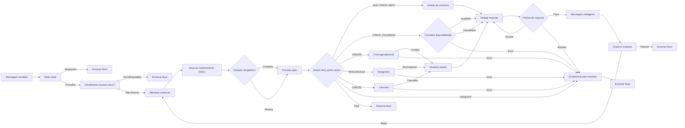

# 📘 Playbook Oficial: Construtores de Fluxo do SDR Flow

> **Guia definitivo de arquitetura, nós, lógica de execução, variáveis e regras de validação da plataforma SDR Flow.**

---

## 🧭 1. Visão Geral da Arquitetura de Fluxos

O **SDR Flow** é uma plataforma visual orientada a grafos direcionados para automação inteligente de atendimento comercial via WhatsApp. Cada fluxo desenhado no Canvas representa o **ciclo de vida de processamento de uma interação** entre um cliente em potencial (lead) e a inteligência artificial.

### Como o Motor de Execução Funciona:
1. **Entrada do Evento:** Uma mensagem do WhatsApp chega através da Evolution API e dispara o gatilho (`trigger.message_received`).
2. **Navegação Nó a Nó:** O motor de fluxo (`FlowEngine`) percorre as conexões (*edges*) a partir do nó inicial, avaliando as saídas (*ports*) de cada nó.
3. **Injeção de Contexto Cumulativo:** Cada nó executado pode injetar variáveis no contexto global (`FlowContext.variables`), enriquecendo a tomada de decisão dos nós seguintes.
4. **Proteção Contra Loops Infinitos:** O motor possui limites estritos por execução (máximo de 5 visitas por nó e 50 passos no total).
5. **Garantia de Término:** Todo ramo do fluxo deve obrigatoriamente convergir para um nó de encerramento (`output.end`) ou suspensão controlada (`flow.wait_reply`).

---

## 🧩 2. Catálogo Completo dos Construtores (Nós)

O catálogo atual possui **44 tipos de nó**, divididos em **10 categorias fundamentais**:

```
[ Gatilhos ] ─► [ Guardas ] ─► [ Entrada ] ─► [ Contexto ] ─► [ Inteligência ] ─► [ Controle ] ─► [ Ações ] ─► [ Integrações ] ─► [ Agenda ] ─► [ Saídas ]
```

---

### 🟢 2.1. Gatilhos (`trigger.*`)
*Ponto de entrada obrigatório de qualquer fluxo.*

#### 1. Mensagem Recebida (`trigger.message_received`)
- **O que faz:** Dispara automaticamente no instante em que um lead envia uma mensagem de texto, áudio ou imagem no WhatsApp.
- **Lógica por trás:** Captura o remetente, número de telefone, texto original da mensagem e o ID da conexão do WhatsApp.
- **Portas de saída:** `next` (única).
- **Regra:** Todo fluxo deve conter **exatamente um** nó de gatilho.

#### 2. Agendamento (`trigger.schedule`)
- **O que faz:** Dispara o fluxo em intervalos regulares com base em uma expressão Cron (ex: `0 9 * * 1-5` para dias úteis às 09:00).
- **Lógica por trás:** Ideal para disparos ativos de reengajamento, follow-ups de leads inativos ou lembretes comerciais.
- **Portas de saída:** `next`.

#### 3. Início Manual (`trigger.manual`)
- **O que faz:** Permite que um atendente humano inicie manualmente um fluxo específico diretamente da tela de Inbox ou CRM para um lead selecionado.
- **Portas de saída:** `next`.

---

### 🟡 2.2. Guardas e Regras de Segurança (`guard.*`)
*Filtram e protegem o fluxo antes de gastar tokens de IA ou acionar ações comerciais.*

#### 4. Filtro de Conexão / Gate de Mensagens Recebidas (`guard.test_mode`)
- **O que faz:** Funciona como um **portão de permissão de segurança** posicionado logo após o recebimento da mensagem (`trigger.message_received`). Controla de forma estrita quais remetentes têm permissão para avançar no fluxo da IA.
- **Lógica por trás:**
  - **Múltiplos Contatos:** Valida o número do remetente contra a lista `allowedPhones`. Suporta múltiplos números e realiza normalização inteligente de formatos brasileiros (DDI `55`, DDD e 9º dígito).
  - **Múltiplos Grupos:** Detecta se a mensagem partiu de um grupo de WhatsApp (`@g.us`, `isGroup: true`) e valida contra a lista de grupos autorizados (`allowedGroups`), comparando tanto JIDs completos quanto IDs limpos.
  - **Interrupção Silenciosa ("Morre no Filtro"):** Se o remetente (contato ou grupo) não estiver nas listas de liberação, a execução é interrompida na saída `blocked`. A mensagem "morre" no filtro: nenhuma resposta é gerada, nenhum token de IA é gasto e os blocos seguintes não são executados.
  - **Interface Zero Code:** No construtor visual, inputs de texto cru foram substituídos por **chips/tags visuais** com botão de exclusão (`X`) e um dropdown integrado que busca contatos e grupos em tempo real direto da instância conectada na Evolution API.
- **Configurações:**
  - `enabled` (`boolean`): Ativa ou desativa o filtro (quando desativado, qualquer remetente passa livremente).
  - `allowedPhones` (`string[]`): Lista de telefones de teste/contatos autorizados.
  - `allowedGroups` (`string[]`): Lista de JIDs de grupos autorizados (ex: `120363024823948293@g.us`).
- **Portas de saída:**
  - `pass`: Remetente autorizado (ou filtro desativado). O fluxo continua para os nós seguintes.
  - `blocked`: Remetente não autorizado. Deve ser deixado desconectado ou ligado a `output.end` para encerramento silencioso imediato.

#### 5. Atendimento Humano Ativo (`guard.human_takeover`)
- **O que faz:** Verifica se a conversa já foi assumida por um atendente humano no Inbox.
- **Lógica por trás:** Consulta o estado `conversation.handled_by === 'HUMAN'` ou `conversation.bot_paused === true`. Se verdadeiro, impede que a IA responda por cima do atendente.
- **Portas de saída:**
  - `pass`: Atendimento continua com a IA.
  - `blocked`: Humano está atendendo. A IA fica em silêncio.

#### 6. Horário Comercial (`guard.business_hours`)
- **O que faz:** Verifica se a mensagem chegou dentro do expediente da empresa.
- **Configurações:** Fuso horário (ex: `America/Sao_Paulo`), hora inicial (ex: `08:00`), hora final (ex: `18:00`) e dias da semana permitidos.
- **Portas de saída:**
  - `pass`: Mensagem recebida dentro do horário de trabalho.
  - `blocked`: Fora do expediente. Pode ser ligada a uma mensagem de aviso de ausência temporária.

#### 7. Tipo de Conversa (`guard.chat_type`)
- **O que faz:** Impede que a IA responda indevidamente em grupos de WhatsApp corporativos ou pessoais.
- **Lógica por trás:** Detecta identificadores que contenham `@g.us`.
- **Portas de saída:** `pass` e `blocked`.

#### Política de Resposta (`guard.response_policy`)
- **O que faz:** Valida a mensagem final antes que ela seja enviada ao lead.
- **Lógica por trás:** Interpola o texto configurado e aplica regras determinísticas sobre campos já
  conhecidos, repetição de pergunta ou conteúdo, tamanho, termos proibidos, preço sem lastro,
  aberturas repetitivas e CTA genérico. As fontes aceitas para validar preços são configuráveis.
- **Portas de saída:**
  - `pass`: mensagem aprovada para envio;
  - `rewrite`: mensagem recuperável, que deve voltar a um agente de redação;
  - `blocked`: mensagem vazia, termo proibido ou preço não encontrado na base oficial; não deve ser
    enviada.
- **Variável gerada:** `{{response_policy.status}}`, `{{response_policy.violations}}` e
  `{{response_policy.message}}`.

---

### 🔵 2.3. Entrada e Pré-Processamento (`input.*`)
*Tratam e preparam a mensagem do lead antes da interpretação.*

#### 8. Agrupar Mensagens / Buffer (`input.buffer`)
- **O que faz:** Aguarda uma janela de segundos (ex: 10 segundos) caso o lead envie múltiplas mensagens picadas ("Oi", "Tudo bem?", "Quero saber o preço").
- **Lógica por trás:** O gateway salva cada mensagem e usa Redis/BullMQ para reiniciar a janela de
  silêncio da conversa. Só a geração mais recente executa, recebendo todas as mensagens do lote; uma
  execução que ficar antiga antes do envio é cancelada sem disparar WhatsApp, webhook ou agenda.
- **Configuração:** `windowSeconds` aceita de 5 a 120 segundos. Em produção, `REDIS_URL` é obrigatória;
  sem Redis o motor executa inline e não simula buffer em memória.
- **Portas de saída:** `next`.

#### 9. Processar Mídia (`input.media`)
- **O que faz:** Transcreve áudios do WhatsApp usando Whisper/OpenAI e descreve imagens recebidas.
- **Lógica por trás:** Converte a fala gravada pelo cliente em texto claro e o injeta na variável `{{mediaEnrichedText}}`, permitindo que a IA entenda perfeitamente leads que preferem mandar áudio.
- **Portas de saída:** `next`.

#### 10. Normalizar Telefone (`input.normalize`)
- **O que faz:** Converte o número de telefone do lead para o padrão E.164 brasileiro (adicionando código do país `55`, DDD e 9º dígito quando faltante).
- **Portas de saída:** `next`.

---

### 🟣 2.4. Contexto e RAG (`context.*`)
*Recuperam o histórico e os dados de conhecimento da empresa para alimentar os prompts da IA.*

#### 11. Memória Comercial (`context.memory`)
- **O que faz:** Carrega os dados persistidos do lead (nome, cidade, plano de interesse, urgência, dependentes) e o histórico das últimas $N$ mensagens da conversa.
- **Lógica por trás:** Injeta a memória estruturada na variável `{{commercialMemory}}` e as mensagens recentes em `{{recentMessages}}`. Assim, a IA nunca esquece o que o cliente já respondeu minutos ou dias atrás.
- **Contexto do turno:** também gera `{{latestLeadMessage}}`, `{{lastAssistantMessage}}`,
  `{{lastAssistantQuestion}}` e `{{recentAssistantMessages}}`. Mensagens internas do sistema são
  excluídas para não aparecerem como falas da IA.
- **Portas de saída:** `next`.

#### 12. Base de Conhecimento RAG (`context.knowledge`)
- **O que faz:** Realiza busca vetorial semântica instantânea na base de conhecimento da empresa cadastrada no sistema.
- **Lógica por trás:**
  1. Pega a mensagem atual do lead;
  2. Gera o vetor de busca e compara por cosseno com a coleção selecionada (`pricing`, `catalog`, `faq`, `objections`, `documents`);
  3. Recupera os trechos mais relevantes dentro do limiar de similaridade (`threshold`);
  4. se configurado, tenta todas as coleções quando a coleção escolhida não retorna trechos;
  5. disponibiliza os trechos em `{{context.knowledge}}` ou `{{knowledge}}` e o diagnóstico em
     `{{knowledgeSearch}}` (consulta, coleção, limiar, fallback, similaridades e motivo de vazio).
- **Portas de saída:** `next`.

#### 13. Consultar CRM (`context.crm`)
- **O que faz:** Busca dados em tempo real da oportunidade/negócio vinculado ao lead no CRM integrado.
- **Portas de saída:** `next`.

#### 14. Resumir Conversa (`context.summarize`)
- **O que faz:** Gera um resumo executivo da conversa quando ela ultrapassa uma quantidade configurada de mensagens (ex: a cada 30 mensagens).
- **Lógica por trás:** Mantém o contexto enxuto e reduz drasticamente o consumo de tokens em conversas muito longas.
- **Portas de saída:** `next`.

#### Armazenamento Interno (`context.storage`)
- **O que faz:** Injeta um conteúdo estático do grafo em uma variável nomeada e permite declarar
  portas de saída customizadas.
- **Portas de saída:** valores definidos em `outputPorts`.

#### Estado da Conversa (`context.conversation_state`)
- **O que faz:** Formaliza em qual etapa real a conversa está, qual ação acabou de ocorrer e qual
  informação o fluxo espera receber em seguida.
- **Lógica por trás:** Mescla o estado anterior, grava `stage`, `last_action`,
  `next_expected_input` e `updated_at` em `lead.memory.conversation_state` e em
  `lead.memory.custom_fields.conversation_state`. Quando há serviço de banco, persiste o lead no
  escopo da organização.
- **Estágios aceitos:** `DISCOVERY`, `QUALIFYING`, `PRICING`, `SCHEDULING`, `CLOSING`, `HANDOFF` e
  `SUPPORT`.
- **Portas de saída:** `next`.
- **Variável gerada:** `{{conversation_state}}`.

---

### 🔷 2.5. Inteligência e Agentes (`agent.*`)
*O cérebro da automação. Executam modelos de linguagem (OpenAI / Gemini).*

#### 15. Decisão do Agente (`agent.decide`)
- **O que faz:** É o agente SDR principal. Lê o contexto, o histórico, a base de conhecimento e decide qual é a melhor resposta e qual o próximo passo comercial.
- **Lógica por trás:**
  - Gera a resposta humanizada do assistente (`decision.reply`);
  - Avalia se o lead já está pronto para transbordo humano (`decision.handoff = true/false`);
  - Passa pelo **Hallucination Guard**: verifica se preços ou promessas citadas realmente existem na base de conhecimento oficial antes de autorizar o envio.
- **Portas de saída:** `next`.
- **Variável gerada:** `{{decision.reply}}`, `{{decision.handoff}}`, `{{decision.handoff_reason}}`.

#### 16. Classificar Intenção (`agent.classify`)
- **O que faz:** Analisa a última mensagem do lead e categoriza a intenção (ex: `duvida_preco`, `agendamento`, `reclamacao`, `cancelamento`, `cumprimento`).
- **Lógica por trás:** Retorna a intenção em `{{decision.intent}}`, permitindo que o fluxo tome rumos diferentes através de um nó de bifurcação (`flow.switch`).
- **Portas de saída:** `next`.

#### 17. Extrair Informações (`agent.extract`)
- **O que faz:** Lê a conversa e extrai os campos padrão do lead e os campos personalizados que o
  construtor declarar no próprio nó.
- **Lógica por trás:** Cada fluxo define nomes, tipos, descrições e valores permitidos. O motor não
  conhece produtos, planos ou etapas de um negócio específico. Os campos personalizados são salvos
  em `{{decision.lead_data.custom_fields}}` e podem ser persistidos por `action.update_lead`.
- **Portas de saída:** `next`.

#### 18. Pontuar Lead (`agent.score`)
- **O que faz:** Avalia a temperatura e a qualificação comercial do lead de 0 a 100 com base nas respostas dadas (ICP, urgência, poder de decisão).
- **Lógica por trás:** Disponibiliza a nota em `{{decision.score}}`.
- **Portas de saída:** `next`.

#### 19. Resposta Estruturada (`agent.structured`)
- **O que faz:** Obriga o LLM a responder em formato JSON estrito conforme as chaves definidas pelo usuário (`outputKeys`).
- **Lógica por trás:** Além das variáveis no JSON `{{structured.<chave>}}`, o nó pode rotear a execução diretamente pela chave escolhida pelo modelo (porta com o nome da chave) ou pela porta de segurança `default`.
- **Portas de saída:** Uma porta para cada chave definida em `outputKeys` + a porta obrigatória `default`.

#### Próxima Ação (`agent.next_action`)
- **O que faz:** Escolhe uma ação comercial enumerada antes de gerar a próxima mensagem.
- **Lógica por trás:**
  1. Lê `required_fields.missing`;
  2. lê a intenção e a evidência da mensagem mais recente;
  3. perguntas, pedidos de detalhes, objeções, correções e pedidos de atendimento têm prioridade
     sobre a coleta de campos ausentes;
  4. solicita `action`, `field`, `reason`, `intent` e `evidence` por saída estruturada;
  5. normaliza a ação para maiúsculas e interrompe a execução se ela não estiver em
     `allowedActions`.
- **Ações disponíveis:** `ASK_MISSING_FIELD`, `SHOW_PRICE`, `CHECK_CALENDAR`,
  `CREATE_APPOINTMENT`, `RESCHEDULE_APPOINTMENT`, `CANCEL_APPOINTMENT`, `SEND_INFORMATION`,
  `HANDOFF` e `END`.
- **Portas de saída:** `next`.
- **Variáveis geradas:** `{{next_action.action}}`, `{{next_action.field}}`,
  `{{next_action.reason}}`, `{{next_action.intent}}`, `{{next_action.evidence}}`,
  `{{next_action.evidence_valid}}`,
  `{{decision.action}}` e `{{decision.next_action}}`.

---

### 🔀 2.6. Controle de Fluxo (`flow.*`)
*Direcionam o caminho da execução de acordo com regras de lógica.*

#### 20. Condição (`flow.condition`)
- **O que faz:** Um bifurcador lógico `IF / ELSE`.
- **Lógica por trás:** Avalia uma variável contra um valor com operadores (`equals`, `not_equals`, `contains`, `greater_than`). Exemplo: `{{decision.handoff}} equals true`.
- **Portas de saída:**
  - `true`: Condição satisfeita.
  - `false`: Condição não satisfeita.

#### 21. Múltiplos Caminhos (`flow.switch`)
- **O que faz:** Um desvio condicional estilo `SWITCH / CASE`.
- **Lógica por trás:** Lê uma variável (ex: `{{decision.intent}}`) e encaminha para a saída correspondente (`interesse`, `duvida`, `financeiro`, etc.). Caso nenhuma combine, encaminha para a porta `default`.
- **Portas de saída:** Cada valor de caso cadastrado + a porta obrigatória `default`.

#### 22. Repetir X Vezes (`flow.loop`)
- **O que faz:** Executa um loop de repetição controlada.
- **Lógica por trás:** Repete $N$ vezes definidas no campo `times` (aceita números literais ou variáveis como `{{structured.total}}`). A cada ciclo, avança pelo caminho `body` incrementando a variável contadora (`loop_count`). Ao término das repetições, avança pelo caminho `done`.
- **Portas de saída:**
  - `body`: Executado a cada repetição.
  - `done`: Executado quando o loop finaliza.

#### 23. Esperar Resposta (`flow.wait_reply`)
- **O que faz:** Pausa a execução do fluxo e aguarda a próxima resposta do cliente no WhatsApp.
- **Lógica por trás:** Salva o estado da sessão. Se o cliente responder dentro do tempo limite (`timeoutMinutes`), o fluxo acorda na porta `reply`. Se o tempo expirar sem resposta, acorda na porta `timeout` (ideal para disparar uma mensagem de reengajamento).
- **Portas de saída:** `reply` e `timeout`.

#### 24. Aguardar / Delay (`flow.delay`)
- **O que faz:** Adiciona uma pausa temporizada de $N$ segundos antes do próximo nó.
- **Portas de saída:** `next`.

#### Campos Obrigatórios (`flow.required_fields`)
- **O que faz:** Determina de forma objetiva se já existem dados suficientes para avançar na
  conversa comercial.
- **Lógica por trás:** Procura cada caminho configurado em `variables`, no lead, em `lead.memory` e
  em `commercialMemory`. Reconhece aliases em português e inglês, como `city`/`cidade`,
  `specialty`/`especialidade` e `desired_day`/`dia_desejado`.
- **Portas de saída:**
  - `complete`: nenhum campo obrigatório está vazio;
  - `missing`: existe pelo menos um campo obrigatório ausente.
- **Variáveis geradas:** `{{required_fields.complete}}`, `{{required_fields.missing}}`,
  `{{required_fields.missing_count}}` e `{{required_fields.optional_available}}`.

---

### 🟠 2.7. Ações Comerciais (`action.*`)
*Executam alterações no CRM, banco de dados ou sistemas externos.*

#### 25. Atualizar Estágio (`action.update_stage`)
- **O que faz:** Altera a etapa comercial da conversa (ex: `NEW_CONVERSATION` ➔ `QUALIFYING` ➔ `PRESENTING_SOLUTION` ➔ `HUMAN_HANDOFF` ➔ `CONVERTED`).
- **Lógica por trás:** Valida a transição na máquina de estados para evitar inconsistências no funil comercial.
- **Portas de saída:** `next`.

#### 26. Atualizar Lead (`action.update_lead`)
- **O que faz:** Persiste na ficha cadastral do lead as informações extraídas pela IA (nome, cidade, dependentes, interesse).
- **Lógica por trás:** Lê os dados de `{{decision.lead_data}}` e grava no banco de dados para consulta futura de outros nós e dos atendentes humanos.
- **Portas de saída:** `next`.

#### 27. Sincronizar CRM (`action.crm_sync`)
- **O que faz:** Cria ou atualiza a oportunidade de venda no CRM com título, pontuação (*lead score*) e status aberto.
- **Portas de saída:** `next`.

#### 28. Encaminhar para Humano / Handoff (`action.handoff`)
- **O que faz:** Realiza o transbordo oficial da conversa para a equipe humana.
- **Lógica por trás:** Pausa imediatamente o robô (`bot_paused = true`), define `handled_by = HUMAN`, altera o estágio para `HUMAN_HANDOFF` e notifica o Inbox para atendimento imediato.
- **Portas de saída:** `next`.

#### 29. Chamar Webhook (`action.webhook`)
- **O que faz:** Dispara uma requisição HTTP (`POST`, `PUT`, `PATCH`) com payload JSON contendo todos os dados do lead e da conversa para qualquer sistema externo (Make, Zapier, N8N, Webhook próprio, ERP).
- **Portas de saída:** `next`.

---

### 🔌 2.8. Integrações (`integration.*`)

#### Google Calendar Genérico (`integration.google_calendar`)
- **O que faz:** Mantém compatibilidade com fluxos genéricos que listam eventos, verificam horários
  ocupados ou criam um evento pela API Google.
- **Portas de saída:** `success` e `error`.
- **Uso recomendado:** somente para fluxos legados. Os novos fluxos comerciais devem usar
  `calendar.*`, que recebe credenciais exclusivamente do servidor.

---

### 📅 2.9. Agenda Comercial (`calendar.*`)
*Executa operações reais no Google Calendar. Ausência de credenciais ou falha HTTP sempre segue
pela porta `error`; não existe sucesso simulado.*

#### Consultar Disponibilidade (`calendar.availability`)
- **O que faz:** Lista compromissos e calcula horários livres para uma data, período, duração e fuso
  horário.
- **Lógica por trás:** Aceita `AAAA-MM-DD`, `hoje`, `amanhã` e nomes de dias da semana em português
  ou inglês. Usa as janelas manhã `08:00–12:00`, tarde `12:00–18:00`, noite `18:00–22:00` ou dia
  `08:00–18:00`, removendo intervalos que colidem com eventos existentes.
- **Portas de saída:**
  - `available`: encontrou pelo menos um horário;
  - `unavailable`: a janela está totalmente ocupada;
  - `error`: configuração, credencial ou chamada Google inválida.
- **Variáveis geradas:** `{{calendar.slots}}`, `{{calendar.slot_starts}}`,
  `{{calendar.slot_details}}`, `{{calendar.first_available}}`, `{{calendar.calendar_name}}`,
  `{{calendar.date}}` e `{{calendar.timezone}}`.

#### Criar Agendamento (`calendar.create_event`)
- **O que faz:** Cria um evento com início ISO 8601, duração, título, descrição e identificação do
  lead.
- **Lógica por trás:** Calcula o fim a partir do início e da duração, anexa nome e telefone à
  descrição e só segue por sucesso se o Google retornar o ID do evento.
- **Portas de saída:** `created` e `error`.
- **Variáveis geradas:** `{{calendar.event_id}}`, `{{calendar.start}}`, `{{calendar.end}}` e
  `{{calendar.event_link}}`.

#### Reagendar (`calendar.reschedule_event`)
- **O que faz:** Altera início e fim de um evento existente usando `PATCH`.
- **Lógica por trás:** Exige `eventId` e novo início ISO 8601; só confirma o ramo de sucesso quando a
  API devolve o evento atualizado com ID.
- **Portas de saída:** `rescheduled` e `error`.
- **Variáveis geradas:** campos canônicos do evento + `{{calendar.rescheduled}}`.

#### Cancelar Agendamento (`calendar.cancel_event`)
- **O que faz:** Exclui um evento existente e registra localmente o motivo informado.
- **Lógica por trás:** Exige `eventId` e só marca cancelamento após confirmação HTTP da API.
- **Portas de saída:** `cancelled` e `error`.
- **Variáveis geradas:** `{{calendar.event_id}}`, `{{calendar.cancelled}}` e
  `{{calendar.cancellation_reason}}`.

> **Conexões Externas & OAuth Oficial:**
> Agora o SDR Flow conta com uma seção dedicada de **Conexões Externas & Integrações (`/integrations`)**.
> O conector do Google Calendar permite autenticação oficial via OAuth 2.0 através do botão *"Conectar com Google"*, 
> gerenciando tokens e refresh tokens com renovação automática pelo servidor.
> Os nós `calendar.*` resolvem as credenciais ativas diretamente do armazenamento seguro do servidor (`StandaloneStore`), 
> dispensando a necessidade de colocar chaves manuais em arquivos `.env` ou expor tokens no JSON dos fluxos.
> Além disso, o usuário pode visualizar e sincronizar todos os calendários da sua conta Google diretamente pela interface.

---

### 🔴 2.10. Saídas (`output.*`)
*Enviam a resposta de volta ao cliente ou encerram a execução.*

#### 30. Enviar Mensagem / Disparo Multi-Destinatário (`output.send_text`)
- **O que faz:** Envia mensagens de texto via WhatsApp (Evolution API) com suporte a disparo para múltiplos destinatários simultâneos (lead, consultores específicos ou grupos de notificação).
- **Lógica por trás:**
  - Suporta três modos de entrega controlados pela propriedade `targetMode`:
    1. `active_lead`: Envia a mensagem exclusivamente para o lead que enviou a mensagem (padrão de atendimento SDR).
    2. `specific_targets`: Envia exclusivamente para uma lista de contatos e/ou grupos selecionados (ideal para finalizações onde a mensagem é uma notificação interna para uma equipe ou grupo de vendas).
    3. `both`: Envia a mensagem para o lead da conversa e, simultaneamente, dispara cópia da notificação para os contatos e grupos definidos em `targets`.
  - **Autocomplete Dinâmico da Evolution API:** No builder, o operador não precisa digitar JIDs ou números manualmente. Um dropdown com busca lista os contatos e grupos da instância conectada em tempo real para seleção rápida com 1 clique.
- **Configurações:**
  - `text` (`string`): Mensagem a ser enviada. Aceita interpolação de variáveis como `{{decision.reply}}`, `{{lead.name}}`, `{{lead.phone}}`.
  - `typing` (`boolean`): Simula o indicador *"digitando..."* no WhatsApp antes do envio.
  - `targetMode` (`'active_lead' | 'specific_targets' | 'both'`): Define os destinatários da mensagem.
  - `targets` (`string[]`): Lista de telefones ou JIDs de grupos (`120363...@g.us`) destinatários quando o modo for `specific_targets` ou `both`.
- **Portas de saída:** `next` (deve ser conectada ao término ou ao próximo passo).
- **Variáveis de saída:** `{{output.send_text.sent}}`, `{{output.send_text.messageIds}}`, `{{output.send_text.destinations}}`.

#### 31. Enviar Mídia (`output.send_media`)
- **O que faz:** Envia fotos, arquivos PDF, vídeos ou áudios gravados através de uma URL pública.
- **Portas de saída:** `next`.

#### 32. Enviar Template (`output.send_template`)
- **O que faz:** Envia mensagens aprovadas de modelo oficial da Meta (útil quando a janela de 24h estiver fechada).
- **Portas de saída:** `next`.

#### Mensagem Inteligente (`output.smart_message`)
- **O que faz:** Entrega uma resposta longa em até três bolhas naturais de WhatsApp.
- **Lógica por trás:** Interpola o texto, separa primeiro por parágrafos e frases completas, agrupa
  conforme `maxCharactersPerBubble`, envia cada bolha com o comportamento de digitação configurado
  e persiste cada mensagem com seu `messageId`.
- **Falha explícita:** texto vazio, telefone ausente ou erro do provedor interrompem o fluxo; o nó
  não reporta envio bem-sucedido sem confirmação.
- **Portas de saída:** `next`.
- **Variáveis geradas:** `{{smart_message.sent}}`, `{{smart_message.bubble_count}}`,
  `{{smart_message.bubbles}}` e `{{smart_message.message_ids}}`.

#### 33. Encerrar Fluxo (`output.end`)
- **O que faz:** Nó terminal definitivo. Indica formalmente que a execução para aquela mensagem terminou com sucesso.
- **Portas de saída:** Nenhuma (é um nó de encerramento).

---

## 🔤 3. Tabela de Variáveis e Interpolação (`{{...}}`)

No SDR Flow, qualquer campo de texto pode receber dados dinâmicos usando chaves duplas:

| Variável | Descrição | Exemplo de Uso |
| :--- | :--- | :--- |
| `{{decision.reply}}` | Resposta em texto gerada pelo agente de IA | No nó *Enviar mensagem* |
| `{{decision.intent}}` | Intenção classificada pelo modelo | No nó *Múltiplos caminhos (Switch)* |
| `{{decision.handoff}}` | Booleano indicando se deve passar para atendente | No nó *Condição (IF)* |
| `{{decision.score}}` | Nota de qualificação comercial do lead (0 a 100) | No nó *Sincronizar CRM* |
| `{{lead.name}}` | Nome do cliente capturado | `"Olá {{lead.name}}, tudo bem?"` |
| `{{lead.phone}}` | Telefone do cliente (WhatsApp) | Para validações ou envio de webhook |
| `{{lead.city}}` | Cidade informada pelo cliente | Na instrução do prompt de credenciados |
| `{{lead.interest}}` | Procedimento ou cartão de interesse do lead | No título da oportunidade no CRM |
| `{{commercialMemory}}` | Objeto com todas as variáveis salvas do lead | No prompt de sistema dos agentes |
| `{{recentMessages}}` | Histórico das últimas mensagens trocadas | Para dar continuidade à conversa |
| `{{latestLeadMessage}}` | Última mensagem real do lead | Consulta do Knowledge e prioridade da próxima ação |
| `{{lastAssistantQuestion}}` | Última pergunta feita pela IA | Interpretar respostas curtas no contexto correto |
| `{{context.knowledge}}` | Trechos encontrados na base de conhecimento | Injetado no prompt para contextualizar a IA |
| `{{knowledgeSearch}}` | Diagnóstico completo da busca semântica | Debug de coleção, limiar, fallback e resultados |
| `{{structured.<chave>}}` | Valor de qualquer campo retornado pelo nó estruturado | `{{structured.repeat_count}}` |
| `{{mediaEnrichedText}}` | Texto transcrito do áudio enviado pelo lead | No prompt da IA |
| `{{required_fields.missing}}` | Lista de campos obrigatórios ainda ausentes | Contexto para decidir a próxima pergunta |
| `{{next_action.action}}` | Ação comercial enumerada escolhida pelo nó | Roteamento em `flow.switch` |
| `{{next_action.field}}` | Primeiro campo que deve ser solicitado, quando aplicável | Prompt da pergunta objetiva |
| `{{conversation_state.stage}}` | Etapa real da conversa action-first | Continuidade entre turnos |
| `{{response_policy.status}}` | Resultado `pass`, `rewrite` ou `blocked` | Controle anterior ao envio |
| `{{calendar.first_available}}` | Primeiro início ISO 8601 livre | Criação de agendamento |
| `{{calendar.event_id}}` | ID confirmado do evento Google | Reagendamento e cancelamento |
| `{{smart_message.bubbles}}` | Bolhas efetivamente enviadas | Trace e auditoria da saída |

---

## ⚠️ 4. Regras Mandatórias de Validação (Como Evitar Erros)

O validador da plataforma roda antes de salvar ou publicar qualquer fluxo. Se alguma dessas regras for violada, a publicação é bloqueada:

1. **Exatamente um Gatilho:** O fluxo precisa começar com 1 nó de gatilho (`trigger.message_received`). Não pode haver 2 gatilhos nem fluxos sem gatilho.
2. **Nenhuma Entrada em Gatilhos:** Gatilhos só possuem conexões de saída (`next`). Nenhuma linha pode apontar para um gatilho.
3. **Todas as Portas Conectadas:**
   - Nós com saídas condicionais (`true`/`false`, `pass`/`rewrite`/`blocked`,
     `complete`/`missing`, `available`/`unavailable`/`error`, `created`/`error`,
     `rescheduled`/`error`, `cancelled`/`error`, `body`/`done`, `reply`/`timeout`, `default`)
     precisam ter **todas as suas portas ligadas**. Nenhuma saída pode ficar solta.
4. **Nenhum Nó Solto no Final:**
   - Nós de ação como `output.send_text` possuem saída `next`. Eles **não podem terminar soltos no vácuo**. A saída `next` deve ser ligada a outro nó ou ao nó **Encerrar fluxo** (`output.end`).
5. **Caminho de Término Garantido (`no_termination`):**
   - Todo ramo precisa alcançar `output.end` ou entrar em um ciclo controlado. Ciclos são permitidos,
     mas o motor limita por padrão cada nó a 5 visitas (`loopLimit`) e a execução inteira a 50 passos.
     `flow.wait_reply` suspende a execução, porém suas portas `reply` e `timeout` também devem estar
     conectadas.
6. **Sintaxe Correta de Variáveis:**
   - Não adicione caracteres ou parênteses extras fechando a expressão. Use estritamente `{{variavel}}`.

---

## 🏆 5. Padrão Arquitetural Recomendado (Template Padrão Ouro de SDR)

Para criar um assistente comercial orientado a ação, seguro e consistente entre turnos, monte o
fluxo seguindo esta sequência:



Com essa estrutura:
- Os testes são isolados sem risco de responder clientes reais antes da hora;
- Atendentes humanos que assumirem o chat nunca terão a IA respondendo por cima;
- O fluxo pergunta somente o primeiro dado obrigatório ainda ausente e não gasta tokens para tomar
  essa decisão;
- A IA escolhe apenas ações comerciais enumeradas, que podem ser auditadas e roteadas por
  `flow.switch`;
- Preços, termos proibidos e repetição de perguntas são validados antes do envio;
- Agenda, memória e estado usam variáveis canônicas, evitando depender de texto livre do LLM;
- A mensagem final é dividida em no máximo três bolhas completas e cada envio fica registrado;
- Falhas de provedor ou calendário terminam em ramo explícito de erro ou handoff, nunca em sucesso
  simulado.


---

## 🗂️ 3. Novas Mecânicas: Abas Superiores do Construtor (Builder Tabs)

O Construtor de Fluxos (`/flows/new` ou `/flows?id=...`) agora conta com uma barra superior de navegação dividida em **3 visões especializadas**, facilitando a criação, manutenção e depuração dos fluxos sem fricção:

```
[ 🗺️ Construtor Visual ]    [ ✍️ Prompts & Conhecimento (N) ]    [ 🔄 Mapa de Variáveis ]
```

### 1. Construtor Visual (`Canvas`)
- Interface visual baseada em React Flow / XYFlow.
- Permite arrastar blocos da biblioteca lateral, conectar portas de entrada e saída, reposicionar nós e inspecionar configurações detalhadas no painel direito.
- Suporta atalhos de teclado de desfazer/refazer (`Ctrl+Z`, `Ctrl+Shift+Z` ou `Ctrl+Y`) e auto-layout inteligente com Dagre (`Organizar`).

### 2. Prompts & Conhecimento (`PromptsView`)
- **Visão consolidada de todas as instruções de IA do fluxo** em um único lugar, sem precisar caçar nós espalhados pelo canvas.
- **Edição Inline Direta:** Permite alterar as instruções de sistema (`system`), prompts do agente (`prompt`), mensagens de saída e perguntas de nós de inteligência e saída em tempo real com auto-salvamento no grafo.
- **Métricas em Tempo Real:** Contador dinâmico de caracteres e estimativa de tokens consumidos por bloco.
- **Associação com Bases de Conhecimento (RAG):** Exibe nós conectados às coleções do `/knowledge` (Preços, Catálogo, FAQ, Objeções e Políticas).
- **Botão "Localizar no Canvas":** Ao clicar no ícone de localização de qualquer bloco, a interface alterna automaticamente para a aba do Construtor Visual e focaliza no nó correspondente.

### 3. Mapa de Variáveis (`VariablesView`)
- **Matriz de Linhagem e Dependência de Dados:** Analisa e mapeia todas as variáveis produzidas e consumidas ao longo do fluxo.
- **Produtores vs. Consumidores:** Lista quais nós geram dados (ex: `agent.decide` gerando `{{decision.reply}}`, `context.memory` gerando `{{recentMessages}}`, etc.) e quais nós leem essas variáveis via interpolação (`{{...}}`).
- **Alerta de Variáveis Órfãs:** Aponta visualmente em amarelo nós que tentam consumir variáveis que não possuem produtor correspondente no fluxo, prevenindo falhas de execução em produção.
- **Cópia Rápida:** Botão de 1 clique para copiar a tag de interpolação exata da variável para a área de transferência.
