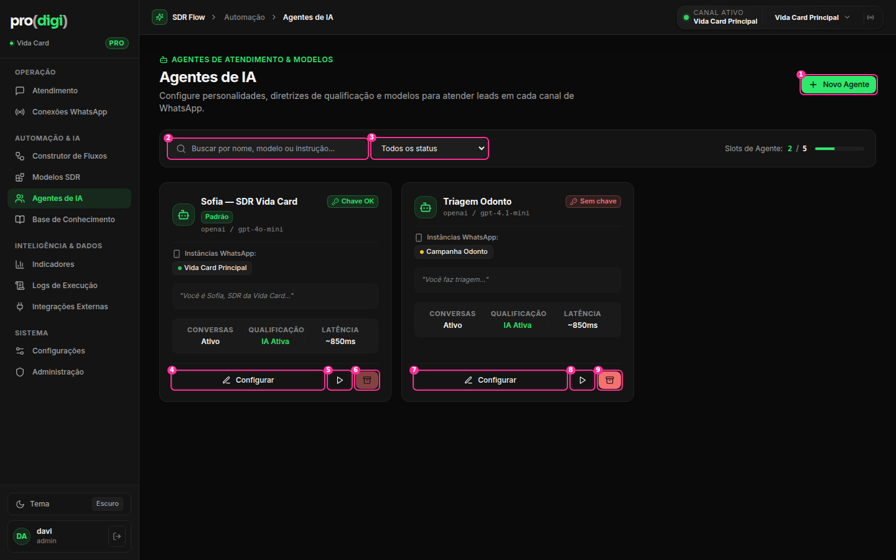
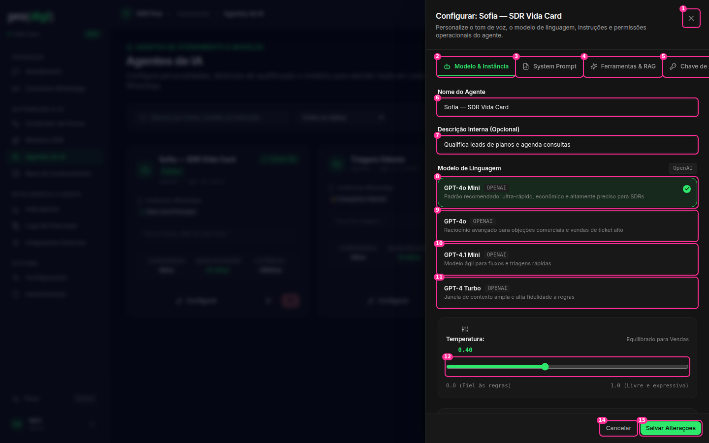
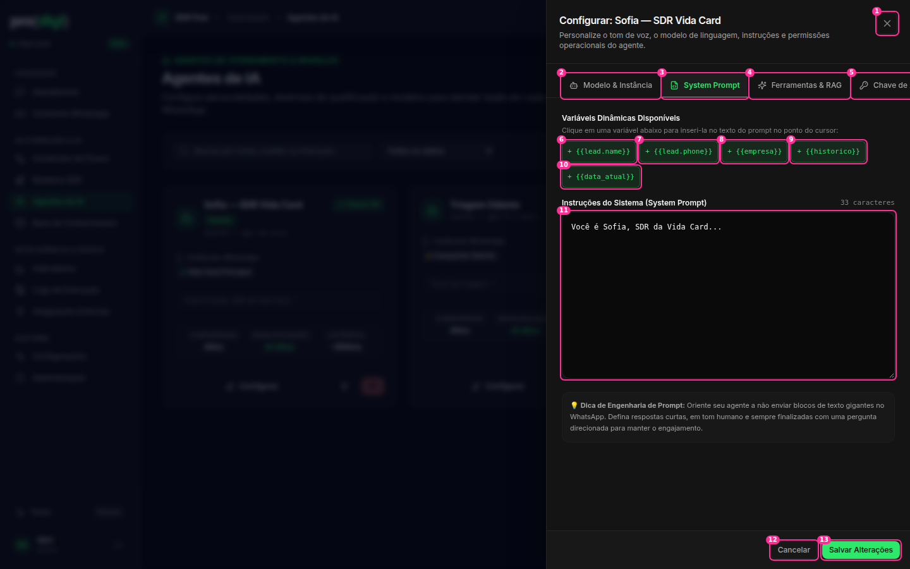
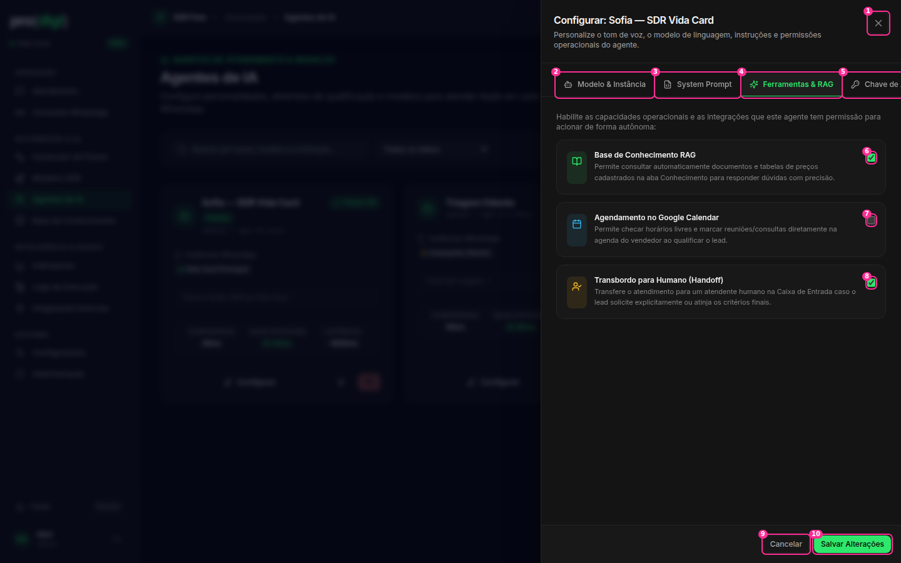

# Agentes de IA



## Lista

| # | Elemento | Decisão | Por quê |
| --- | --- | --- | --- |
| 1 | Novo Agente | ✅ | |
| 2 | Busca | ✂️ Esconder até ~6 agentes | O plano permite 5 agentes. Uma busca para 2 itens é ruído |
| 3 | "Todos os status" (select nativo) | ✂️ Mesmo motivo | |
| — | "Slots de Agente: 2 / 5" + barra, à direita dos filtros | 🔁 Texto no cabeçalho: "2 de 5 agentes do plano" | Informação de plano, não filtro |
| — | Card inteiro | 🔁 **Card clicável** (abre o agente). O bloco de métricas **fixas no código** ("Ativo", "IA Ativa", "~850ms") ✂️ sai até existirem dados reais | Métrica inventada (ver `plans/ux-audit/agents.md`) |
| 4, 7 | Configurar (botão largo) | ✂️ O card inteiro abre o agente | Botão largo repetindo a ação do card |
| 5, 8 | ▶ (só ícone: "Simular resposta") | 🔁 Botão com texto: **"Testar"** | Ícone sem rótulo não é descobrível (a dica depende do `title`) |
| 6, 9 | Arquivar (**vermelho cheio**; no padrão aparece desabilitado, em vermelho escuro) | ⋯ Menu do card → Duplicar · Definir como padrão · Arquivar… | Destrutivo em destaque. No agente padrão, um botão vermelho desabilitado é ruído puro |
| — | "Chave OK" (verde) / "Sem chave" (vermelho) + "Padrão" | 🔁 "Sem chave" vira uma faixa no card: "⚠ Sem chave da OpenAI · Adicionar". "Chave OK" ✂️ (o normal não precisa de selo) | Mostrar só a exceção |

## Edição do agente: da gaveta para uma **página própria**

  

A gaveta tem **4 abas** (a última fica cortada: "Chave de…"), um prompt que é **o campo mais importante do agente** num textarea de 264px, 4 cards de modelo com 60px cada, um slider nativo e checkboxes nativos. É conteúdo demais para uma gaveta.

**Decisão: 🗂️ `/agents/:id` como página**, com o layout de configurações:

```
← Agentes   Sofia — SDR Vida Card   ● Ativo · Padrão          [Testar]  [Salvar]  ⋯
┌───────────────┬───────────────────────────────────────────────┬──────────────────┐
│ Geral         │  Instruções                                   │  Testar agora    │
│ Instruções  ● │  ┌───────────────────────────────────────────┐│  (chat do        │
│ Modelo        │  │ Você é Sofia, SDR da Vida Card…           ││   playground     │
│ Ferramentas   │  │                                           ││   ao lado)       │
│ Instâncias    │  │   editor grande, fonte normal, variáveis  ││                  │
│ Chave de API  │  │   inseridas com "/" ou "{{"               ││                  │
│               │  └───────────────────────────────────────────┘│                  │
└───────────────┴───────────────────────────────────────────────┴──────────────────┘
```

| # (gaveta) | Elemento | Decisão | Por quê |
| --- | --- | --- | --- |
| 2–5 | 4 abas horizontais (uma cortada) | 🔁 Navegação lateral (Geral · Instruções · Modelo · Ferramentas · Instâncias · Chave) | Cabe qualquer quantidade, sem cortar |
| 6–7 | Nome + descrição | ✅ Em "Geral" | |
| 8–11 | 4 cards de modelo (60px cada, com a descrição) | 🔁 **Select com descrição** (um item por modelo, descrição em texto menor) + "Recomendado" no primeiro | 4 cards grandes para uma escolha que se faz uma vez |
| 12 | Temperatura (range **nativo** + `0.40` em mono verde) | 🔁 SegmentedControl **Preciso · Equilibrado · Criativo** + um slider próprio em "Avançado" | W4 + simplicidade |
| 13 | Instância vinculada (select nativo) | 🗂️ Seção "Instâncias", com uma lista de checkboxes (um agente pode atender vários números) | O select limita a uma instância e esconde as demais |
| 6–10 (Prompt) | 5 chips `+ {{lead.name}}`… acima do texto | 🔁 Digitar `{{` ou `/` abre um menu de variáveis **no cursor** | Os chips ocupam 2 linhas e só inserem no fim ou no cursor anterior |
| 11 (Prompt) | Textarea de 264px, **monoespaçada** | 🔁 Editor grande em fonte normal, com as variáveis destacadas como pílulas | É texto em linguagem natural (W8). O campo mais importante merece a maior área |
| — | "💡 Dica de Engenharia de Prompt" | 🔁 Ícone em vez de emoji, recolhível | W10 |
| 6–8 (Ferramentas) | 3 cards com checkbox **nativo** no canto | 🔁 **Switch** à direita + o card inteiro clicável. Google Calendar desativado com "Conectar agenda →" quando não houver integração | W4. O card inteiro é o alvo esperado |
| 14–15 | Cancelar / Salvar (28px, no rodapé) | 🔁 Salvar no header (36px). Aviso de "alterações não salvas" ao sair | Numa página, a ação fica no topo |
