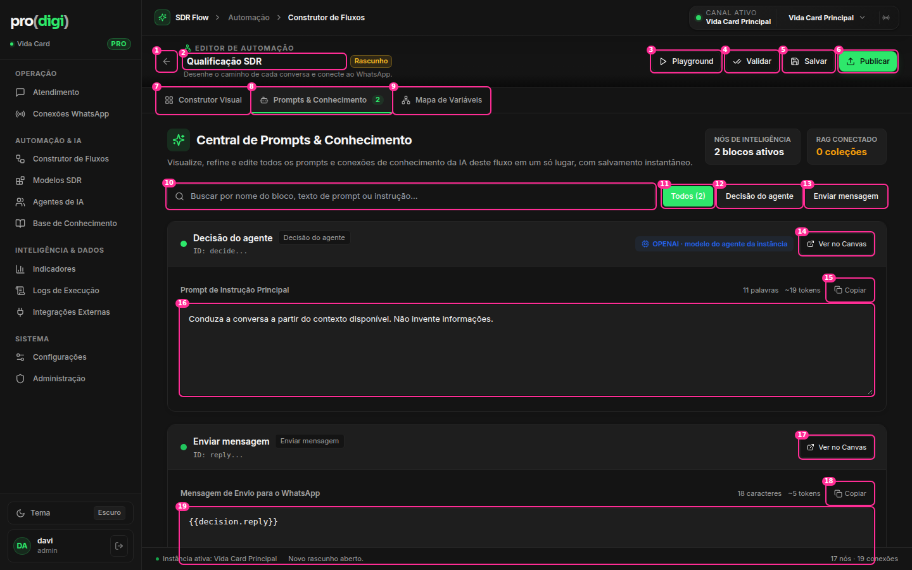
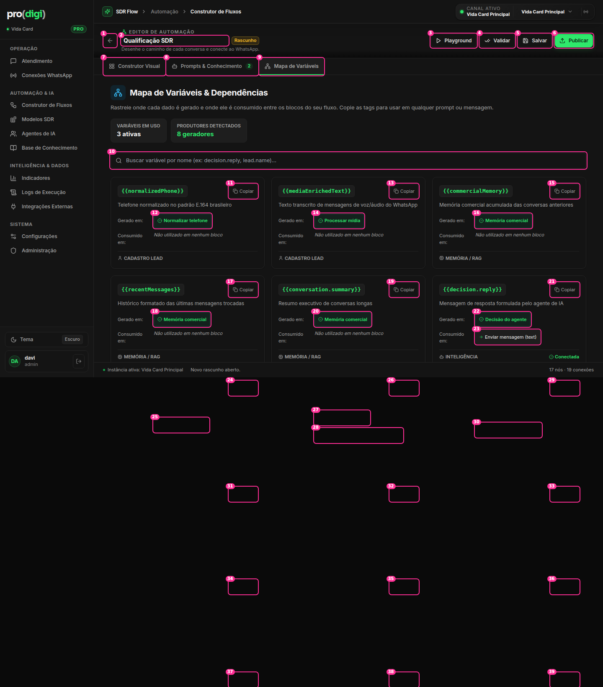

# Prompts & Conhecimento · Mapa de Variáveis

## Prompts & Conhecimento

| # | Elemento | Decisão | Por quê |
| --- | --- | --- | --- |
| — | Título "Central de Prompts & Conhecimento" + descrição + 2 cards de números ("2 blocos ativos", "0 coleções") | ✂️ Remover o título e a descrição (a aba já diz onde se está). Os números viram uma linha: "2 blocos com IA · nenhuma base de conhecimento ligada **[Ligar base]**" | Três blocos grandes antes do conteúdo |
| 10 | Busca (38px) | 🔁 32px, na mesma linha do filtro | Altura diferente dos filtros ao lado (W3) |
| 11–13 | Todos (2) · Decisão do agente · Enviar mensagem | 🔁 SegmentedControl padrão | Terceira forma de filtro-pílula do app |
| 14, 17 | "Ver no Canvas" em cada bloco (botão de 34px) | 👆 Aparece no hover do card (ou o título do bloco vira um link) | Repetido em cada card |
| 15, 18 | Copiar (em cada textarea) | 👆 Ícone dentro do canto do textarea, no hover | Padrão de bloco de código |
| 16, 19 | Textareas com contagem de "palavras / tokens" | ✅ A contagem vai para o rodapé do campo, em texto discreto. **Monoespaçada só no #19** (é uma variável) | O prompt é texto em linguagem natural, não código (W8) |
| — | "ID: decide..." e selo "OPENAI · modelo do agente da instância" em azul | ✂️ O ID vai para os detalhes. O selo fica neutro: "usa o modelo do agente" | Jargão. O azul não tem significado aqui |

## Mapa de Variáveis

**Hoje:** 39 elementos. São 8 cards grandes, cada um com Copiar + chip de origem + "Consumido em", e a maioria diz *"Não utilizado em nenhum bloco"*.

| Elemento | Decisão | Por quê |
| --- | --- | --- |
| Grade de 8 cards (3 colunas) | 🔁 **Tabela compacta**: Variável · Descrição · Gerada em · Usada em. Uma linha por variável | Um conjunto grande de dados parecidos fica mais legível em tabela que em cards (`dataviz`: tabela para muitos itens com os mesmos atributos) |
| "Não utilizado em nenhum bloco" em cada card | 🔁 Filtro "Mostrar: **Em uso** · Disponíveis · **Com problema**", com "Com problema" em destaque quando houver uma variável **usada mas não gerada** | O caso importante (a variável quebrada) fica escondido no meio do ruído |
| Copiar (8×) | 👆 No hover da linha, ou clicar na própria variável copia (com toast "Copiado") | Repetição |
| Cards de resumo "3 ativas / 8 geradores" | ✂️ Vira o contador dos filtros ("Em uso 3") | Duplicado |
| Chips de origem e de categoria em caixa alta (CADASTRO LEAD, MEMÓRIA / RAG) | 🔁 Texto normal numa coluna "Origem" | W8 |
