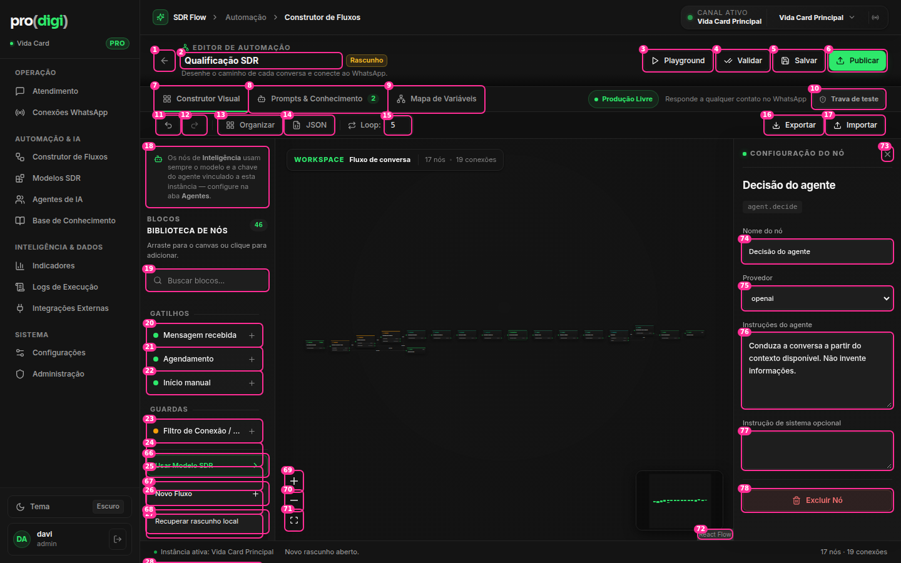

# Construtor de Fluxos



**Hoje:** **78 elementos interativos** numa tela só: 17 nas 3 faixas de controles acima do canvas, 51 na biblioteca de blocos, 3 de zoom e 6 no painel do nó. E **o canvas, que é o produto, ocupa a menor parte** e mostra o Modelo SDR (17 nós) ilegível, a ~15% de zoom, mesmo depois de "Organizar".

## Faixa 1 — cabeçalho do editor

| # | Elemento | Decisão | Por quê |
| --- | --- | --- | --- |
| 1 | ← Voltar aos fluxos | 🔁 Vira parte do **seletor de fluxo** (#2) | Não existe uma lista de fluxos para onde "voltar" |
| 2 | Nome do fluxo (input de **23px**, sem borda) | 🔁 **Seletor de fluxo**: "Qualificação SDR ▾" abre um popover com os fluxos, "Novo fluxo", "Duplicar" e "Recuperar rascunho local". Renomear com duplo clique | O input de 23px não parece editável, e trocar de fluxo hoje fica escondido no rodapé da biblioteca (#26–28) |
| — | Selo "Rascunho" + descrição "Desenhe o caminho de cada conversa…" | 🔁 Selo de estado com o salvamento: **"Rascunho · salvo há 3 s"** / "Publicado v11 · alterações não publicadas". ✂️ Remover a descrição | Retorno de status no lugar certo. A descrição é texto de marketing numa ferramenta |
| 3 | Playground | ⭐ Renomear para **"Testar"** (secundário, ao lado de Publicar) | É o 2º passo mais comum |
| 4 | Validar | ✂️ Vira **automático**: um chip "✓ Sem problemas" / "⚠ 2 problemas" que abre um popover com a lista (clicar leva ao nó) | Validar é um estado, não uma ação |
| 5 | Salvar | ✂️ **Salvamento automático** do rascunho (já existe um rascunho local), com ⌘S como atalho | Um botão Salvar ao lado de Publicar confunde ("salvar publica?") |
| 6 | Publicar | ⭐ Manter como a ação principal, com um **▾** que abre o popover de publicação: modo **Teste / Produção** (hoje é o #10), instância e observação da versão | Publicar e o modo de resposta são a mesma decisão |

## Faixa 2 — abas

| # | Elemento | Decisão | Por quê |
| --- | --- | --- | --- |
| 7–9 | Construtor Visual · Prompts & Conhecimento · Mapa de Variáveis (40px) | 🔁 **SegmentedControl compacto** no cabeçalho (Canvas · Prompts · Variáveis). Libera a faixa inteira | 40px de altura para 3 abas |
| 10 | "Trava de teste" + "Produção Livre" + "Responde a qualquer contato…" | 🪟 Vai para o popover do Publicar (#6) | Três peças para uma configuração |

## Faixa 3 — barra de ferramentas (**some por completo**)

| # | Elemento | Decisão | Por quê |
| --- | --- | --- | --- |
| 11–12 | Desfazer / Refazer | 🔁 **Barra flutuante no canvas** (canto inferior esquerdo), junto com o zoom (#69–71) + atalhos ⌘Z/⇧⌘Z | Ferramentas de canvas ficam no canvas (padrão Figma, tldraw) |
| 13 | Organizar | 🔁 Na mesma barra flutuante. **Mudar para o layout de cima para baixo** e enquadrar com zoom mínimo de 50% | Hoje "Organizar" mantém a linha horizontal ilegível |
| 14 | JSON | ⋯ Menu do fluxo → "Ver JSON" | Ferramenta de desenvolvedor |
| 15 | Loop: 5 (input de 27px) | 🪟 Popover **"Configurações do fluxo"** (⚙ no ⋯): limite de repetições, instância e descrição | Um parâmetro técnico visível o tempo todo, sem explicação |
| 16–17 | Exportar / Importar | ⋯ Menu do fluxo | Uso raro |

## Biblioteca de blocos (coluna esquerda)

| # | Elemento | Decisão | Por quê |
| --- | --- | --- | --- |
| 18 | Aviso fixo "Os nós de Inteligência usam sempre o modelo…" | ✂️ Vira um ⓘ no título "Inteligência" da biblioteca | Ocupa ~100px o tempo todo. **E ele contradiz o painel do nó (#75), que tem um select "Provedor: openai/gemini"** |
| 19 | Buscar blocos | ✅ Com atalho `/` | Ok |
| 20–65 | 46 blocos em lista sempre aberta | 🔁 **Duas formas de adicionar**: (a) biblioteca **recolhível** com as categorias fechadas por padrão; (b) **menu de comandos**: tecla `/` ou o `+` que aparece ao arrastar uma saída sem destino abre uma busca de blocos já ligada àquela saída | 46 itens sempre visíveis. Adicionar pelo fio que se está puxando é o padrão de editores de fluxo maduros |
| 25–28 | "Usar Modelo SDR", "Novo Fluxo", "Recuperar rascunho local" (rodapé fixo, **sobreposto aos blocos #24/#66–68**) | ✂️ Vão para o seletor de fluxo (#2). O modelo aparece no **estado vazio do canvas** | Hoje o rodapé cobre itens da lista (os números aparecem empilhados na captura) |
| 72 | Crédito "React Flow" | ✂️ `proOptions={{ hideAttribution: true }}` | W10 |

## Painel do nó (direita)

| # | Elemento | Decisão | Por quê |
| --- | --- | --- | --- |
| — | `agent.decide` (id técnico em selo mono) | ✂️ Vai para ⋯ → Detalhes técnicos | Jargão |
| 73 | Fechar (20px, raio 4) | 🔁 28px | Alvo pequeno demais (W1) |
| 74 | Nome do nó | ✅ | |
| 75 | Provedor (select **nativo**: openai / gemini) | 🔁 Select próprio **ou remover**, se a regra do aviso #18 for a verdadeira | Contradição com o aviso da biblioteca |
| 76–77 | "Instruções do agente" + "Instrução de sistema opcional" (2 textareas) | 🔁 Um campo principal (maior, com um botão "expandir" que abre em modal grande). O segundo fica em "Avançado ▸" | Dois campos de prompt parecidos lado a lado geram dúvida sobre qual usar |
| 78 | Excluir Nó (vermelho, 34px) | ⋯ Menu do nó (⋯ no topo do painel) + tecla Delete + **toast com Desfazer** | Destrutivo em destaque (T3). Já existe desfazer |
| — | "Visão geral do fluxo" (sem nó selecionado): 17 nós / 19 conexões em cards grandes | 🔁 Linha pequena no rodapé. O painel mostra a **validação** e os **blocos que precisam de atenção** | Contagem de nós não ajuda a decidir nada |

## Proposta

```
┌──────────────────────────────────────────────────────────────────────────────┐
│ Qualificação SDR ▾  ● Rascunho · salvo há 3 s   [Canvas|Prompts|Variáveis]  ⚠ 2  [Testar] [Publicar ▾] ⋯ │
├──────────┬─────────────────────────────────────────────────────┬─────────────┤
│ Blocos ⌄ │                                                     │ (painel do  │
│ 🔍 /     │           canvas: fluxo de cima para baixo          │  nó quando  │
│ ▸ Gatilh.│                                                     │  houver     │
│ ▸ Guardas│                                                     │  seleção)   │
│ ▸ Intelig│                                                     │             │
│ ▸ Saídas │  ┌─────────────────────┐                  ┌───────┐ │             │
│          │  │ ↶ ↷ │ ⊞ Organizar │ − 70% + ⛶ │        │minimap│ │             │
└──────────┴──┴─────────────────────┴──────────────────┴───────┴─┴─────────────┘
 ⋯ do fluxo = Configurações do fluxo · Ver JSON · Exportar · Importar · Duplicar · Excluir…
```

Ganho: **~90px a mais de canvas** (as faixas 2 e 3 somem) e **~45 controles a menos** visíveis ao mesmo tempo.
