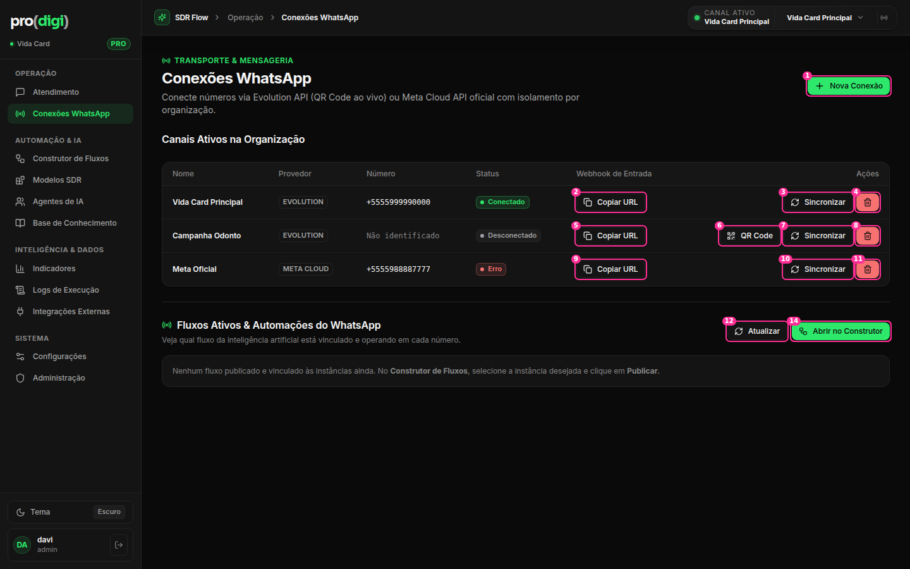
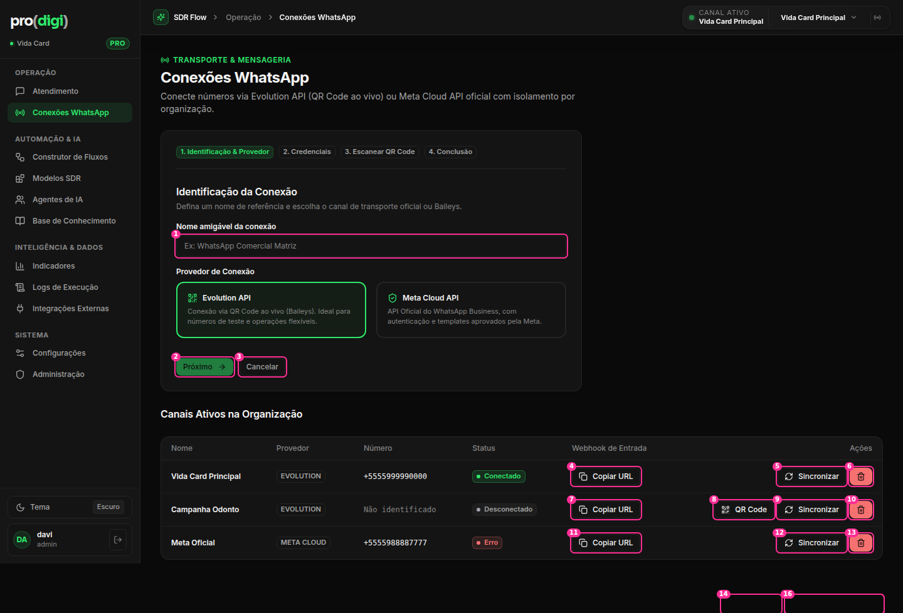

# Conexões WhatsApp

 

**Hoje:** 3–4 botões por linha (Copiar URL, QR Code, Sincronizar, Excluir em vermelho) = 11 botões para 3 números.

| # | Elemento | Decisão | Por quê |
| --- | --- | --- | --- |
| 1 | Nova Conexão | ✅ | Ação principal da página |
| 2, 5, 9 | Copiar URL (webhook) em cada linha | ⋯ → "Copiar URL do webhook" | Usado uma vez, na configuração da Meta |
| 3, 7, 10 | Sincronizar | ⋯ → "Verificar status" (e verificar sozinho a cada minuto) | Rótulo vago. Ação de manutenção |
| 4, 8, 11 | Excluir (**vermelho cheio**, só ícone) | ⋯ → "Remover conexão…" + ConfirmDialog | Destrutivo em destaque, 3 vezes (T3/W5) |
| 6 | QR Code (só na desconectada) | ⭐ Vira **a** ação da linha quando está desconectada: "Reconectar" | O próximo passo óbvio |
| — | Coluna Status (selo "Erro" sem explicação) | 🔁 Status + motivo na mesma célula ("Erro · token expirado") + ação inline ("Reautenticar") | Um erro sem saída |
| — | Colunas Provedor (EVOLUTION / META CLOUD em caixa alta mono) e Número (mono) | 🔁 Ícone do provedor ao lado do nome. Número formatado em fonte normal | W8 |
| 12–14 | Seção "Fluxos Ativos & Automações" + Atualizar + Abrir no Construtor (**#13 e #14 são o mesmo destino**, link e botão) | 🗂️ Vira **colunas da tabela**: "Agente" e "Fluxo publicado" em cada linha. ✂️ Remover a seção | Informação que pertence à linha, e dois controles para o mesmo lugar |
| wizard 1–3 | Assistente em 4 passos **inline**, empurrando a tabela | 🔁 **Modal** com passos (Identificação → Credenciais → QR → Pronto) | Uma tarefa focada pede uma camada focada (apple-design: "Dim to focus") |
| wizard | Cartões "Evolution API / Meta Cloud API" | 🔁 Títulos pelo resultado: "QR Code (rápido)" / "API oficial da Meta". A tecnologia aparece em texto menor | Jargão |

## Proposta de linha

```
 Nome                  Número              Status                         Agente   Fluxo       
 Vida Card Principal   +55 55 99999-0000   ● Conectado                    Sofia    SDR v11    ⋯
 Campanha Odonto       —                   ○ Desconectado  [Reconectar]   Triagem  —          ⋯
 Meta Oficial          +55 55 98888-7777   ● Erro · token expirado [Reautenticar]  —   —      ⋯
                                                     ⋯ = Copiar webhook · Verificar status · Renomear · Remover…
```
