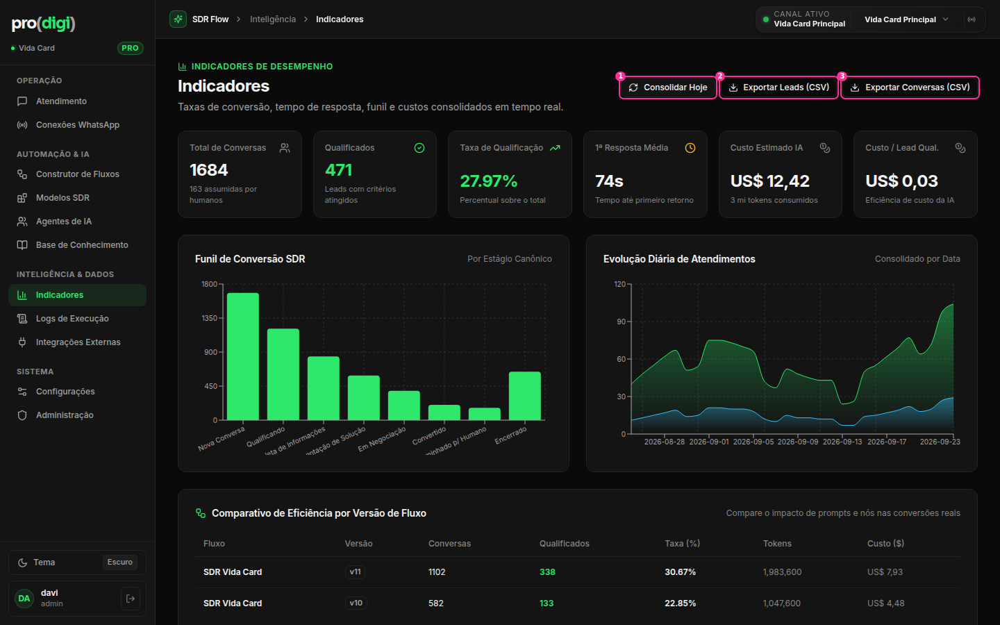

# Indicadores (Dashboard)



A análise de dados (tipos de gráfico, cores validadas, período) está em [`../dashboard-ux-audit`](../dashboard-ux-audit/README.md). Aqui fica o que é de **elemento e layout**.

| # | Elemento | Decisão | Por quê |
| --- | --- | --- | --- |
| 1 | "Consolidar Hoje" | ⋯ Vai para o menu da página (visível só para admin) | Ação interna de manutenção ocupando o lugar mais nobre |
| 2 + 3 | "Exportar Leads (CSV)" + "Exportar Conversas (CSV)" | 🔁 **Um botão "Exportar ▾"** que abre um DropdownMenu com Leads e Conversas | Dois botões quase iguais, com rótulos longos. O formato "(CSV)" vai para a descrição da opção |
| — | 6 cards de KPI do mesmo tamanho | 🔁 1 número de destaque + 4 cards. O custo total vai para dentro do card de custo | 6 cartões iguais = nenhum é importante |
| — | Os 2 gráficos lado a lado, cada um com um subtítulo que não informa ("Por Estágio Canônico", "Consolidado por Data") | ✂️ Remover os subtítulos. O período fica na barra de filtros | Ruído |
| — | Tabela "Comparativo por versão" no fim da página | 🗂️ Pode virar a aba **"Versões"** dentro de Indicadores, ou ir para a página do fluxo | É uma análise de *fluxo*, para quem edita fluxos. A dashboard é para quem acompanha resultados |
| (novo) | Barra de filtros | ⭐ **Período ▾ · Instância ▾** numa linha acima dos KPIs | Hoje não existe e o período fica escondido |

## Proposta

```
Indicadores                                   [Exportar ▾]  [⋯]
Últimos 30 dias · Todas as instâncias · atualizado 14:32
[ 30 dias ▾ ]  [ Instância: Todas ▾ ]
┌───────────────────────┐ ┌────────┐┌────────┐┌────────┐┌────────┐
│ Taxa de qualificação  │ │Convers.││Qualif. ││1ª resp.││Custo/  │
│ 28,0%   ▲ 3,1 p.p.    │ │ 1.684  ││  471   ││1min14s ││lead    │
│ ▁▂▃▅▃▄▆▇ (sparkline)  │ │ ▲ 12%  ││ ▲ 18%  ││ ▼ 9 s  ││US$0,03│
└───────────────────────┘ └────────┘└────────┘└────────┘└────────┘
┌ Funil (barras horizontais) ─────┐ ┌ Conversas por dia (linhas) ──┐
└─────────────────────────────────┘ └──────────────────────────────┘
```
