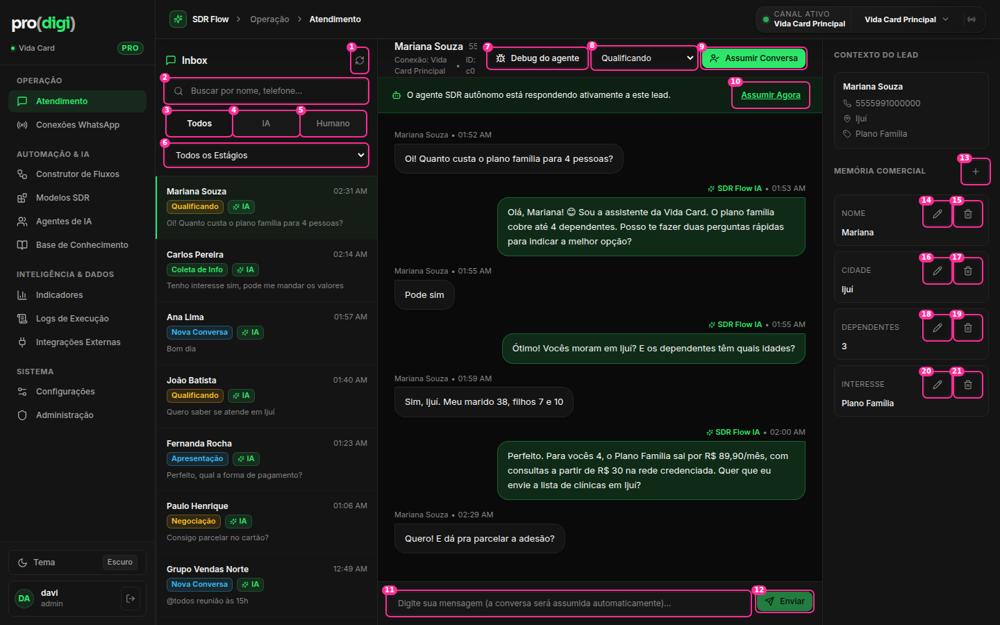

# Atendimento (Inbox)



**Hoje:** 21 controles na área da conversa, sendo **9 só no painel de memória** e **2 botões de "assumir"**. As linhas da lista de conversas **não são focáveis** (`div onClick`).

## Coluna da lista

| # | Elemento | Decisão | Por quê |
| --- | --- | --- | --- |
| 1 | Atualizar lista (ícone, 34px, raio 4) | ✂️ Remover. Se houver falha no tempo real, mostrar um aviso "Reconectando…" com "Tentar agora" | A lista já é em tempo real (WebSocket). Um botão de recarregar sugere que não é |
| 2 | Busca (34px) | ✅ Adicionar o atalho `/` para focar | Ok |
| 3–5 | Todos · IA · Humano (34px, raio 6) | 🔁 SegmentedControl padrão (32px, raio 8) **com contagem** ("Humano 2") | Três implementações diferentes de segmentado no app |
| 6 | "Todos os Estágios" (select **nativo**, 31px) | 🪟 Vira um botão de filtro **"Filtros (1)"** que abre um popover com estágio, instância, "ocultar grupos" e "só não lidas" | O select nativo tem outra altura e abre com a lista do sistema operacional. Os filtros vão crescer, e um popover acomoda |
| — | Linhas da lista (div clicável) | 🔁 `button` com foco visível e navegação por ↑↓. Selo de estágio neutro. Selo "IA" ✂️ (só aparece "Humano") | Teclado (W9) e ruído visual |
| (novo) | Seção "Aguardando você" | ⭐ Fixa no topo da lista | A exceção é o trabalho do operador |

## Header da conversa

| # | Elemento | Decisão | Por quê |
| --- | --- | --- | --- |
| — | Nome + `55` (telefone cortado) + "Conexão: Vida Card Principal" + "ID: c0" | 🔁 Nome (linha 1) · `+55 55 99100-0000 · Vida Card Principal` (linha 2). ID ✂️ (vai para ⋯ → Detalhes técnicos) | Hoje são 4 informações em 3 linhas quebradas |
| 7 | Debug do agente (28px) | ⋯ Vai para o menu da conversa | Ferramenta de desenvolvimento no lugar da ação principal |
| 8 | Estágio (select **nativo**, 31px) | 🔁 Selo clicável "Qualificando ▾" que abre um popover com os estágios em ordem (marcando o atual) | O estágio é um *status*: deve parecer um status, e não um formulário |
| 9 | "Assumir Conversa" (28px, verde cheio) | ✂️ Remover (fica o #10, redesenhado) | Duplicado |
| 10 | "Assumir Agora" (link sublinhado no banner) | ⭐ **Botão** "Assumir" dentro do banner da IA | É a ação principal enquanto a IA atende. Link sublinhado não parece botão (W10) |
| (novo) | ⋯ da conversa | Debug do agente · Copiar telefone · Ver no Logs · Detalhes técnicos · Encerrar conversa | Tudo que é ocasional num só lugar |

## Campo de resposta

| # | Elemento | Decisão | Por quê |
| --- | --- | --- | --- |
| 11 | Input de 1 linha (34px) com a instrução no placeholder | 🔁 **Textarea que cresce** (1–6 linhas). Enter envia, Shift+Enter quebra linha. À esquerda: 📎 anexo e ⚡ respostas rápidas (popover) | Mensagens de venda têm várias linhas. O placeholder não serve para explicar consequências |
| 12 | Enviar (28px ao lado de um input de 34px) | 🔁 Mesma altura do campo. Rótulo **"Assumir e enviar"** enquanto a IA atende | Alturas desalinhadas (W1). A consequência fica na própria ação |

## Painel "Contexto do lead"

| # | Elemento | Decisão | Por quê |
| --- | --- | --- | --- |
| 13 | + (adicionar campo, 34px) | ✅ Menor (28px), junto ao título da seção | Ok |
| 14–21 | Editar + Excluir em **cada** campo (8 botões de 34px sempre visíveis) | 👆 **Editar ao clicar no valor** (edição inline). Excluir aparece no hover como um × discreto | 8 botões para 4 dados. O painel vira uma lista de botões |
| — | Painel sempre aberto (256px) | 🪟 Recolhível: botão "Contexto" no header da conversa. Aberto por padrão só em telas ≥ 1440px | Em 1280px a conversa fica espremida entre a lista e o painel |

## Proposta

```
┌ Inbox ────────────────┐┌ Mariana Souza                       Qualificando ▾  ⋯  ⓘ ┐
│ 🔍 Buscar      /      ││ +55 55 99100-0000 · Vida Card Principal               │
│ [Todos 10|IA 8|Hum 2] ││┌──────────────────────────────────────────────────────┐│
│ [Filtros (1)]         │││ ✨ Sofia está respondendo esta conversa   [ Assumir ] ││
│ AGUARDANDO VOCÊ (2)   ││└──────────────────────────────────────────────────────┘│
│ ● Luciana M.  há 12min││            ─── Hoje ───                                 │
│ ● Paulo H.    há 3min ││ (balões)                                               │
│ TODAS                 ││                                                        │
│  Mariana S.   14:31   ││┌📎⚡ Escreva uma mensagem…            [Assumir e enviar]┐│
└───────────────────────┘└────────────────────────────────────────────────────────┘
```
