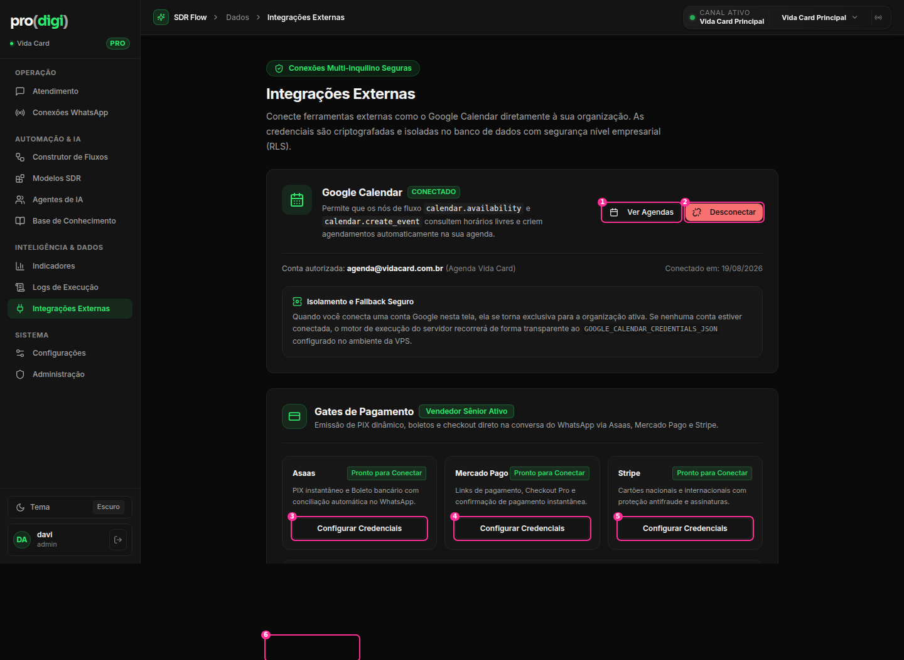

# Integrações Externas



**Hoje:** uma página longa com blocos de texto técnico. Cada integração tem um layout diferente: o Google Calendar é um card grande com um sub-card de "fallback", e os pagamentos são 3 mini-cards com o selo "Pronto para Conectar".

| # | Elemento | Decisão | Por quê |
| --- | --- | --- | --- |
| — | Selo "Conexões Multi-inquilino Seguras" + descrição com "(RLS)" | ✂️ | Jargão de infraestrutura como título |
| — | Layout: cards de largura total, empilhados | 🔁 **Grade de integrações no estilo de uma loja de apps**: um card igual por integração (logo, nome, frase, status, botão). Clicar abre a **página ou painel da integração** com os detalhes | Todas com a mesma forma, e fácil de crescer para WhatsApp, CRM, Asaas… |
| — | Sub-card "Isolamento e Fallback Seguro" com `GOOGLE_CALENDAR_CREDENTIALS_JSON` e "VPS" | 🗂️ Vai para a página da integração, em "Detalhes técnicos" (visível só para admin) | Texto de operação de servidor na tela do cliente |
| 1 | Ver Agendas | 🪟 Popover com a lista de agendas e a agenda **usada pelos agentes** marcada | Uma consulta rápida, sem sair da tela |
| 2 | Desconectar (**vermelho cheio**) | ⋯ → Desconectar… + ConfirmDialog | T3 |
| 3–5 | "Configurar Credenciais" ×3 com o selo verde "Pronto para Conectar" | 🔁 Selo neutro "Não conectado" + um botão "Conectar" | Verde para o que não está configurado confunde |
| 6 | "Voltar aos fluxos" no rodapé | ✂️ | Navegação sem contexto: a página não veio dos fluxos |

## Proposta

```
Integrações                                                   
┌──────────────────┐ ┌──────────────────┐ ┌──────────────────┐ ┌──────────────────┐
│ [G] Google Agenda│ │ [A] Asaas        │ │ [M] Mercado Pago │ │ [S] Stripe       │
│ Marca consultas  │ │ Pix e boleto na  │ │ Link de pagamento│ │ Cartão nacional e│
│ na sua agenda    │ │ conversa         │ │ na conversa      │ │ internacional    │
│ ● Conectada   ⋯  │ │ ○ Não conectado  │ │ ○ Não conectado  │ │ ○ Não conectado  │
│ agenda@vidacard  │ │       [Conectar] │ │       [Conectar] │ │       [Conectar] │
└──────────────────┘ └──────────────────┘ └──────────────────┘ └──────────────────┘
```
