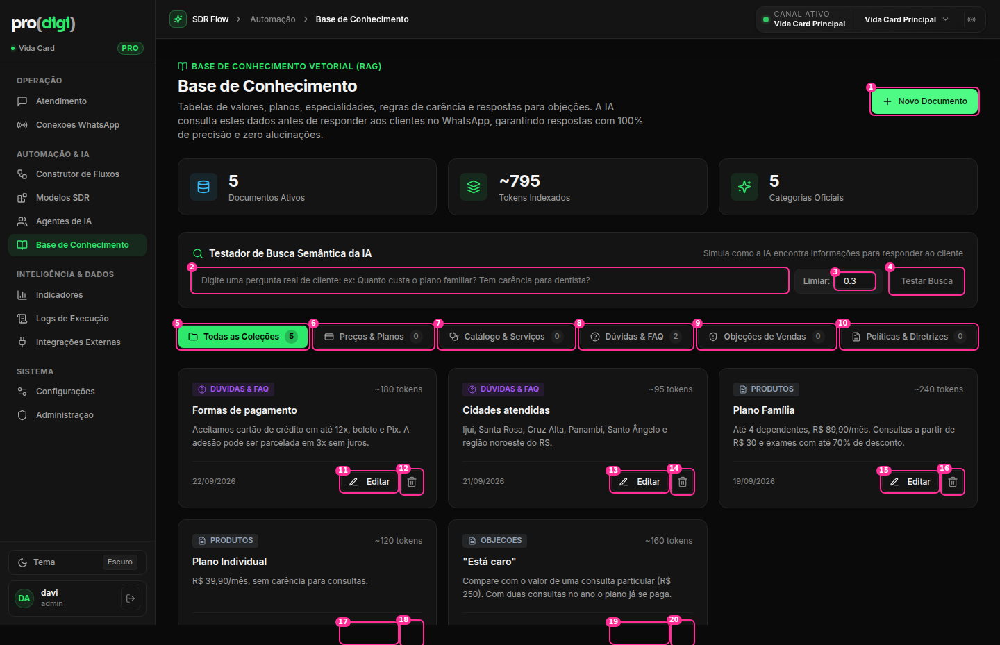
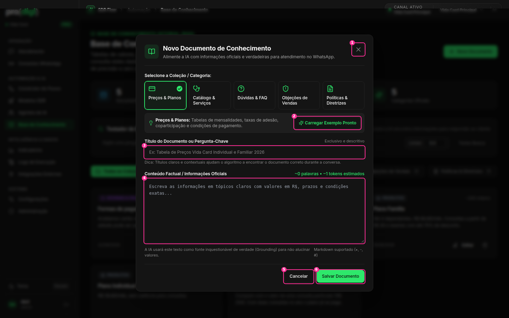

# Base de Conhecimento

| # | Elemento | Decisão | Por quê |
| --- | --- | --- | --- |
| — | Título com a promessa "100% de precisão e zero alucinações" | 🔁 Reescrever (ver `plans/ux-audit/knowledge.md`) | Promessa falsa |
| — | 3 cards de estatística (Documentos, Tokens, "5 Categorias Oficiais") | ✂️ Vira uma linha: "5 documentos · atualizado há 2 dias" | "5 categorias" é constante. Tokens é métrica técnica |
| 1 | Novo Documento (36px) | ✅ 32px, igual aos outros botões principais | W1 |
| 2–4 | **Testador de busca** (input + "Limiar 0.3" com input number de **22px** + botão) ocupando uma faixa inteira | 🪟 Botão **"Testar pergunta"** no cabeçalho, que abre um **popover grande / painel lateral** com o campo, os resultados e o limiar em "Avançado" | Ferramenta útil, mas ocasional. Hoje o input de 22px e o termo "limiar" dão cara de painel técnico |
| 5–10 | 6 filtros-pílula de coleção com contagem (incluindo os de 0) | 🔁 Coleções numa **coluna à esquerda** (tipo pastas), com contagem. As de 0 ficam esmaecidas com um "+" | 6 pílulas em linha quebram em telas menores. Pastas escalam |
| 11–20 | Editar (28px) + Excluir (34px, raio 4) em **cada** card | 👆 O **card inteiro abre o editor**. Excluir no ⋯ que aparece no hover | 10 botões para 5 documentos, com alturas e raios diferentes entre si (W1/W2) |
| — | Card: selo da coleção + "~180 tokens" + título + texto + data | 🔁 Título → 2 linhas do texto → "atualizado 22/09". ✂️ Remover o selo de coleção quando o filtro já é a coleção | Hierarquia |
| — | Layout em cards de 3 colunas | ✅ até ~15 docs. 🔁 **Alternância lista/cards** acima disso (a lista mostra título, coleção, atualizado e usado por) | Um conjunto grande em cards obriga a rolar muito |

## Modal "Novo documento"

| # | Elemento | Decisão | Por quê |
| --- | --- | --- | --- |
| — | 5 cartões de coleção | ✅ Bom padrão (escolha visual) | |
| 2 | "Carregar Exemplo Pronto" | ✅ Ótimo para começar. Rótulo: "Usar exemplo" | |
| 3 | Título | ✅ | |
| 4 | Conteúdo: textarea de 182px, **monoespaçada**, com "~0 palavras · ~1 tokens estimados" em verde | 🔁 Fonte normal, altura maior (ou modal em tela cheia) com pré-visualização do Markdown. O contador fica discreto, sem "tokens" | W8. O conteúdo é o valor do documento |
| — | Textos de ajuda com "Grounding" e "algoritmo" | 🔁 Linguagem de uso: "A IA usa este texto como fonte para responder" | Jargão |
| 5–6 | Cancelar / Salvar (36px) | ✅ | |
