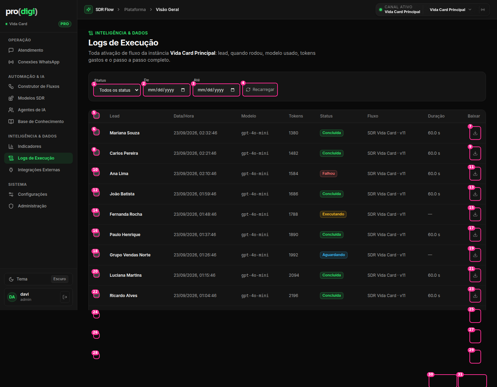

# Logs de Execução



**Hoje:** 31 controles visíveis: **12 checkboxes nativos** + **12 botões de download** (um por linha) + 4 filtros. As linhas abrem o detalhe com o mouse, mas **não com o teclado** (`tr onClick`).

| # | Elemento | Decisão | Por quê |
| --- | --- | --- | --- |
| 1 | Status (select nativo) | 🔁 SegmentedControl **Todas · Falhas · Em andamento**, com contagem | São 5 estados, mas a pergunta real é "o que falhou?" |
| 2–3 | De / Até (`input type=date` **nativo**, mostra `mm/dd/yyyy`) | 🔁 **DateRangePicker** com presets (Hoje, 24 h, 7 dias, 30 dias, personalizado) | W4 + formato americano |
| 4 | Recarregar | 🔁 Ícone discreto + recarregar sozinho a cada 30 s enquanto houver execuções "Em andamento" | Ação manual para um estado que o sistema conhece |
| — | Caixa de filtros com borda, rótulos em cima de cada controle | 🔁 **Barra de filtros sem caixa**, numa linha, sem rótulos (o controle já diz o que é: "Status: Todas ▾") | Um formulário em caixa para 3 filtros pesa demais |
| 5 | Selecionar todas (checkbox nativo no cabeçalho) | 🔁 Checkbox próprio | W4 |
| 6, 8, 10… | Checkbox em cada linha | 👆 Aparece no **hover** da linha ou quando já há alguma selecionada | 12 checkboxes à vista para uma ação rara (baixar em lote) |
| 7, 9, 11… | Baixar (ícone) em cada linha | 👆 Só no hover. Também no detalhe da execução | 12 ícones iguais repetidos |
| (novo) | Barra de ações em lote | ⭐ Barra **flutuante no rodapé** quando há seleção: "3 selecionadas · Baixar JSON · Limpar" | Padrão de DataTable. Aparece só quando faz sentido |
| — | Linha (tr onClick) | 🔁 Linha focável (Enter abre o detalhe), com o **lead como link** para a conversa | W9 |
| — | Colunas: Lead · Data/Hora · Modelo (mono) · Tokens · Status · Fluxo · Duração · Baixar | 🔁 **Status na 1ª coluna** (é o que se procura). Modelo e Tokens ✂️ saem da tabela (vão para o detalhe, ou para "Colunas ▾" opcional). Data relativa ("há 12 min") com a data completa no tooltip | 8 colunas, e a mais importante no meio. `dataviz`: números alinhados à direita, com separador pt-BR |

## Proposta

```
Logs de Execução                                                   
[Todas 148 | Falhas 3 | Em andamento 1]   [Últimas 24 h ▾]   [Instância: Vida Card ▾]      ↻
 Status        Lead               Fluxo            Quando        Duração
 ● Falhou      Ana Lima →         SDR Vida Card v11  há 22 min     30,0 s        (hover: ☐  ⤓)
 ● Concluída   Mariana Souza →    SDR Vida Card v11  há 4 min       1,2 s
 …
                         ┌──────────────────────────────────────────┐
                         │ 3 selecionadas   [Baixar JSON]   Limpar │  ← só com seleção
                         └──────────────────────────────────────────┘
```
