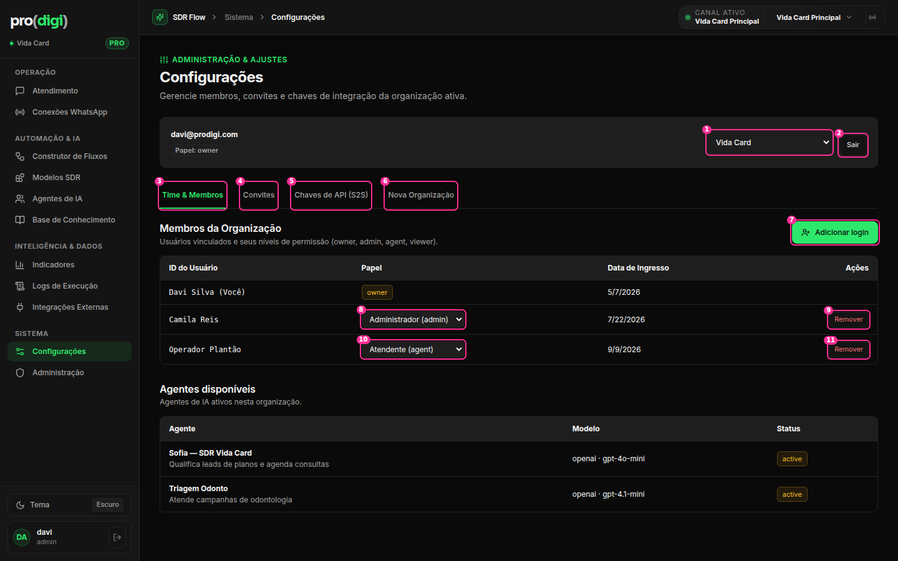
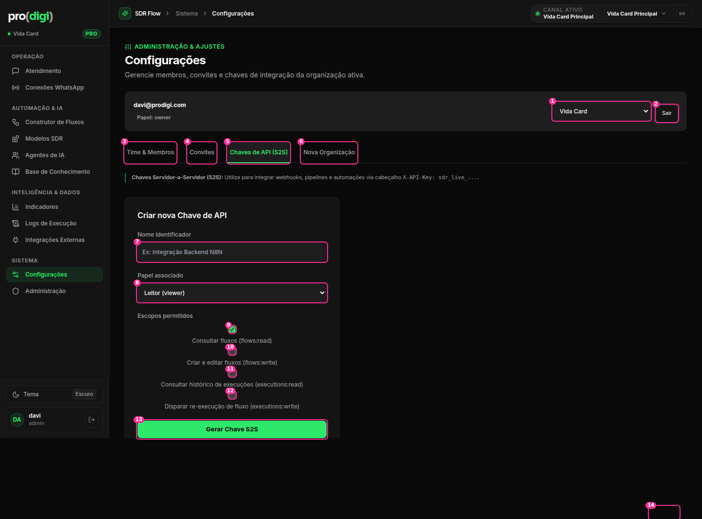
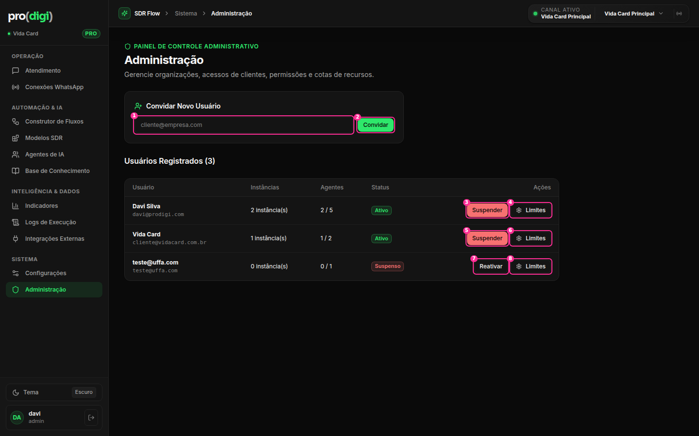

# Configurações + Administração



## Estrutura

**Hoje:** o topo da página tem um card com e-mail + papel + **select de organização** + **Sair**. Abaixo ficam 4 abas (Time, Convites, Chaves de API, Nova Organização). A aba Time ainda repete uma tabela de "Agentes disponíveis".

**Decisão: 🗂️ Configurações com navegação lateral** (padrão de páginas de configurações):

```
Configurações
┌──────────────┬────────────────────────────────────────────────────────────┐
│ ORGANIZAÇÃO  │ Membros                                    [Convidar pessoa]│
│  Geral       │ Pessoa                      Papel            Desde           │
│  Membros   ● │ Davi Silva (você)           Dono             há 4 meses      │
│  Chaves API  │ davi@prodigi.com                                              │
│  Plano       │ Camila Reis                 Administrador ▾  há 2 meses   ⋯  │
│ MINHA CONTA  │ Operador Plantão            Atendente ▾      há 2 semanas ⋯  │
│  Perfil      │ ── Convites pendentes (1) ──────────────────────────────────  │
│  Preferências│ novo.vendedor@vidacard.com.br  Atendente   expira em 5 dias ⋯ │
└──────────────┴────────────────────────────────────────────────────────────┘
```

| # | Elemento | Decisão | Por quê |
| --- | --- | --- | --- |
| 1 | Select de organização (nativo, 37px) | 🗂️ Vai para o **seletor de organização da sidebar** (ver [shell.md](shell.md)) | Contexto global escondido numa página |
| 2 | Sair | ✂️ Fica só no menu do usuário | Duplicado |
| — | Card "davi@prodigi.com · Papel: owner" | 🗂️ Vai para "Minha conta › Perfil" | Não é configuração da organização |
| 3–6 | 4 abas horizontais | 🔁 **Navegação lateral** (acima). "Convites" vira uma seção dentro de Membros. "Nova Organização" vai para o seletor de organização | As abas crescem sem espaço. Convite pendente é um membro ainda não aceito |
| 7 | "Adicionar login" (ação principal) | 🔁 **"Convidar pessoa"** (modal: e-mail + papel). "Criar login com senha" vira uma opção avançada dentro do modal | Uma porta de entrada (ver `plans/ux-audit/settings.md`) |
| 8, 10 | Papel (select **nativo de 27px** dentro da tabela, com "Administrador (admin)") | 🔁 **Menu de papel**: o texto "Administrador ▾" abre um popover com os 4 papéis **e o que cada um pode fazer**. Mudou → toast "Camila agora é Atendente · Desfazer" | W4. A escolha de permissão precisa de contexto e de volta atrás |
| 9, 11 | Remover (26px, texto vermelho) | ⋯ da linha → "Remover da organização…" + ConfirmDialog | T3/W5 |
| — | Coluna "ID do Usuário" com nomes em mono · datas `5/7/2026` | 🔁 "Pessoa" (nome + e-mail) · "Desde" relativo | W8, T1 |
| — | Tabela "Agentes disponíveis" | ✂️ Já existe a página Agentes | Duplicado |



## Chaves de API

| # | Elemento | Decisão | Por quê |
| --- | --- | --- | --- |
| — | Aviso "Chaves Servidor-a-Servidor (S2S)… `X-API-Key: sdr_live_...`" | 🔁 "Use para integrar outros sistemas." + um link "Como usar ↗" com o exemplo de código | Jargão |
| 7–13 | **Formulário de criação sempre aberto** (nome, papel, 4 escopos, botão) ocupando a página | 🔁 A página mostra a **lista de chaves** (nome, prefixo, último uso, ⋯). O botão **"Criar chave"** abre um **modal** com o formulário | Criar chave é raro. A lista é o que se consulta |
| 9–12 | 4 checkboxes **nativos, centralizados acima do texto** | 🔁 Checkbox próprio à esquerda, com o escopo técnico em cinza menor | Bug de layout (CSS antigo `label{flex-direction:column}`) + W4 |
| 13 | "Gerar Chave S2S" (verde, largura total) | 🔁 "Criar chave" (tamanho padrão). Depois de criar: um modal "Copie agora" com botão de copiar | Botão de largura total é estética de formulário de login |
| 14 | Revogar (26px, vermelho) | ⋯ da linha → Revogar… | T3 |



## Administração

| # | Elemento | Decisão | Por quê |
| --- | --- | --- | --- |
| 1–2 | Card "Convidar Novo Usuário" (input + botão) acima da tabela | 🔁 Botão "Convidar cliente" no cabeçalho da tabela → modal | Um formulário sempre aberto para uma ação rara |
| 3, 5 | **Suspender** (vermelho cheio, 28px), inclusive na própria conta | ⋯ da linha → Suspender… + ConfirmDialog. **Desabilitado na própria conta** | Destrutivo, sem confirmação, e permite suspender a si mesmo |
| 4, 6, 8 | Limites (abre um editor) | 🪟 **Popover** ancorado ao botão, com os 2 campos (agentes, instâncias) e Salvar | Edição rápida de 2 números |
| 7 | Reativar | ✅ Fica visível na linha **só quando** a conta está suspensa (é a ação principal desse estado) | O estado decide a ação principal |
| — | "2 instância(s)" / "2 / 5" | 🔁 "2 / 3 instâncias" · "2 / 5 agentes" com uma barrinha de uso (meter) | Consistência + leitura rápida do uso do plano (`dataviz`: meter) |
