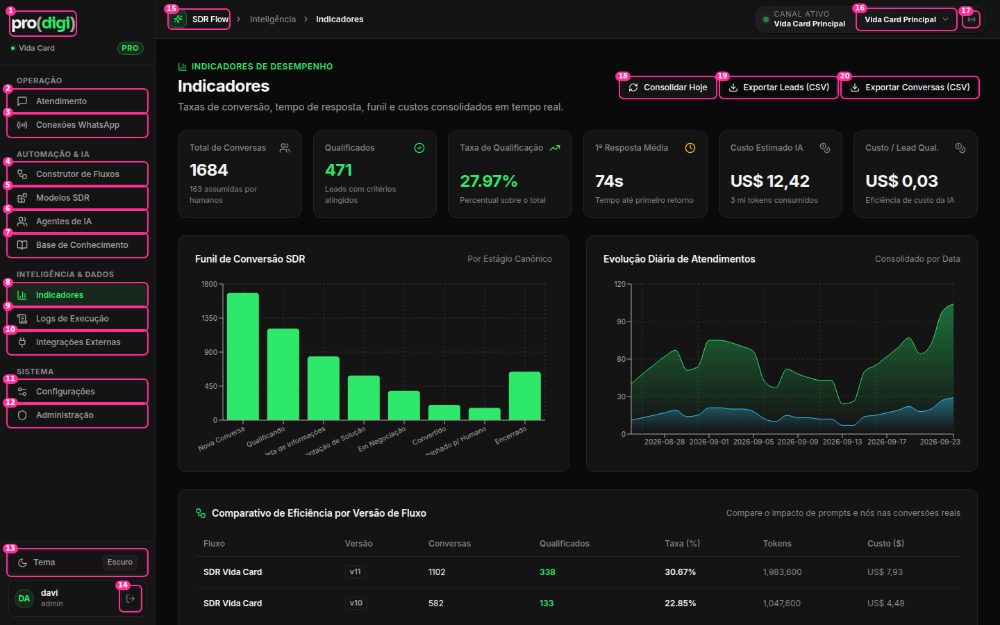

# Estrutura global — sidebar + header



| # | Elemento | Decisão | Por quê |
| --- | --- | --- | --- |
| 1 | Logo `pro(digi)` → Indicadores | ✅ | Padrão esperado |
| — | "● Vida Card" + selo **PRO** (abaixo do logo) | 🔁 **Seletor de organização** (clicável, abre um popover com as organizações + "Nova organização") | Hoje a troca de organização fica escondida em Configurações. A organização é um contexto global e tem que ficar onde ela já aparece |
| 2–12 | 11 itens do menu em 4 grupos | ✅ Manter os grupos, com ajustes: **Modelos SDR** ✂️ sai do menu (vira o estado vazio e o "Novo fluxo" do Construtor) · **Administração** fica visível só para quem é admin da plataforma | São 11 itens para um SDR que usa 3 no dia a dia. Menos itens, menos procura |
| 13 | "Tema · Escuro" (botão de 36px no rodapé) | ⋯ Vai para o **menu do usuário** | Tema é uma preferência que se muda uma vez. Não merece um botão fixo na tela |
| — | Card do usuário "DA davi admin" | 🔁 Vira um **botão de menu** (avatar + nome) que abre: Tema · Configurações · Sair | O padrão de SaaS (Linear, Vercel, Notion): um lugar só para tudo que é "meu" |
| 14 | Sair (ícone solto de 34px) | ⋯ Vai para o menu do usuário | Sair num ícone ao lado do nome é fácil de clicar por engano |
| 15 | "SDR Flow" (link no caminho do topo) | ✂️ | Duplica o logo da sidebar |
| 16 | Seletor de instância "Vida Card Principal" (28px) + o bloco "CANAL ATIVO / Nenhuma instância" | 🪟 **Popover** com a lista de instâncias, status e "Gerenciar conexões". No header fica só um *chip*: ● Vida Card Principal ▾ | Hoje há 3 peças (rótulo, valor, seletor) e o seletor tem uma altura diferente do resto |
| 17 | Ícone de antena (20px) → Conexões | ✂️ Vai para dentro do popover do #16 ("Gerenciar conexões") | Alvo de 20px sem rótulo, com a dica pelo `title` |

## Proposta

```
┌──────────────┬─────────────────────────────────────────────────────────────┐
│ pro(digi)    │  Automação › Construtor de Fluxos        ● Vida Card Princ ▾ │
│ Vida Card ▾  ├─────────────────────────────────────────────────────────────┤
│  PRO         │                                                             │
│              │                                                             │
│ OPERAÇÃO     │                                                             │
│  Atendimento │                                                             │
│  Conexões    │                                                             │
│ AUTOMAÇÃO    │                                                             │
│  Fluxos      │                                                             │
│  Agentes     │                                                             │
│  Conhecimento│                                                             │
│ DADOS        │                                                             │
│  Indicadores │                                                             │
│  Logs        │                                                             │
│  Integrações │                                                             │
│              │                                                             │
│ (DA) davi  ⋯ │ ← menu: Tema · Configurações · Administração* · Sair        │
└──────────────┴─────────────────────────────────────────────────────────────┘
```
